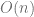
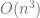

<!--yml

分类：未分类

date: 2024-05-17 23:42:14

-->

# 使用 CUSP 和 CUDA 解决稀疏线性系统 – HPC-QuantLib

> 来源：[`hpcquantlib.wordpress.com/2011/11/13/solving-sparse-linear-systems-using-cusp-and-cuda/#0001-01-01`](https://hpcquantlib.wordpress.com/2011/11/13/solving-sparse-linear-systems-using-cusp-and-cuda/#0001-01-01)

有限差分方程可以基于稀疏线性系统表示并求解。当使用包含隐部的方案来求解方程时，需要计算这个稀疏矩阵的逆。迭代求解器如 BiCGStab 算法（加上预处理器）是为这类问题量身定制的。此外，这些求解器可以轻松适应像现代 GPU 这样的并行计算架构。cusp 库[1] 实现了一组基于 CUDA 和 thrust[2]的稀疏矩阵的常用迭代求解器。

另外，可以使用操作分解技术来解决问题。在这种情况下，只需要反转三对角线性系统。托马斯算法（以 Liewellyn Thomas 的名字命名）可以以操作而不是操作解决此类系统，而不是高斯消元所需操作。但是，托马斯算法不容易并行化。

在 CPU 上，对于隐部，操作分解通常比 BiCGStab 等迭代求解器表现更好。之前的博客文章中的 VPP 定价问题现在将作为基准，以比较 CPU 上的求解器性能与 GPU 上的性能。如下图所示，在 CPU 上，操作分解比 BiCGStab 求解器加上预处理器更快。但是，即使对应的 GPU 预处理器尚未实现，BiCGStab 在 GPU 上显然获得了领先。请在此处找到 QuantLib/boost::ublas 与 cusp 之间的接口类[here](http://www.hpc-quantlib.de/src/gpubicgstab.zip)。  

[1] cusp, [用于稀疏矩阵和图计算的通用并行算法](http://code.google.com/p/cusp-library/)

[2] thrust, [以光速编写代码](http://code.google.com/p/thrust/)
