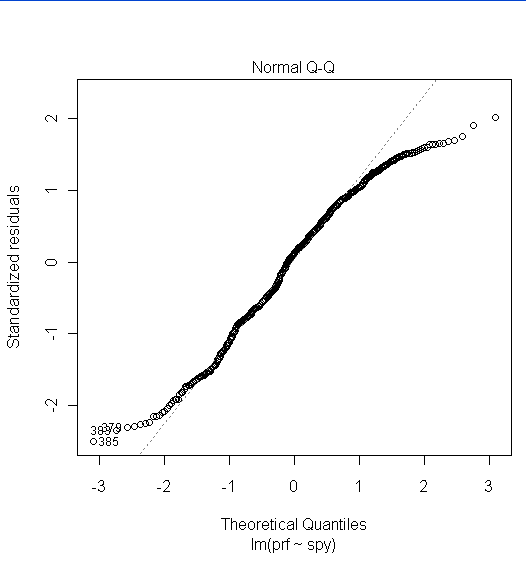
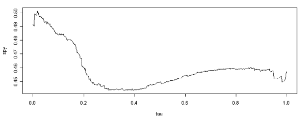

<!--yml

分类：未分类

日期：2024-05-18 13:56:25

-->

# 稳健统计学中的稳定性 | Quantivity

> 来源：[`quantivity.wordpress.com/2009/08/03/stability-by-quantile/#0001-01-01`](https://quantivity.wordpress.com/2009/08/03/stability-by-quantile/#0001-01-01)

稳定性是影响量化交易算法*一致性*最重要的因素之一。在牛市中有效的方法在熊市中不一定有效；在趋势市场中有效的方法在震荡市场中不一定有效。

稳定性重要性的例子比比皆是，最新的臭名昭著的例子就是通过[copula](http://en.wikipedia.org/wiki/Copula_(statistics))方法（由[Li](http://en.wikipedia.org/wiki/David_X._Li)在其经典文章“关于违约相关性：一种 copula 函数方法”，《固定收益杂志》9: 43-54） discredited 的[CDS](http://en.wikipedia.org/wiki/Collateralized_debt_obligation)定价。结果证明，相关性根本不是一个稳定的关联度量。其他来自量化交易的例子包括：

+   波动性：市场体制之间的相互关系和转换

+   分散度：指数波动与成分股波动之间的关系

+   板块轮动：市场板块、价值与增长之间的关系及相关因素

稳定性通常通过应用稳健统计学技术（动态系统应用提供了额外的技术，通常对数学家和物理学家更为熟悉）来评估。

稳健统计学特别有趣，因为它们与[三大骑士](https://quantivity.wordpress.com/2009/07/25/bias-stationarity-ergodicity/)（偏差、平稳性和 ergodic 性）的关系：

> 稳健统计学对由假设偏差产生的结果误差有抵抗力。

交易员对市场回报的“长尾”了如指掌，这反映了大多数金融市场都普遍存在的正超额[峰度](http://en.wikipedia.org/wiki/Kurtosis)（leptokurtosis，通常与[拉普拉斯分布](http://en.wikipedia.org/wiki/Laplace_distribution)相关）的现象：更多的方差是由于不频繁的极端偏差引起的，而不是频繁的小规模偏差。同样，任何在 2008-2009 年观察市场的人都能很容易地发现市场回报的方差随时间不是恒定的（正式称为[异方差性](http://en.wikipedia.org/wiki/Heteroskedasticity)）。然而，尽管这些普遍的熟悉，许多分析师仍然坚持使用经典的非稳健技术。

平均值与中位数（更一般地，[分位数](http://en.wikipedia.org/wiki/Quantile)）是稳定性的根本考虑之一，无论是直接还是间接。这可以通过修订先前的帖子中的 SPY-PRF 配对交易来证明。先前的帖子使用 OLS 估计 SPY 和 PRF 之间的协整关系。

从交易算法的角度来看，这种方法存在两个基本问题：

+   异常值：OLS 众所周知对异常值高度敏感（这已经相当频繁地发生了），这在考虑到配对交易的目的时尤其成问题，即找出异常值表现出特定期望行为的配对。

+   水平敏感性：OLS 估计一个参数值，不考虑水平。

忽略水平敏感性在统计套利中尤其成问题，因为它假设证券以相同的方式共同行为，而不管它们的值如何。这个假设在实践中通常是站不住脚的，正如通过比较最近市场底部（例如 2009 年 3 月）和市场顶部（例如 2007 年 10 月）的行为很容易证明的那样。

考虑到这些问题，要生成一致的交易结果，需要对稳定性进行仔细评估，回答诸如：“PRF-SPY 比率是否取决于 PRF 或 SPY 的水平？”和“如果是这样，在所有观察到的 PRF 和 SPY 值下，比率的范围是多少？”等问题。这些问题都是最小二乘法（OLS）和经典统计学无法回答的。

评估协整关系（如 PRF-SPY 对）稳定性的最简单方法之一是使用[分位数回归](http://en.wikipedia.org/wiki/Quantile_regression)，这是一种[稳健回归](http://en.wikipedia.org/wiki/Robust_regression)（注意[最小绝对偏差](http://en.wikipedia.org/wiki/Least_absolute_deviations)是拉普拉斯分布误差的[最大似然](http://en.wikipedia.org/wiki/Maximum_likelihood)估计，这很好地与上面讨论的长尾分布违反相一致）。这可以通过使用一些 R 代码快速完成。假设以下数据框设置：

`> prices <- read.table("prf-spy-all.txt", header = TRUE, sep = "\t")

> prf <- prices$PRF
> 
> spy <- prices$SPY

我们估计 OLS：

`> fm <- lm(prf ~ spy)`

考虑到 SPY 参数估计值为 0.4549 和截距为-7.3561，以及以下正态[Q-Q 图](http://en.wikipedia.org/wiki/Q-Q_plot)：

它们的尾巴明显与正态性相差很大，这表明应该仔细评估对的稳定性。使用分位数回归估计相同的关系（使用[quantreg](http://cran.r-project.org/web/packages/quantreg/index.html)cran 库）：

`> quantile <- rq(prf ~ spy, tau = -1, data = prices)`

这个估计是在所有分位数（tau = -1）上的关系。SPY 参数估计（即对冲比率）与分位数（tau）从零到 1.0 的图表：

这意味着，例如，SPY 对冲比率在零分位数时是 0.49（0.0 tau）而在中位数时是 0.45（0.50 tau）。这个图表很好地说明了稳定性（或缺乏稳定性），并为我们之前的价格对交易问题提供了图形答案：

**Q**：PRF-SPY 比率取决于 PRF 或 SPY 的水平吗？

**A**：是的。

**Q**：如果是这样，在 PRF 和 SPY 观察到的所有值下，比率的范围是多少？

**A**：SPY 对冲比率在分位数范围内从小于 0.45 到大于 0.50 不等，分位数与对冲比率之间没有清晰的线性关系。

翻译成交易术语：PRF/SPY 对冲比率在 PRF 价格最低分位数（低至 30 美元出头，对应于 10%的分位数）处增加到几乎 2:1（0.50）。在其他所有分位数（40-60）上，SPY 对冲比率下降到[0.45, 0.46]的范围内。

这些值与 OLS 估计的 0.4549 大不相同，并揭示了关于稳定性的关键见解：假设 0.45 估计的对子交易者，随着 PRF 降低到较低的分位数，会不断亏损，因为他们的对子残差持续偏离零。

绕着稳定性一圈回来，这个分析暗示了：如果 SPY-PRF 对子在 2007-2008 年期间被交易，其残差的平均值将是不稳定的。因此，*假设稳定性为 0.4549 的对子交易者，随着 PRF 降低到 30 美元的范围，可能会不断增加资本损失于残差偏离*。
