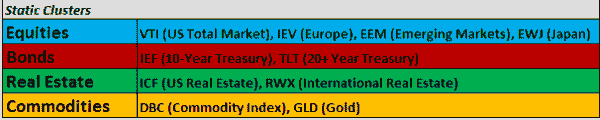
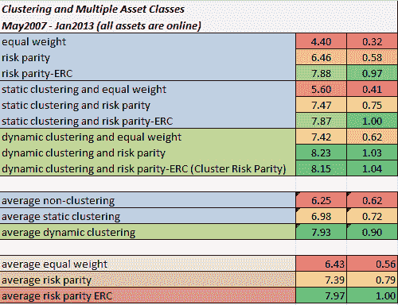

<!--yml

类别：未分类

日期：2024-05-12 18:02:03

-->

# Static versus Dynamic Clustering on Multiple Asset Classes | CSSA

> 来源：[`cssanalytics.wordpress.com/2013/01/19/static-versus-dynamic-clustering-on-multiple-asset-classes/#0001-01-01`](https://cssanalytics.wordpress.com/2013/01/19/static-versus-dynamic-clustering-on-multiple-asset-classes/#0001-01-01)

在上一篇文章中，我们研究了[道琼斯 30 股票的静态与动态聚类表现](https://cssanalytics.wordpress.com/2013/01/14/dynamic-versus-static-clustering-dow-30-stocks-1995-present/ "Dynamic versus Static Clustering: Dow 30 Stocks 1995- Present"). 研究同样的比较在多个资产类别上也合乎逻辑。Systematic Investor 的 Michael Kapler 对主要市场资产类别 ETF 进行了相同的测试以供比较。为了避免静态与动态聚类的扭曲，测试数据的起点设置为所有资产类别的 ETF 数据都可用的时间点。我们使用了“常识”方法进行静态聚类，这通常是投资者和交易者如何分类资产的：

所选的 ETF 覆盖了广泛的资产类别。对于动态聚类，我们再次使用了在“R”中称为“hcluster”的主成分聚类方法。请注意[集群风险平价](https://cssanalytics.wordpress.com/2013/01/03/cluster-risk-parity/ "Cluster Risk Parity")指的是使用动态聚类和风险平价分配在群组内和群组间——理想情况下使用[风险平价-ERC](https://cssanalytics.wordpress.com/2012/07/19/not-equal-a-comparison-of-risk-parity-and-equal-risk-contribution/ "Not Equal: A Comparison of “Risk Parity” and “Equal Risk Contribution”"), 或者说是风险贡献均等。测试比较如下：

虽然这不是一个长时间的回测，但我们看到结果与道琼斯 30 测试的先前的结果一致，也符合我们的逻辑预期：1) 集群风险平价在风险调整后的回报（以及在这种情况下）年化回报方面表现最佳 2) 动态聚类在回报和风险调整后的回报方面优于静态聚类 3) 静态聚类优于非聚类，所有聚类方法在回报和风险调整后的回报方面都优于非聚类。为进一步细分，我们还看到基于风险分配方法的自然排名进展：1) 所有风险平价变体在回报和更重要的是在风险调整后的回报方面优于等权重 2) 风险平价-ERC 超越了更基本的无风险平价方法- 这些方法不利用协方差信息。在这个数据集中，所有排名在数值上比道琼斯 30 测试分离得更大，这可以预期，因为资产的异质性比股票大。

通常，这些测试的目的是展示动态聚类的重要性，以及更精确的风险分配方法在投资组合管理中的作用。这两种方法的结合比单独使用任一种方法都能带来更优的风险控制和风险调整后的表现。尽管性能提升 somewhat 谦虚，但它们是相当一致的，更重要的是，它们使投资组合分配过程对由于宇宙指定产生的不利变异变得不那么敏感。实际上，通过这些方法的某些细化，可以避免在最初就需要仔细预选一个宇宙。这导致回测表现 less 可能与样本外结果相比被夸大。在一个完美的世界中，我们希望能够输入一个大量流动性好的可交易宇宙，并拥有一个基于一套预先指定的约束的多层次自我组装优化和分配过程。
