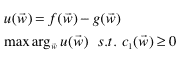
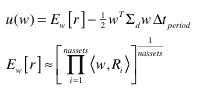
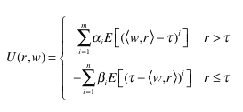
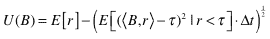

<!--yml

类别：未分类

日期：2024-05-18 15:35:10

-->

# Strategy Allocation | Tr8dr

> 来源：[`tr8dr.wordpress.com/2010/01/10/strategy-allocation/#0001-01-01`](https://tr8dr.wordpress.com/2010/01/10/strategy-allocation/#0001-01-01)

我感兴趣的是以一种平衡最大化回报和最小化方差下降的方式分配资本 across a series of strategies or assets. I haven't spent much time thinking about this previously, so this is a work in progress.

**均值-方差方法**

长期以来，传统上使用均值-方差方法进行投资组合分配。均值-方差方法的一个问题是，它不仅惩罚分布的“左侧”（负的），还惩罚“右侧”（正的）的额外回报。这是许多人认为夏普比率在投资者看待风险方面有缺陷的一个原因。

均值-方差方法对分布的**D**和**C**部分进行惩罚。投资者通常对超额回报（即 D 部分）感到满意，对方差下降的部分（即区域 A 和 C）感到不满意。我们更愿意接受分布右侧的全部回报，并尝试最小化左侧。

**低阶框架**

为了解决这个问题，我们可以使用非对称的方差度量，以关注表示我们风险的分布的部分。这样的函数族被称为“低阶函数”。低阶函数允许我们关注分布中的**A**和**C**部分（即方差下降的部分），而不将右侧视为风险的贡献。

低阶函数如下表示：

想法很简单，就是计算分布下某些阈值（比如 0）区域的阶数（度 m）。

对于风险度量，我们可能希望惩罚回报小于 0 的情况，或者或许惩罚回报小于无风险利率的情况。我们会根据我们希望惩罚的部分来选择τ。

**应用于投资组合**好吧，低阶似乎是一个度量下侧风险的好方法。我们如何将其纳入？让我们设定问题：

1.  让**R**代表回报矩阵

    每个时期一行，列数=资产或策略的数量。

1.  让**w**代表每个资产/策略的权重向量

1.  让**Σd**代表关于资产或策略集的回报的低阶协方差。

假设：

1.  让我们假设过去的业绩可以预示未来的业绩（我们稍后可以放宽这个条件）

1.  让我们假设负回报服从椭圆分布（即多元正态分布）

1.  让我们假设漂移与方差成比例增加

好吧，这些都是相当激进的假设，但它们允许我们第一次尝试整合这些内容。

我们需要创建一个混合上行和下行的效用函数，并受到各种约束。这里 f(w)表示凸效用函数中奖励正回报的部分，g(w)描述风险惩罚的函数。

（图片链接）

让我们将效用定义为下一时期（给定先前的回报）的预期回报和期间内预期负面回报成分（我们的风险）的加权平均：

（图片链接）

我们的效用函数的第一部分 E[r]表示观察到的平均回报，第二部分是负漂移（我们的下行风险）。E[r]可以用许多方法计算，例如：

+   作为过去回报的时间加权平均

+   作为一个带有季节性的回归模型

+   来自一个根据过去回报校准的随机模型

风险惩罚是 E[(τ – <w,r>)² | r < τ) · Δt 的一半，这近似于由Δt 表示的期间内的预期下行漂移。

上述内容有点临时，我可能重复计算了上行和下行风险，用 E[r]。我将不得不思考混合下部时刻测量和完整时刻测量的含义。

可能需要做一些调整，但已经概述了一个初步的惩罚回报的方法，希望到达一个更平衡的权重选择。

**附加说明**

一个更一般化的方法可能是将效用函数组成参数化的上部和下部时刻的和（Farinelli 和 Tibiletti 2002）。我已经对这个方法做了一些调整以适应我的问题：

（图片链接）

下部分的数量可以与上部分不同（或者简单地让一些时刻的系数为 0）。我在前一部分提出的是本质上这个函数对于 2 个时刻的系数{1,0}和{0,1/2}。

**附加说明 2**

效用函数应该是（漂移与 sqrt 成比例），我的错：

（图片链接）
