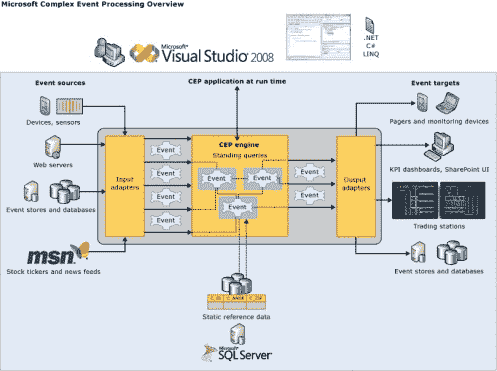

<!--yml

类别：未分类

日期：2024 年 5 月 18 日 06:09:59

-->

# StreamInsight CTP2 可在 MSDN 上获得 |来自交易桌的传说

> 来源：[`mdavey.wordpress.com/2009/08/19/streaminsight-ctp-available-on-msdn/#0001-01-01`](https://mdavey.wordpress.com/2009/08/19/streaminsight-ctp-available-on-msdn/#0001-01-01)

## StreamInsight CTP2 可在 MSDN 上获得

文档和示例可在此处获得[here](http://go.microsoft.com/fwlink/?LinkId=160598)。我从未见过 CTP1，不知道谁收到了那个。StreamInsight 事件流调试工具包含在发布中。

StreamInsight 可以托管或以独立模式运行（StreamInsightHost.exe）。支持三种开发模型 – 都支持通过 LINQ 表达式定义查询逻辑 🙂 。模型包括：

+   显式 – 通过允许应用程序开发者显式创建和注册所有必需的对象，提供一个完整的复杂事件处理（CEP）应用程序环境，以转换和处理进入和离开 CEP 服务器的 events

+   隐式 – 提供了一个易于使用的环境，隐藏了与显式模型相关的许多复杂性

+   IObservable/IObserver – 为事件源和接收器的生产者和消费者提供了一种替代输入和输出适配器的方法

对象模型示例似乎存在一些问题：

创建 CEP 服务器

创建 CEP 应用程序

注册事件类型

注册适配器工厂

注册 LINQ 查询模板

注册绑定查询

开始查询

‘cep:/Server/EventManager’的诊断视图：

所有事件计数：3

所有事件内存（字节）：69632

‘cep:/Server/PlanManager’的诊断视图：

查询计数：3

流计数：17

操作员计数：16

‘cep:/Server/Application/ObjectModelSample/Query/TrafficSens

orQuery’：

查询状态：已放弃

开始时间：2009 年 8 月 19 日 07:00:52

结束时间：2009 年 8 月 19 日 07:00:52

查询异常：Microsoft.ComplexEventProcessing.Engine.OperatorExecutionExcep

tion: The adapter ‘locationInput’ of type ‘CepSamples.InputAdapters.TextFileEdge

输入’，查询‘TrafficSensorQuery’，未能启动。—> System.FormatException

:字符串未识别为有效的 DateTime。

在 System.DateTimeParse.Parse(String s, DateTimeFormatInfo dtfi, DateTimeStyl

es 样式)

在 System.Convert.ToDateTime(String value, IFormatProvider provider)

在 CepSamples.InputAdapters.TextFileEdgeInput.CreateEventFromLine(String line

)在 c:\temp\cep\Samples\InputAdapters\TextFileInputAdapter\TextFileEdgeInput.cs

:line 257

在 CepSamples.InputAdapters.TextFileEdgeInput.ProduceEvents()中，文件路径为 c:\temp\cep\

Samples\InputAdapters\TextFileInputAdapter\TextFileEdgeInput.cs:line 144

在 CepSamples.InputAdapters.TextFileEdgeInput.Start()中，文件路径为 c:\temp\cep\Samples\

InputAdapters\TextFileInputAdapter\TextFileEdgeInput.cs:line 66

在 Microsoft.ComplexEventProcessing.Adapters.Adapter.ThreadProcStart(Object t

hisPtr)

—内异常堆栈跟踪结束—

流计数：0

操作符计数：0

总传入事件计数：2

总消耗事件计数：2

总生成事件计数：1

总发出事件计数：1

最后传入事件系统时间：2009 年 8 月 19 日 07:00:52

最后消耗事件系统时间：2009 年 8 月 19 日 07:00:52

最后生成事件系统时间：2009 年 8 月 19 日 07:00:52

最后发出事件系统时间：2009 年 8 月 19 日 07:00:52

总消耗事件延迟（毫秒）：32

总生成事件延迟（毫秒）：44

总发出事件延迟（毫秒）：47

最后生成的 CTI 时间戳：2001 年 1 月 1 日 00:00:00

流事件计数：0

包括事件的流内存（字节）：0

操作符索引事件计数：0

操作符事件内存（字节）：0

操作符索引内存（字节）：0

操作符调度总次数：4

总操作符 CPU 使用时间（毫秒）：0

~ mdavey 于 2009 年 8 月 19 日。

发布在[未分类](https://mdavey.wordpress.com/category/uncategorized/)

标签：[微软](https://mdavey.wordpress.com/tag/microsoft/)
