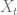

<!--yml

类别：未分类

日期：2024-05-17 23:40:05

-->

# 摆动期权：线性规划与动态规划 I – HPC-QuantLib

> 来源：[`hpcquantlib.wordpress.com/2011/05/29/swing-option-i-linear-vs-dynamic-programming/#0001-01-01`](https://hpcquantlib.wordpress.com/2011/05/29/swing-option-i-linear-vs-dynamic-programming/#0001-01-01)

为摆动期权寻找最优行使策略是一项挑战，即使对于简单的收益结构。在缺少复杂的时间积分约束的情况下，可以使用动态规划计算最优行使策略。对整个标的资产路径进行 *ex post* 的线性规划能够处理更复杂的时间积分约束，但该算法只能得到真实期权价格的上界 [1]。

一个基本的收益结构例如：在行使日期  时，决策变量  表示是否行使  或不行使  期权。收益为  对于看涨期权或  对于看跌期权。其中  是执行价格， 是即期价格。行使次数由

。

期权的摆动看涨期权价格由

![\text{npv} = \max_{\beta}\mathbb{E}^\mathbb{Q} \left[ \sum_{i=1}^N \beta_i \left( P(t_i) - K\right)e^{rt_i}\right]](img/81f6ce454db48d6841abb4b35ef23406.png)

令风险中性测度  下的标的资产价格动态为 Kluge 模型 [2]：

这个模型由一个奥恩斯坦-乌伦贝克（OU）过程，一个确定性的周期函数组成，用来描述季节性，还有一个均值回归过程以及跳跃来引入尖峰。是一个泊松过程，跳跃强度为，跳跃本身是指数分布。随机变量和是独立的。蒙特卡洛路径模拟将建立在标准 OU 过程和泊松跳跃扩散过程组件之上[3]。动态规划方法可以使用最小二乘蒙特卡洛*假设*（朗斯菲尔德-施瓦茨算法）或使用有限差分方法。我们更喜欢有限差分方法，以避免例如选择适当基函数集的问题。费曼-卡克定理导致相应的部分积分微分方程（PIDE）：

\ \begin{array}{rcl} rV =&&\frac{\partial V}{\partial t}+\frac{\sigma²}{2}\frac{\partial² V}{\partial x²} + \alpha(\mu(t)-x)\frac{\partial V}{\partial x}-\beta y\frac{\partial V}{\partial y}\\&+&\lambda \int_\mathbb{R} \left( V(x,y+z,t)-V(x,y,t)\right )\omega(z) dz \end{array} \

高斯-拉格朗日积分适用于计算 PIDE 的积分部分。除了这个二维 PIDE，还需要一个额外的维度来跟踪已经消耗的行权。三维公式与贝尔曼最优性原理一起，将全局优化问题转化为局部优化问题。

线性规划方法的目标是上界。

\[ \text{npv} \le \mathbb{E}^\mathbb{Q}\left[ \max_{\beta} \sum_{i=1}^N \beta_i\left(P(t_i) - K \right) e^{rt_i}\right] \](img/d3323d572751de6a4fb5675e5291b5cd.png)

线性规划算法将分别在每个蒙特卡洛路径上计算最优行权策略，以给定约束为基准（*完美预见*）。对于这种基本的摆动期权，线性规划有点过度设计，因为一个简单的排序算法也可以复制最优行权策略。但是，现在引入线性规划和小整数规划将使我们能够 later on to deal with more complicated time-integral constraints. 用于此任务的库是免费可用的，例如[GNU 线性规划套件](http://www.gnu.org/software/g

模型的测试参数化是

\ \alpha=1.0, \sigma=200\%, \mu(t)=3.0,\beta=5.0, \eta=2.0, \lambda=1.0, X_0=3.0, Y_0=0.0 \，

这个示例的摆动看涨期权到期日为一年，行权价格为 40，每月有一次行权机会，最低行权次数等于最高行权次数，。利率为。

正如上面的图表所示，对于这个设置，使用线性规划计算的摆动期权价格上限与基于格子动态规划计算的正确价格有显著差异。对于十二次行权机会，两种算法必须提供相同的结果，因为约束强制在每次行权日期行使。接下来是使用更现实的远期曲线和过程参数重新运行模拟。

代码可在此处[获得](http://hpc-quantlib.de/src/simpleswing.zip)。它依赖于[GNU 线性规划套件](http://www.gnu.org/software/glpk/)，用于并行化的[Boost 线程](http://www.boost.org)库，以及截至写作时最新的[QuantLib](http://www.quantlib.org)版本，来自[SVN 主干](http://sourceforge.net/p/quantlib/code/HEAD/tree/)。如果你想直接从 C++程序生成图表，还需要[R](http://www.r-project.org/)，[RCPP](http://cran.r-project.org/web/packages/Rcpp/index.html)和[RInside](http://cran.r-project.org/web/packages/RInside/index.html)。

[1] M. Burger, B. Graeber, G. Schindlmayr, 管理能源风险，ISDN 978-0-470-ß2962-6

[2] T. Kluge, [定价摆动期权及其他电力衍生品](http://eprints.maths.ox.ac.uk/246/1/kluge.pdf)

[3] P. Glasserman, 金融工程中的蒙特卡洛方法。ISBN-0387004513
