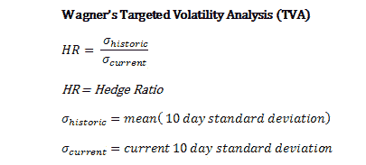

<!--yml

类别：未分类

日期：2024-05-12 18:23:46

-->

# 目标波动性分析 | CSSA

> 来源：[`cssanalytics.wordpress.com/2010/06/14/targeted-volatility-analysis/#0001-01-01`](https://cssanalytics.wordpress.com/2010/06/14/targeted-volatility-analysis/#0001-01-01)

交易中最被忽视的领域之一就是保持恒定的投注规模，以确保一致的风险调整后回报。大多数交易员没有明确地调整市场波动性，当市场剧烈波动时，不幸地投注错误方向可能会造成灾难性的影响。使用杠杆使这变得更加危险。然而，这一因素对长期持有投资者也有影响。投资组合管理基于为具有特定风险/回报概况的投资者创建资产配置，这基于预期回报和波动性。大多数被动投资组合保持对市场条件的恒定敞口，在像 2008 年这样的波动性激增年份，实际上可能会过度杠杆。

那么现场的投资组合经理是如何处理这些问题的呢？博客的好友 Jerry Wagner 在这方面有丰富的决策经验，他曾是[Flexible Plan Investments](http://www.flexibleplan.com/)的总裁。CSS 最近参加了在奥兰多举办的[NAAIM Uncommon Knowledge 2010 Conference](http://www.naaim.org/annualconference.aspx)，Jerry 在那里介绍了一种使用当前和历史波动性进行头寸规模/对冲的有趣技术。这是关于 Secret Sauce Trading Seminar 的系列报道的第一部分，其中我们的 CSS 研究人员 David Abrams 也提交了一份论文。那么 Jerry 的秘诀是什么，以解决保持投资组合恒定波动性的问题呢？这个方程实际上非常简单，却又数学上优雅：

你可以无论是否使用杠杆都将此纳入自己的交易中。以下是使用杠杆的方法：

如果（HR < 1）则头寸规模 = 1 - HR

如果（HR >1 且 HR<2）则头寸规模= HR

如果（HR> 2）则头寸规模 = 2

头寸规模为 1 意味着满仓，2 意味着 100%杠杆。因此，对冲比率（HR>1 且 HR<2）意味着杠杆（HR-1）。这的好处是持续根据历史波动性与当前波动性的比率调整头寸规模。分子可以通过波动性乘数进行调整，以“目标”特定的波动水平，使你的系统更加保守或激进。

让我们来看一个例子。

|  | **年化复合增长率** | **每日标准差** | **夏普比率** | **DVR** | **最大回撤** |
| --- | --- | --- | --- | --- | --- |
| **买入持有** | 7.29% | 1.25% | 36.66% | 0.01% | -55.19% |
| **TVA（无杠杆）** | 6.55% | 0.84% | 49.14% | 0.02% | -34.09% |
| **TVA（200%杠杆）** | 7.59% | 0.79% | 60.35% | 0.05% | -30.58% |

下图展示了如何使用 TVA 和杠杆来控制头寸规模的简单长期策略，这种策略可以将最大回撤减少一半，同时几乎将夏普比率翻倍，并且略微增加年化复合增长率。

尽管明确使用了杠杆，但得出的权益曲线比买入并持有分配要稳定得多。在未来的文章中，我们将探讨如何将波动性和其他指标纳入头寸规模。这些将整合到我们的系统投资组合管理工具中。杰瑞，干得好！
