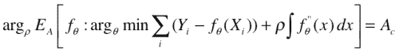
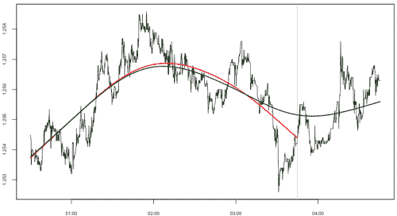

```yml

类别：未分类

日期：2024-05-18 15:37:50

-->

# “均值”，再次尝试 | Tr8dr

> 来源：[`tr8dr.wordpress.com/2009/11/04/the-mean-take-2/#0001-01-01`](https://tr8dr.wordpress.com/2009/11/04/the-mean-take-2/#0001-01-01)

2009 年 11 月 4 日 · 1:01 pm

思考先前的帖子，我对那种方法不满意，因为它没有以明确的方式量化均值和价格与均值的关系。

让我们检查系统应表示的各种属性：

1.  ∫Y[t] – μ[t] 应该接近于 0

    这意味着均值的过程在时间/距离上在均值以下和以上之间保持平衡。

1.  平均最大振幅应达到目标振幅

    我们希望有一个可预测的均值回归过程。确保均值允许一些平均最大偏差是一种方法。我们将与演变分布的振幅一起工作，以修改均值的行为。

1.  应该平滑且连续，除了跳跃之外

    也就是说，我们最小化 μ”(t)² 的积分，与其他约束以某种比例进行。或者我们可以要求一个 AR(p) 过程提供与先前的 μ(t) 观察值连续性。

**后验方法**

事后解决这个问题相对简单，我们找到一个满足上述要求的回归器 f(t)。观察价格差异的最小值和最大值，以便我们可以将其整合到方程系统中。

假设我们有回归器 f(t)，以及一个评估回归器上平均振幅的函数 Ea (f)，我们可以表示为：



这个问题是，尽管它在评估的数据集上是最优的，但相对于未来的 Yi 值，它很可能不是最优的。观察回归器如何不同（红色与原始数据系列，绿色与额外一个小时的数据相对）：



初始回归器（红色）在额外一个小时的数据显示下已不再是最优的。现在的绿色回归器代表了最优解。这种分析指向了确定一个“在线”均值估计的方向，该估计在概率上有效。

**在线方法**

我目前还没有具体的解决方案，所以接下来的内容是一个思路链：

+   使用带有约束的演变随机三次系统来引导系数过程（上述和如何约束）。

+   或者将均值模型化为一个自回归过程，创新性与运行方差估计成比例。将方差和平稳持续期等同，得出“创新”的数量以及因此允许的均值偏差。

+   上述方法的一种变体是对 AR 系数进行调整，以响应波动的变化。

随着想法的成熟我会进行更新…
