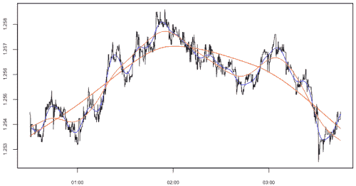

<!--yml

类别：未分类

日期：2024-05-18 15:38:46

-->

# 在均值回归过程中的“均值”| Tr8dr

> 来源：[`tr8dr.wordpress.com/2009/11/03/the-mean-in-the-context-of-a-mean-reverting-process/#0001-01-01`](https://tr8dr.wordpress.com/2009/11/03/the-mean-in-the-context-of-a-mean-reverting-process/#0001-01-01)

我们知道，价格过程在多个时间尺度上表现出均值回归的特点。假设有人想要测量价格 X[t]与均值 E[X[t]]之间的距离。价格过程的均值特别难以建模，因为该过程是非平稳的。在期权建模中的标准方法是围绕一个近似平稳的过程（如对数回报）来进行建模。

我对经验价格到均值的距离感兴趣。可以将对数回报的和作为价格的代理，但经验回报非常嘈杂，均值回归方面会丢失。这在连续模型中可行，但在经验模型中需要一些平滑处理才能有意义。

**“均值”**

再次关注均值，在非平稳过程中，我们可以根据关注的时间尺度对均值采取不同的看法。以下是通过价格序列得到的不同均值的一个例子（作为惩罚最小二乘回归的结果）：

随机变量的均值定义为变量 E[X]的期望值。这很好，但是 E[x]依赖于模型，也依赖于我们想要的时间尺度上的均值回归。在上面的例子中，所有的回归线代表均值的合理值，并且在最小二乘意义上是最优的，所以我们应该选择哪个“均值”，以及产生它的过程是什么？

**建模问题**

最终，我希望能提出一个经验性的、离散的、状态系统，使我能够从最大似然观点估计均值作为一个隐藏状态。与“波动率”一样，均值并不是真正可观测的。模型需要表达以下内容：

1.  表示关注的均值回归时间尺度

1.  处理跳跃/制度变化时的平均值

1.  均值是时间的函数

1.  方差是时间的函数

**模型**

均值回归模型的一个常见起点是*奥恩斯坦-乌伦贝克过程*：

注意，这表达了一个长期均值（常数）μ，一个均值回归系数（常数）κ，以及一个标准差（常数）σ。也要注意，这是一个模拟价格变化（通常是逻辑变化）的过程。

**Hull-White 模型**进一步允许均值和标准差随时间变化。最后，**扩展 Vasicek 模型**允许均值回归常数随时间变化：

好吧，有几个问题。我们还没有解决价格运动的跳跃方面，同时也需要将这转化为一个离散的经验过程。引入跳跃组件的一种方法是修改上述公式以包括跳跃过程 dQ（注意我已经调整了均值回归过程为一个常数，以便我们稍后求解μ(t)）：

这并不是最复杂的模型，然而，为了建模目的，均值应该是有用的。

**离散形式**让我们先忽略跳跃组件，得出混合模型中高斯成分的离散公式。一般的高斯马尔可夫过程具有以下形式：

我们得到以下解决方案：

对于我们方程来说，这可以简化为：

或者在时间 t-Δt 和 t 之间：

现在我们已经足够形成一个状态系统。我们将假设在Δt 内的波动性或均值变化足够小，以至于可以假设在Δt 内的积分波动性和均值是常数。

首先我们需要决定一个过程来表达方差。对于日收益，我们可以使用 GARCH(1,1)，对于日内则需要一个替代模型：

在均值回归 SDE 的离散增量Δt 内，波动性按以下方式缩放：

我们将均值表达为一个 AR(2)过程，但放在更大的状态系统中，这样它就可以接受来自均值回归过程（通过递归反馈）的“创新”：

我们可以很容易地将这个状态系统在粒子滤波器中表达出来，以找到最大似然参数（假设κ为常数）。

**处理跳跃**鉴于我们不是以预测方式使用这个 SDE，我们可以将跳跃作为点过程引入，或者作为我们观察市场跳跃时的累积变量。例如，可以将均值过程重新表达为：

**结论**

我们此行的目标是确定一个准确的均值衡量标准，从模型/最大似然的角度来看，我们可以认为它是最佳的。我现在需要把这个状态系统实现到粒子滤波器中，并确定它的有效性。可能需要一些改进。这是一个进行中的工作，请期待进一步的更新...
