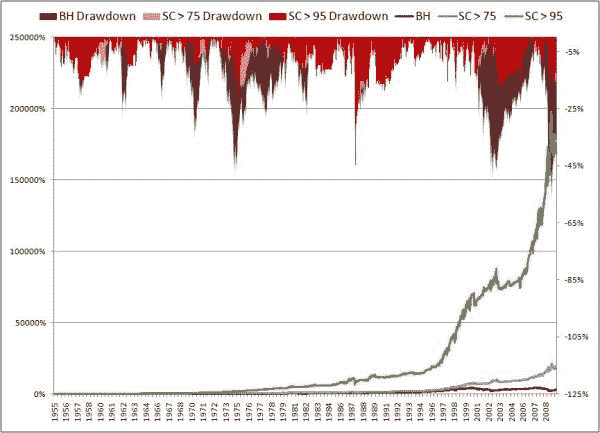

<!--yml

分类：未分类

日期：2024-05-12 18:48:23

-->

# 适应性时间机器：统计过滤的重要性 | CSSA

> 来源：[`cssanalytics.wordpress.com/2009/09/16/the-adaptive-time-machine-the-importance-of-statistical-filters/#0001-01-01`](https://cssanalytics.wordpress.com/2009/09/16/the-adaptive-time-machine-the-importance-of-statistical-filters/#0001-01-01)

**注意：** *对于高级量化群体来说，使用怀特现实检查的引导测试是避免数据挖掘偏差（即随机重新采样，通过减去标普 500 回报进行数据去趋势）的更合适的置信度衡量标准。*

回到我们的小实验[`cssanalytics.wordpress.com/2009/09/14/busting-the-efficient-markets-hypothesis-the-adaptive-market-time-machine/`](https://cssanalytics.wordpress.com/2009/09/14/busting-the-efficient-markets-hypothesis-the-adaptive-market-time-machine/)和方法[`cssanalytics.wordpress.com/2009/09/15/creating-the-adaptive-time-machine/`](https://cssanalytics.wordpress.com/2009/09/15/creating-the-adaptive-time-machine/)，回忆一下，我们的机器可以选择 50 种策略。它可以在上涨或下跌的任意组合上进行买入或卖出。问题是我们应该关注哪些策略？那些理解市场收益时间序列的人知道，为了避免交易噪音，需要过滤掉相当一部分随机性。过滤策略的一种方法是 T 统计量[`en.wikipedia.org/wiki/T-statistic`](http://en.wikipedia.org/wiki/T-statistic)。T 统计量或 T 分数的基本原理是帮助你得出一个策略具有统计学上不同于零的平均值的置信度。这是一个不错的开始，因为置信度低的策略更有可能是随机效应。科学家通常使用 95%作为区分偶然效应和系统效应所需的置信度标准。现在将这个指标应用于时间序列数据有点复杂，但超出了本文的范围。像我的 MarketSci 同事 Michael Stokes[`marketsci.wordpress.com/`](http://marketsci.wordpress.com/)和我的交易专家朋友 Frank at Trading the Odds[`www.tradingtheodds.com/`](http://www.tradingtheodds.com/)都频繁使用这个统计量和置信度的概念。

为了进行我们的第一次测试，我们选择了从 1955 年到现在的标普 500 数据。首先我们测试了买入持有策略，然后测试了基于均值回归偏见（即在下跌行情中买入，在上涨行情中卖出）或标准跟进或趋势偏见的基准策略。然后我们使用了 t 统计量创建了三个过滤器：1) 最低 50%置信度 2) 最低 75%置信度和 3) 最低 95%置信度。然后根据 t 检验指示的方向交易策略——即如果 t 统计量是负的，我们交易策略短线；如果是正的，我们交易策略长线。注意，这个方法是“无偏见”的，因为我们不在乎策略交易的方向。置信度数字是使用 3 年和 1 年时间的窗口组合计算得出的。请注意，即使是在 95%置信度下，我们平均同时交易了 7 个策略，而在 75%置信度下我们交易了 24 个，在 50%置信度下我们交易了 32 个。这与选择“最佳方法”不同。这也帮助验证了过滤器的健壮性。让我们看看这个过滤器与各种基准表现如何：

请注意，每个置信水平的表现都优于其他水平，股票曲线非常平滑，能够在各种制度中进行适应。对于 50%、75%和 95%的置信度，年回报率和夏普比率都远胜于买入持有策略。这是有道理的，因为即使是 50%的置信度，也会包含超过 95%置信度的策略。作为一个深层次的思考，市场本质上是由成千上万策略组成的股票曲线，其中许多是基于判断而非统计数据执行的。因此，市场的随机成分实际上相当高，避免低置信度策略可以轻松击败买入持有策略。所有策略也轻松击败了均值回归或跟进偏见。这显示了这个简单算法适应性有多强，它能从正在发挥作用的地方学习并重新分配资本。在下一系列的帖子中，我们将研究选择策略的其他方法以及进一步提高性能。
