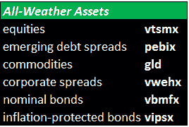
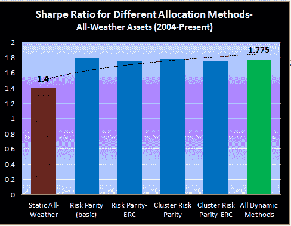

<!--yml

分类：未分类

日期：2024-05-12 18:01:48

-->

# 全天候投资组合：静态还是动态风险分配？ | CSSA

> 来源：[`cssanalytics.wordpress.com/2013/01/29/the-all-weather-portfolio-static-or-dynamic-risk-allocation/#0001-01-01`](https://cssanalytics.wordpress.com/2013/01/29/the-all-weather-portfolio-static-or-dynamic-risk-allocation/#0001-01-01)

**[全天候投资组合](https://cssanalytics.wordpress.com/2012/11/07/the-all-weather-portfolio-derivation/ "全天候投资组合 推导")** 由 **雷·达里奥** 设计（显然受到了 **哈里·布朗** 的**[永久投资组合](https://cssanalytics.wordpress.com/2012/11/01/permanent-portfolio-derivation-and-historical-performance/ "永久投资组合推导和历史表现")**的影响），旨在为投资者提供一种稳健的静态分配，可确保长期一致的业绩。该投资组合的构建逻辑是对抗通胀或经济增长的风险/不确定性——这两大因素被认为是解释所有资产回报的全部。资产分配是根据每种资产对这些因素变化的长期预期敏感度来决定的——基于它们是相对于历史标准显著上升还是下降。

我们知道，采用上述方法的“静态”全气候投资组合有着非常好的长期业绩记录作为支撑。更有趣的问题是，是否使用动态风险分配可以超越静态方法的表现。从理论上讲，风险输入——尤其是标准差——在动态环境中应该很容易建模，因为它们相对可预测。此外，我们并不一定需要预先指定资产之间的关系，因为我们可以通过[聚类](https://cssanalytics.wordpress.com/2013/01/10/a-visual-of-current-major-market-clusters/ "A Visual of Current Major Market Clusters")观察它们变化的关系。由于全气候方法通常被认为与[风险平价](https://cssanalytics.wordpress.com/2012/07/19/not-equal-a-comparison-of-risk-parity-and-equal-risk-contribution/ "Not Equal: A Comparison of “Risk Parity” and “Equal Risk Contribution”")可互换，因此很有趣的是，使用相同资产的纯粹机械和动态风险平价方法是否表现更佳。系统投资者（Systematic Investor）的**Michael Kapler**在 R 语言中使用了不同的风险平价变体进行了以下测试。我们还展示了更复杂的[聚类风险平价](https://cssanalytics.wordpress.com/2013/01/06/cluster-risk-parity-crp-versus-risk-parity-rp-and-equal-risk-contribution-erc/ "Cluster Risk Parity (CRP) versus Risk Parity (RP) and Equal Risk Contribution (ERC)")（Kapler, Varadi, 2012），它消除了投资组合分配中的宇宙偏差，提供了更精确的风险分配。下面用于表示不同资产类别的资产是基金和 ETF 的组合，以最大化数据历史：

（[点击查看](https://cssanalytics.files.wordpress.com/2013/01/all-weather-assets.png)）

下表展示了静态全气候投资组合与动态变体的相对风险调整表现。

（[点击查看](https://cssanalytics.files.wordpress.com/2013/01/all-weather-perf-dynam-static.png)）

我们可以看到，所有动态方法在风险调整回报方面的表现都优于静态方法，优势相当显著。这表明，每个资产类别 changing risk and correlations 已经反映了对于经济因子风险（既通货膨胀和经济增长）变化的预期。此外，这些变化可以通过观察最近的历史数据来预测。另外，我们还可以看到，风险平价更复杂版本（ERC 和聚类变体）略逊于忽略证券之间相关性且只使用风险信息的简单风险平价版本。这可能意味着资产之间存在恒定的相关性，或者这些不同资产的精心选择已经反映了一种内嵌的静态聚类方法（这使得在动态背景下，相关性信息比风险更不重要）。由于[之前的测试](https://cssanalytics.wordpress.com/2013/01/19/static-versus-dynamic-clustering-on-multiple-asset-classes/ "Static versus Dynamic Clustering on Multiple Asset Classes")证明了聚类方法（无论是静态还是动态）优于基本的 risk parity，这暗示所选择的宇宙是一个好的静态聚类方法。总之，结果至少表明动态风险分配是创建有效的“全天候”投资组合的一个有效途径。在实际操作中，使用具有多样性和大规模资产池的聚类风险平价是捕捉这一特征同时避免许多预先设定的最简便方法。
