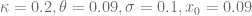

可以使用 Mathematica 计算非中心卡方分布的前 n 个矩，并将其导出为纯 C 代码，以便集成到 QuantLib 中。


<!--yml

# 具有平方根核过程的 CLV 模型 - HPC-QuantLib

> 类别：未分类

Collocating Local Volatility（CLV）模型的核心过程[1]定义了模型的前期偏斜动态。虽然 Ornstein-Uhlenbeck 过程具有一些良好的分析特性，但有时对前期偏斜动态的控制力度不够。平方根过程


是一种有前景的核心，以更好地控制前期偏斜。首先，对于平方根过程，精确抽样非常容易。给定，的概率密度函数为

来源：[`hpcquantlib.wordpress.com/2016/11/02/the-clv-model-with-a-square-root-kernel-process/#0001-01-01`](https://hpcquantlib.wordpress.com/2016/11/02/the-clv-model-with-a-square-root-kernel-process/#0001-01-01)

其中表示自由度为 d 的非中心卡方分布，非中心参数


日期：2024-05-17 23:26:53


boost 库提供了非中心卡方累积分布函数的逆的高效准确实现，该函数可用于精确的蒙特卡罗抽样方案。

最佳的拟合点由高斯求积点给出，其由对应正交多项式的零点定义。正交多项式由递推关系定义，拟合点由对角线为和副对角线为的对称三对角矩阵的特征值给出。同样，这些向量由递推关系定义[2]

-->

-->

```
m[n_] := CForm[ Expectation[X^n, X \[Distributed]
NoncentralChiSquareDistribution[d, lambda]] // Simplify]

```

使用双精度解决递推关系通常是病态的。因此，结果方程将使用 Boost.Multiprecision 包的 cpp_dec_float 后端（仅标头且无依赖性）来解决。结果已根据[3]中的提案进行了测试。对于任何合理数量的插值点，精度高达 100 位似乎是足够的。另一方面，即使使用 100 位，计算速度也非常快。特征值计算使用标准双精度进行。

实施校准例程的方式与 Ornstein-Uhlenbeck 核过程相同。尽管涉及多精度算术，与其他结构化模型相比，校准速度快且准确。

**示例：前期波动率偏斜**

+   市场价格由 Heston 模型给出

.

+   SquareRoot-CLV 核过程参数由以下给出



下图显示了从 0.5 到 2 变化的摩尼尼斯的前期欧式期权的隐含波动率，并在重设日期后六个月到期。


相同的图，但使用平方根核过程的以下参数


源代码可在[此处](http://hpc-quantlib.de/src/squarerootclvmodel.zip)获取。该代码处于早期阶段，需要进行更多测试/清理才能进行拉取请求。下一步将是校准这样的 CIR-CLV 模型到 Heston 随机局部波动率模型的前期偏斜动态。

[1] A. Grzelak，2016，[CLV 框架-高效定价的新视角](http://papers.ssrn.com/sol3/papers.cfm?abstract_id=2747541)

[2] M. Morandi Cecchi 和 M. Redivo Zaglia，[计算系数](http://ac.els-cdn.com/0377042793901522/1-s2.0-0377042793901522-main.pdf?_tid=643d5dca-a05d-11e6-9a56-00000aab0f27&acdnat=1478023545_cf7c87cba4cc9e37a136e68a2564d411) [的循环公式](http://ac.els-cdn.com/0377042793901522/1-s2.0-0377042793901522-main.pdf?_tid=643d5dca-a05d-11e6-9a56-00000aab0f27&acdnat=1478023545_cf7c87cba4cc9e37a136e68a2564d411) [用于数值积分的时刻和](http://ac.els-cdn.com/0377042793901522/1-s2.0-0377042793901522-main.pdf?_tid=643d5dca-a05d-11e6-9a56-00000aab0f27&acdnat=1478023545_cf7c87cba4cc9e37a136e68a2564d411) [修改后的时刻。](http://ac.els-cdn.com/0377042793901522/1-s2.0-0377042793901522-main.pdf?_tid=643d5dca-a05d-11e6-9a56-00000aab0f27&acdnat=1478023545_cf7c87cba4cc9e37a136e68a2564d411)

[3] Walter Gautschi，[如何以及如何不检查高斯积分公式。](https://www.cs.purdue.edu/homes/wxg/selected_works/section_08/084.pdf)
