<!--yml

类别：未分类

日期：2024-05-17 23:27:39

-->

# 校准局部波动率模型 – HPC-QuantLib

> 来源：[`hpcquantlib.wordpress.com/2016/09/11/the-collocating-local-volatility-model/#0001-01-01`](https://hpcquantlib.wordpress.com/2016/09/11/the-collocating-local-volatility-model/#0001-01-01)

在最近的一篇论文[1]中，Lech Grzelak 引入了他的校准局部波动率模型（CLV）。该模型利用所谓的校准方法[2]将任意核过程的累积分布函数映射到从期权市场报价中提取的真实累积分布函数（CDF）。

校准局部波动率模型的起点是标的资产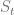在时间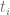的市场暗示 CDF：

过程的动态应由某个随机过程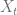和一个确定性的映射函数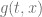给出，使得

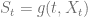

映射函数确保了由 CLV 模型给出的的期末分布与市场暗示的 CDF 相匹配。然后模型读作

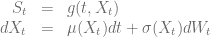

选择随机过程不会影响欧式看涨期权的价格——它们由市场暗示的期末 CDF 给出——但会影响模型生成的远期波动率偏斜的动态，因此影响更复杂期权的 prices. 选择一个可追踪的分析过程以减少计算工作量是可取的。

[2]中概述的配点方法定义了一种有效的算法，可基于一组到期日 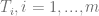 和每个到期日 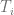 的 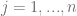 插值点近似映射函数 。令 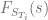 为给定到期日  的市场隐含 CDF。然后我们得到

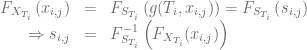

对于带有 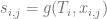 的配点。

最佳配点由 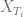 的终端分布的高斯积分的横坐标给出。最简单的选择是一个类似于 Ornstein-Uhlenbeck 过程的正态分布内核过程 。

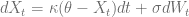。

正态-CLV 模型的相应配点由以下给出

![\begin{array}{rcl} x_j(t) &=& \mathbb{E}\left[X_t\right] + \sqrt{\mathbb{V}ar\left[X_t\right]} x_j^{\mathcal{N}(0,1)}  \nonumber \\ &=& \theta + \left(X_0 - \theta)e^{-\kappa t}\right) + \sqrt{\frac{\sigma²}{2\kappa}\left(1-e^{-2\kappa t}\right)} x_j^{\mathcal{N}(0,1)}, \ j=1,...,n\end{array}](img/a06b465580b3b248792efa2389ca3ff8.png)

使用 QuantLib 的 Gauss-Hermite 积分实现可以计算标准正态分布的配点 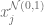。

```
Array abscissas = std::sqrt(2)*GaussHermiteIntegration(n).x()

```

拉格朗日插值多项式[3]是一种有效的插值方案，可用于插值配点之间的映射函数 。

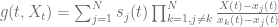

严格来说，拉格朗日插值多项式不保留单调性，人们也可以使用 QuantLib 的样条插值例程支持的单调插值方案。正如[2]所述，此方法也可以用于近似“昂贵”分布的逆 CDF。

因此，将正态-CLV 模型校准到市场价格非常快速和简单，因为它需要校准 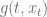。

蒙特卡洛定价意味着模拟可追踪过程并评估如果需要现货过程\frac{\partial V}{\partial x} + \frac{1}{2}\sigma²(x)\frac{\partial² V}{\partial x²}-rV = 0](img/b661d6810fc338425b8833f9242f9cb4.png)。

在到期时间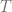时的终值条件

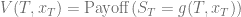。

对于普通香草期权，上边界和下边界条件为

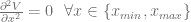。

**示例 1：普通香草期权的定价误差**

+   市场价格由布莱克-舒尔斯-默顿模型给出，

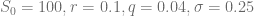。

+   普通-CLV 过程参数由

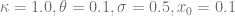。

使用了十个节点来定义映射函数，到期时间为一年。下面的图表显示了基于 PDE 解的普通正态-CLV 价格的隐含波动率与真实值的 25%之间的偏差。

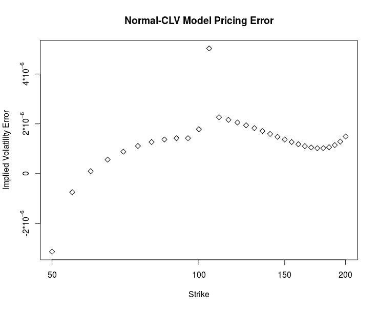。

即使已经使用了十个节点，就已经足够获得非常小的定价误差。如果在节点数增多时，[2]中的建议——扩展节点网格，已经被证明是非常有效的。

**示例 2：波动率曲线的斜率**

+   市场价格由 Heston 模型给出，

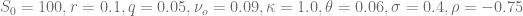。

+   普通-CLV 过程参数由

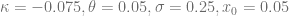。

下面的图表显示了一种欧式看涨期权（forward starting）的隐含波动率，该期权的行权价从 0.5 到 2 不等，且在重置日之后六个月到期。

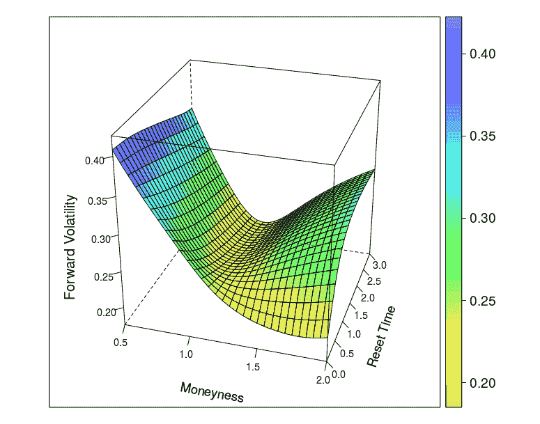。

**参考文献**

毫不奇怪，1Y 双触点期权的价格在与正态-CLV 模型和海森-SLV 模型下所示的“八字胡”图表中表现出类似的模式。但是，使用正态-CLV 模型的计算工作量远小于校准和解决海森-SLV 模型的努力。

+   Market prices are given by the Heston model with

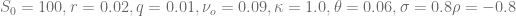.

+   Normal-CLV process parameters are given by different  values and

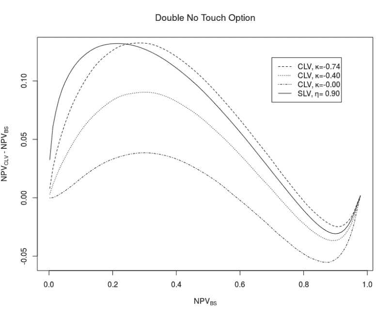

[2] L.A. Grzelak, J.A.S. Witteveen, M.Suárez-Taboada, C.W. Oosterlee,

[The Stochastic Collocation Monte Carlo Sampler: Highly efficient sampling from “expensive” distributions](http://papers.ssrn.com/sol3/papers.cfm?abstract_id=2529691)

The QuantLib implementation of the Normal-CLV model is available as a pull request [#117](https://github.com/lballabio/QuantLib/pull/117), the [Rcpp](https://cran.r-project.org/web/packages/Rcpp/index.html) based package [Rclv](http://hpc-quantlib.de/src/Rclv.tgz) contains the R interface to the QuantLib implementation and the demo code for all three examples.

正态-CLV 模型的远期波动率表面与具有大混合角度  的更复杂的海森或海森随机局部波动（Heston-SLV）模型的表面有重要的相似性。但是，正态-CLV 模型的本质使得远期波动率不依赖于 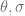 或 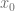 的值，这限制了该模型可以创建的不同远期偏斜动态的多样性。非正态核过程的 CLV 模型将支持更大的多样性。

**示例 3：双触点期权的定价**

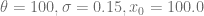

[1] A. Grzelak, 2016, [The CLV Framework – A Fresh Look at Efficient Pricing with Smile](http://papers.ssrn.com/sol3/papers.cfm?abstract_id=2747541)
