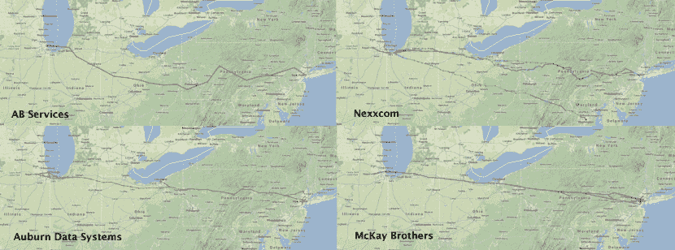

<!--yml

类别：未分类

日期：2024-05-18 14:24:18

-->

# 大联储抢劫：新证据 - 马瓦狙击手和朋友们

> 来源：[`sniperinmahwah.wordpress.com/2013/12/04/the-fed-robbery-new-evidence/#0001-01-01`](https://sniperinmahwah.wordpress.com/2013/12/04/the-fed-robbery-new-evidence/#0001-01-01)

**附录 2 [13/7/2013, 06:10:00:0001 EST]**

看来，在下面附录中复制的 Virtu 代表的引文是由 Rosenblatt Securities 出版和分发的“*一份机密报告的摘录*”（我不知道引文的来源，有人匿名发给我），这份报告是“*私人的*”。Rosenblatt 发送了一封电子邮件，并要求我删除这段文字，因为它构成了对[他们]知识产权的未经授权的重新分配”。PS：一些人可能写道我是一名记者，但我只是一名人类学家，研究“市场的本质” - 从风险/资本/套利/价值的中世纪起源到当代的硅谷交易员。

**附录 [12/7/13, 14:10:00:0001 EST]**

十月初，大约在 Virtu 发布了关于大联储抢劫的[自己的数据](http://www.virtu.com/news-22/study-of-federal-reserve.html)大约一周后，Virtu 的一位高级代表在交易所的高管面前发表讲话，并说：“©©©©© ©© ©©©©©©©© ©©©© ©©©©©©©© ©©©©© ©© ©©©©© ©©©©©©©。©©© ©©©©©©©© ©© ©©©© ©©©© ©©©©©。©©© ©©©©©©© ©© ©©©© ©©© ©©© ©©©© ©©©© ©©© ©©©© ©©© ©©© ©©©© ©©©©©© ©©©©©©© ©©© ©©©©©© ©©© ©©© ©©© ©© ©© ©© ©©©©©©©©©©©©© ©©©©©©。©©It seems there is some YAML content included in the text. Let me know if you want me to translate that as well.

上帝保佑 Nanex！我不认为 Nanex 真的与肯尼迪暗杀事件有关（毕竟，我们不知道子弹的速度 - 毫秒级的精度 - 是多少）；是的，Nanex 可能是个 Twitter 上瘾的人（有什么问题吗？）；是的，图表可能会导致不同的解释（这是一个认识论问题）；是的，在这个世界上，没有人能百分之百正确 - 但有些人可能百分之百错误。在大联储抢劫案中，不幸的是，麦凯兄弟的研究似乎毫不犹豫地证明了 Virtu 是百分之百错误的，Nanex 是百分之百正确的，就是这样。现在，让我们继续前进。

[下面的帖子是在东部时间上午 10:00:00:0000 从一个安全的封闭房间发布的。]

**时间与空间**

« *通往密尔沃基、拉辛、南波特和芝加哥。——我们以闪电之速向你们这些西部的美丽姐妹致敬。时间已被消灭。不要让任何不和的元素将我们分开。愿你们的繁荣如昔日般继续前进。莫尔斯所发明、速度所结合的，不要让任何男人将其拆散* »。这是 1848 年 1 月 15 日芝加哥收到的第一条电报信息，它宣告了 1848 年是风城“机器崛起”的一年。二月，第一台蒸汽驱动的谷物升降机取代了旧的马拉升降机。三月，加莱纳和芝加哥联合铁路开始运营。四月，伊利诺伊和密歇根运河终于向交通开放。所有这些新技术使芝加哥能够从草原上收集越来越多的谷物，最终在成立了第一芝加哥交易所来组织谷物交易：芝加哥商品交易所（CBOT）。

技术对交易所始终至关重要，因为市场是通过信息流来运作的，而信息需要被运输。第一条电报信息花了 18 个小时才从底特律到达芝加哥，但很快速度就提高了，风城与纽约之间的信息可以在几秒钟内传输。电报被视为“*国家的神经系统*”、“*一个巨大的血管系统，它将心脏的跳动传递到最远的极端*”，在第一个“先到”产品的开发中发挥了重要作用，因为产品——比如说，中西部的谷物——不能像产品的*价格*一样快地到达纽约。在 CBOT 于 1857 年提出第一个官方*期货*产品之前，“产品与其价格之间的解脱”促使纽约的交易员认为那张印有价格的纸片*就是产品本身*。

« *时间已被消灭* », 1848 年第一条电报推特这样说。十年后，在《政治经济学批判大纲》（当时未发表）中，卡尔·马克思写道，资本主义就像一台机器，导致了“*通过时间消灭空间* ”。也许马克思对空间的说法是对的：2013 年，芝加哥期权交易所（CBOE）不再位于伊利诺伊州的芝加哥，而是位于新泽西州的 Secaucus。地理发生了变化，但时间从未被消灭，高频交易证明了这一点：旧交易大厅的空间变成了匹配引擎，旧的人类交易员变成了算法（实际上，交易员是人类理性和非人类理性的混合体），现在的交易所是一个巨大的数据中心，算法紧邻匹配引擎。如果时间被消灭，我们将生活在这个世界上最好的可能世界里，但有一个问题：在曼哈顿运行的算法比在新泽西数据中心并列的算法得到信息要慢。所以，“*让无人能将我们分开* ”这个说法只是一个梦想。位于曼哈顿的算法与匹配引擎被分割开来，它们之间的毫秒延迟现在是相关的。时间永远不会被消灭… 因为空间。

虽然高频交易（HFT）目前在金融市场上备受讨论，但它并不是什么新鲜事物。在 1848 年 9 月《芝加哥民主党人》杂志上发表的一篇文章中，CBOT 成立五个月后，讲述了一个芝加哥人听到电报办公室传来东海岸小麦价格上涨的消息后，冲下码头的故事。他“*立刻以每蒲式耳八十美分的价格成交了一船货物……不到十五分钟市场就涨到了八十五美分，幸运的消息灵通者最后口袋里揣着五百美元* ”。 “*闪交易*”这个词在 1850 年代的芝加哥投机者嘴里已经出现了！电报使得芝加哥和美国其他地区的价格趋同，但更知情的中介（感谢电报提供商西联，它在 CBOT1930 年建造新大楼时是一个激烈的游说者）能够更快地进行套利。高频交易没有什么新意——只是技术市场微观结构变得复杂，并为“[硅交易员](http://riskbooks.com/high-frequency-trading-new-realities-for-traders-markets-and-regulators)”产生了新的信息类型。

**微波与麦凯兄弟**

爱因斯坦向我们展示了科学事实：带有信息的粒子在真空中不能超过光速，大约在每毫秒 186 英里。如果股票交易所想要一个公平的竞争环境，所有的交易所应该地球上同一个地方，但现实情况并非如此。距离是一个问题，而在美国，主要挑战一直是在芝加哥交易所（期货交易所在此）和纽约交易所（股票交易所在此）之间的延迟。即使 CBOE 现在在新泽西州，CME 和 CBOT（两个历史交易所于 2007 年合并）仍然在芝加哥——更准确地说，在奥罗拉，CME 集团在此建立了自己的数据中心。纳斯达克交易所位于新泽西州的卡特雷特。

1873 年 CBOT 的一名成员曾问：“是什么造就了芝加哥？”答案是：“让我们回答，是东方的手段和西方的机会相结合。”东方的机会是纽约，以及纽约之外欧洲——所以谷物可以从芝加哥运到巴黎。在电报发明之前很久，芝加哥和纽约交易所就已经紧密相连，但随着算法交易的现在变成了*高频*交易（参见[MacKenzie, Beunza, Millo & Pardo-Guerra 2012](http://www.sps.ed.ac.uk/__data/assets/pdf_file/0003/78186/LiquidityResub8.pdf))，延迟变得至关重要。在遥远的过去，马和鸽子是传播信息最快的技术。19 世纪它们被电报取代，20 世纪末又被光纤取代。现在，似乎是一种古老的模拟技术成为了在芝加哥和纽约之间传播市场数据/信息的最快方式：微波。

在 2013 年 9 月纽约交易展示会上，麦克凯兄弟公司联合创始人 Stéphane Tyĉ在视频演讲中详细介绍了微波网络提供商在纳斯达克总部卡特雷特和 CME 所在地奥罗拉之间市场数据传输的最新进展。麦克凯兄弟公司声称他们的微波路径使他们在两地之间的延迟更低。以下是演讲中的一些地图，包括其他微波网络提供商基于联邦通信委员会数据的路径，以及麦克凯兄弟的路径：

我们可以看到，麦克凯兄弟的路径几乎是一条直线。以下是 2013 年交易展示会上的另一张照片：

2013 年 11 月 25 日， McKay Brothers [宣布](http://www.mckay-brothers.com/wp-content/uploads/2013/11/McKay-Brothers-Releases-2014-US-Microwave-Roadmap1.pdf)，他们在 2014 年将把 Aurora 和 Cartaret 之间的延迟从 8.181 毫秒减少到 8.147 毫秒，感谢这条“*与大地测量完美弧线几乎零偏差*”的路径（在这里，延迟是从小机架到机架的往返时间）。Quincy Data，市场数据服务提供商， McKay Brothers 的母公司， [宣称](http://www.quincy-data.com/2013/11/market-data-at-the-speed-of-light/) 在 2013 年 11 月初，他们可以将“*CME 期货数据直接传送到 Carteret 的 NASDAQ 主要数据中心，在 4.09 毫秒内*”，即比两地之间真空中的光速估计速度 3.93 毫秒慢 0.16 毫秒。所以， McKay Brothers 似乎是 CME 和 Nasdaq 之间市场数据的最佳微波传输器，如果所有算法都位于两地，如果所有这些算法都是 McKay 的客户， *也许* 我们将有一个公平竞争的场地。芝加哥和纽约之间延迟的悠久历史可能很快就会结束。

**大美联储抢劫案**

然而，信息仍然需要在空间中传播。位于芝加哥的市场数据提供者和数据分析公司 [Nanex](http://www.nanex.net)，以其显示“硅谷交易员”工作的图表而闻名，最近在 2013 年 9 月 18 日发布的 Fed/FOMC 信息中发现了一个差异。正如 2013 年 7 月 CNBC 记者 Eamon Javers [在此](http://www.cnbc.com/id/100880782)解释的那样，美联储在华盛顿的 1275 K 街有自己的数据中心。9 月 18 日，信息应该从 K 街在东部时间下午 2:00 公开，然后传播到不同的美国市场。虽然新闻在下午 2:00 之前告诉了一些记者，但这些记者在一个安全的锁闭房间里， presumably unable to leak information. But what [Nanex](http://www.nanex.net/aqck2/4436.html) data proves that Chicago and New York markets reacted to the Fed news so fast that is was physically impossible for the news to travel from Washington to both Chicago and New York. “*当信息在华盛顿正式发布时，纽约应该在 2 毫秒后看到它，芝加哥应该在 7 毫秒后看到它。这意味着我们应该看到股票（在纽约交易）在大约 5 毫秒后对新闻作出反应，而金融期货（在芝加哥交易）的反应则在此之后。实际上，这就是我们在新闻从华盛顿发布时通常看到的情况*” Nanex 在其文章 “[爱因斯坦和伟大的美联储抢劫案](http://www.nanex.net/aqck2/4436.html)”中写道。即使是最快的微波网络或超音速信鸽，芝加哥和纽约也不可能如此快速地作出反应。

在 Nanex 报道的“爱因斯坦和伟大的联邦抢劫”中，引发了关于实际发生了什么的热烈辩论。高频交易公司 Virtu 在 9 月 25 日通过发布他们[自己的研究](http://www.virtu.com/news-22/study-of-federal-reserve.html)回应，结论是“*Nanex 研究存在严重缺陷*。”攻击 Nanex 数据的准确性，Virtu 说，“*Nanex 研究似乎完全依赖于不准确的 SIP 市场数据时间戳 […] Nanex 的数据显然是错误的，因为它反映了 SIP 完成整合过程后的时间戳*。”虽然 Nanex 确实使用了公开可用的合并馈送，而不是交易所的原始馈送，但 Virtu 的数据证实了 Nanex 的主张，即芝加哥市场在 Virtu 最小的时间延迟估计 2.1 毫秒内做出了反应。为了得到这个 2.1 毫秒的数字，Virtu 取了从华盛顿特区到纽约市的 204 英里直线距离和从纽约到芝加哥的 595 英里直线距离，得出从国会到纽约再到芝加哥的消息应该具有接近光速延迟的结论。目前能够以这么快的速度传输数据的网络只有一条，那就是微波网络。正如 Nanex 所指出的，“*现实远非完美*”；微波网络并非使用完全直线的路径，所以“*这比简单地使用直线距离并忽略我们世界的现实要复杂得多*”。

McKay Brothers 揭示了关于 Nanex 对“大联邦抢劫”的研究的新现实，这对 Virtu —— 或者联邦储备银行来说都不是什么好事。就在几分钟前，在 2013 年纽约交易展示会上，McKay Brothers 的联合创始人 Stéphane Tyc 发表了一场题为“重新审视联邦抢劫”的演讲。McKay 使用自己的数据源——从 Aurora 和 Carteret 收集的原始数据馈送，这两个地点分别是 CME 和 Nasdaq 匹配引擎的共置中心——重新审视了这场辩论。在详细介绍了他们的研究的技术预设和结果时，详细信息将于今晚发布，供进一步研究。以下是与本文相关的信息概述。

McKay 假设华盛顿特区的新闻和芝加哥/纽约之间的新闻可以通过以下微波网络传播 McKay 自己的尖端网络，华盛顿特区和 Aurora 之间的距离是 624 英里，华盛顿特区和纳斯达克之间的距离是 188 英里，所以从 DC 发来的消息应该在到达纽约后 2.34 毫秒到达芝加哥，而不是 Virtu 的 2.1 毫秒：

（链接：[点击这里](https://sniperinmahwah.wordpress.com/wp-content/uploads/2013/12/capture-d_c3a9cran-2013-12-03-c3a0-13-58-54.png)）

McKay Brothers 认为 FFC 频率应用的一个子集可能是网络（© Stéphane Tyc/McKay Brothers）

McKay 研究的第一批结果显示，黄金 ETF 上的交易在同一纳秒时间戳 14:00:00:00033613 上最为活跃，而在 SPY 上，有 155 个时间戳为 14:00:00:000390009 的交易：

然而，由于技术原因，这些观察仍然可能与华盛顿的锁定发布一致。McKay 将*锁定*新闻发布与*全国性禁运*新闻发布进行了区分，前者在下午 2 点之前将信息锁定在房间内，而后者将信息预先加载到各个位置，然后在下午 2 点在这些位置发布。为了获得更精确的图片，McKay 从市场时钟的输入中恢复了微秒时间戳。他们得到以下结果：

McKay 得出结论，美联储/FOMC 的声明并未在华盛顿发生；这不是一个锁定发布，而是一个禁运发布。信息在下午 2 点之前已经在新 York 和芝加哥。这证实了 Nanex 数据的精确粒度，并与 2013 年 10 月 2 日 FIA PTG 所作的[声明](http://www.futuresindustry.org/ptg/downloads/FIA-PTG-Statement-10-2-2013.pdf)一致：“*从 3 月份开始，经过认证的媒体机构已提前在禁运下获得联邦储备政策声明（与 3 月份之前的锁定方式相反）。 […] 由于多个媒体机构在芝加哥和纽约设有分发点，因此上周下午 2:00 ET 在芝加哥和纽约同时发布美联储声明（以及在这些市场中同时波动）应该是可以预期的*“。

结论：主要问题不是原始数据流*与*SIP 数据，或是微波网络*与*光缆网络等问题，而是美联储对于新闻发布的透明度不足。在 Nanex 揭露“美联储大抢劫”之后，美联储联系了几位传播 Nanex 调查结果的记者，我们非常想了解美联储对他们说了什么。如果美联储能公开、精确地解释新闻发布的运作方式，我们将非常乐意。增加透明度会使金融世界变得更好。
