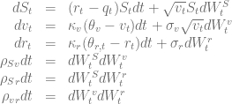
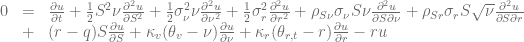
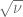
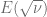
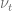
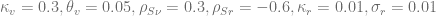
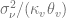
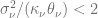
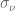
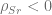

<!--yml

类别：未分类

日期：2024-05-17 23:31:11

-->

# H1HW 近似中的混合 Heston-Hull-White 模型 - HPC-QuantLib

> 来源：[`hpcquantlib.wordpress.com/2012/08/17/the-hybrid-heston-hull-white-model-in-the-h1hw-approximation/#0001-01-01`](https://hpcquantlib.wordpress.com/2012/08/17/the-hybrid-heston-hull-white-model-in-the-h1hw-approximation/#0001-01-01)

在他的博士论文[1]中，Lech Grzelak 研究了几种混合股权利率模型。其中，论文提出了混合 Heston-Hull-White 模型的 H1HW 近似：

](img/d22f9b2f071c87cf69db05c3a2ad288e.png)

这个模型是专门为分析随机利率对结构化股票票据（如自动调用期权）的影响而量身定制的。相应的偏微分方程

](img/65b5f976ac97a5585117017854522f0b.png)

不符合仿射扩散过程框架，因此没有基于特征函数的封闭形式解，例如 Heston 模型。

H1HW 近似将相关性交互中的项](img/dbdc75526aa267f4dcb07536b8de3bf2.png)替换为其期望值](img/e2a619d190fff9e31510e33a2a7d533c.png)。如果](img/c56c88dfcf2d52e0221304d7c3dd90f9.png)是 CIR 类型的过程，则存在](img/e2a619d190fff9e31510e33a2a7d533c.png)的半封闭形式解。相应的混合模型是仿射的，基于特征函数框架可以很容易地在 QL 中实现普通欧式期权的定价引擎。

下图显示了具有行权价格为 40%、80%、100%、120%和 180%的普通欧式期权的均方根误差。过程的参数如下所示

](img/f4474d7071754907801dd8d43b55d803.png)

波动率的波动  被设定为使得 Feller 参数  在 0.25 到 128 之间变化。参考价格使用有限差分的 Heston-Hull-White 引擎进行计算。

当 Feller 约束  被满足时，H1HW 近似的结果看起来非常好，但在高  场景下会有问题。如果 ，H1HW 近似特征函数的积分就会变得不稳定。示例代码可在此处获得 [`hpc-quantlib.de/src/h1hw.zip`](http://hpc-quantlib.de/src/h1hw.zip)，并且依赖于基于最新 QL 版本的 SVN 主干 [`sourceforge.net/p/quantlib/code/HEAD/tree/`](http://sourceforge.net/p/quantlib/code/HEAD/tree/)。

[1] Lech A. Grzelak: 定价长期金融衍生品用的股票和外汇混合模型
