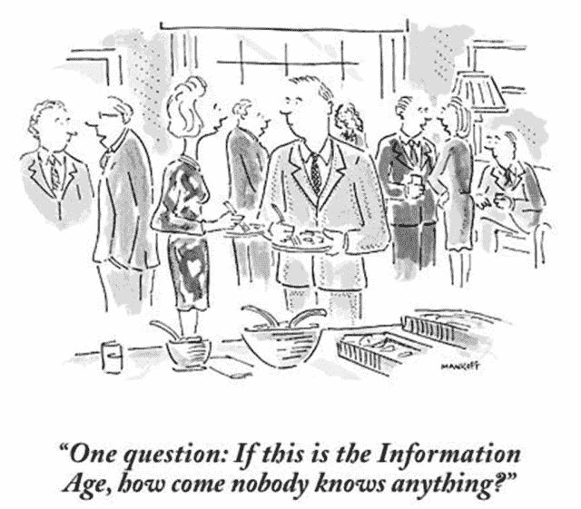

<!--yml

分类：未分类

日期：2024-05-18 14:14:43

-->

# 信息时代—— Mahwah 狙击手与朋友们

> 来源：[`sniperinmahwah.wordpress.com/2015/05/15/the-information-age/#0001-01-01`](https://sniperinmahwah.wordpress.com/2015/05/15/the-information-age/#0001-01-01)

我在 Twitter 上找到了这幅漫画。漫画表达的意思比我本人能说的要好：我们生活在一个信息时代，前所未有的，我们能够接触到大量的数据/信息（多亏了互联网），但是大多数人获取的信息很少（多亏了糟糕的新闻报道和电视节目）。我们确实生活在一个矛盾的时代…
