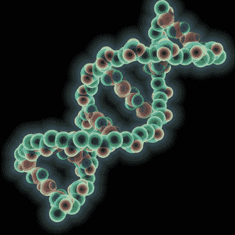

<!--yml

分类：未分类

日期：2024-05-12 17:59:17

-->

# 强大的（但谦逊的）微遗传算法（mGA）| CSSA

> 来源：[`cssanalytics.wordpress.com/2013/08/30/the-mighty-but-humble-micro-genetic-algorithm-mga/#0001-01-01`](https://cssanalytics.wordpress.com/2013/08/30/the-mighty-but-humble-micro-genetic-algorithm-mga/#0001-01-01)

***优化简介***

优化领域在过去几十年里已经发生了显著的演变。为了解决金融、工程和分子生物学等不同领域中的复杂问题，已经提出了几种新的理论、算法和计算方法。在金融领域，优化是解决投资组合问题、建模/预测时间序列数据、创建交易系统以及实施交易执行的必要条件。

优化方法可以分为两大类；**确定性**和**启发式**方法。这两种方法对于定量金融应用都至关重要。**确定性**优化是一种高度数学化和基于梯度的优化形式，最适合定义明确、具有平滑连续搜索空间的问题。确定性优化的例子有共轭梯度、单纯形法、梯度下降法、二次规划（用于马科维茨型投资组合问题）、非线性求解器和拟牛顿或牛顿法。这些方法是贪婪的且高度高效，如果用于适当的应用，它们保证能找到全局最优解。确定性方法类似于一级方程式赛车：它们非常快且精确，只要在良好的天气条件下使用正确的赛道，就能到达终点。你不会想在没有地图的情况下将它们驶入森林。下面是理想优化搜索空间类型的例子——一个[凸函数](http://en.wikipedia.org/wiki/Convex_function)：

**启发式**方法相反，它们是**算法**的（即一个封闭形式的计算，近似一个可行解，如“[最小相关算法](https://cssanalytics.wordpress.com/2012/09/12/minimum-correlation-algorithm-mca/ 'Minimum Correlation Algorithm (MCA)')”）或者是**随机**的（依赖于随机数生成的巧妙操作来找到一个解决方案），并且可以在不需要专业知识的情况下用于高度复杂的问题。传统意义上的启发式方法包括蒙特卡洛（MC）、粒子群优化（PSO）、遗传算法（GA）、模拟退火（SA）和差分进化。算法启发式方法通常是特定领域（或特定目的）的，并且不如随机方法具有普遍性。大多数科学家和工程师发现，对于复杂的真实世界问题，启发式方法比确定性方法更灵活、更高效，但无法保证找到全局最优解。然而，在典型的大型应用中，进行真正的彻底搜索要么不可能，要么从计算角度来看不切实际。启发式方法就像一个可以相互沟通或竞争的悍马车队，以找到最终目标。这为在处理噪声时间序列数据时经常遇到的复杂未知地形提供了更大的成功机会。一个只能通过启发式方法（通常是遗传算法）处理的搜索空间的例子是[Rastrigin 函数](http://en.wikipedia.org/wiki/Rastrigin_function)：

**瑞士军刀：微遗传算法（mGA）**

**微遗传算法**（[Micro Genetic Algorithm](http://proceedings.spiedigitallibrary.org/proceeding.aspx?articleid=1262014)）是一种非常简单但强大的方法，它比大多数纯（非混合）启发式方法更快地解决最复杂的问题。几乎任何金融问题都可以使用这种方法作为构建模块来解决。微遗传算法（mGA）比传统的**遗传算法**（SGA）快得多，并且不需要估计几个额外的参数输入（如变异率）就能产生更优的解决方案。mGA 也适用于并行处理，可以显著减少编程和处理时间以及内存需求。在下一篇文章中，我将详细分解创建 mGA 应用程序的步骤。现在这里有一个关于 mGA 工作流程的流程图：

