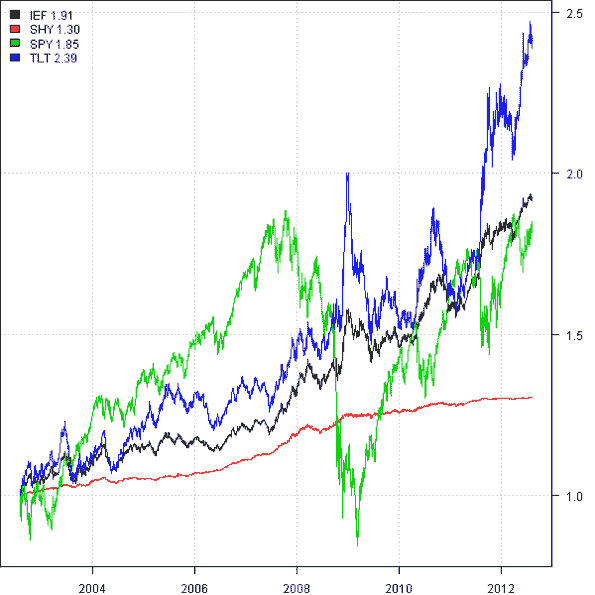
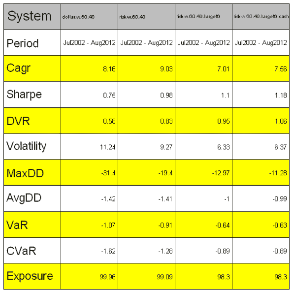
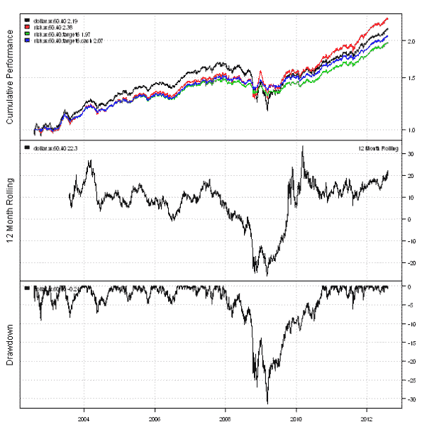
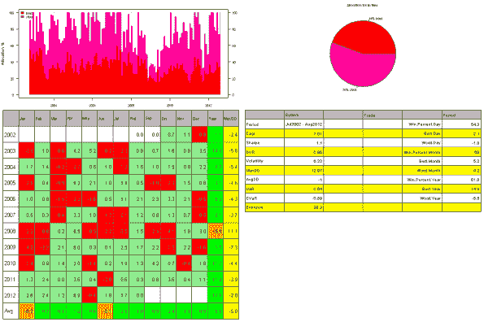
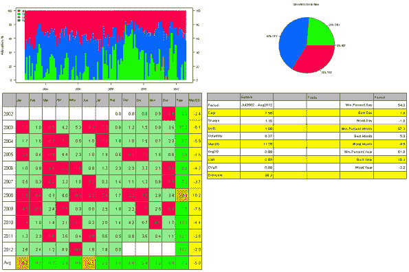

<!--yml

类别：未分类

日期：2024-05-18 14:38:53

-->

# 新的 60/40 | 系统投资者

> 来源：[`systematicinvestor.wordpress.com/2012/08/07/the-new-6040/#0001-01-01`](https://systematicinvestor.wordpress.com/2012/08/07/the-new-6040/#0001-01-01)

我想分享一个绝妙的想法和一个来自[GestaltU](http://gestaltu.blogspot.ca/)博客的[你看错了数字](http://gestaltu.blogspot.ca/2012/07/youre-looking-at-wrong-number.html)帖子中的精彩例子。今天，我将重点关注这个帖子中概述的简单步骤，通过使用风险分配而不是美元分配，改善典型的 60/40 股票/债券组合，并 targeting constant portfolio volatility。

我将使用 SPY（标普 500）作为股票分配的代理，TLT（20 年国债）作为债券分配的代理。让我们首先通过[系统投资者工具箱](https://systematicinvestor.wordpress.com/systematic-investor-toolbox/)加载 SPY 和几个固定收益 ETF 的历史价格：

```

###############################################################################
# Load Systematic Investor Toolbox (SIT)
# https://systematicinvestor.wordpress.com/systematic-investor-toolbox/
###############################################################################
setInternet2(TRUE)
con = gzcon(url('http://www.systematicportfolio.com/sit.gz', 'rb'))
    source(con)
close(con)

	#*****************************************************************
	# Load historical data
	#****************************************************************** 
	load.packages('quantmod')	
	tickers = spl('SHY,IEF,TLT,SPY')

	data.all <- new.env()
	getSymbols(tickers, src = 'yahoo', from = '1990-01-01', env = data.all, auto.assign = T)	
	for(i in ls(data.all)) data.all[[i]] = adjustOHLC(data.all[[i]], use.Adjusted=T)		
	bt.prep(data.all, align='remove.na')

	prices = data.all$prices
		n = ncol(prices)
		nperiods = nrow(prices)

	# normalize all prices and plot them
	prices = prices/ matrix(first(prices), nr=nperiods, nc=n, byrow=T)
	plota.matplot(prices)

```



固定收益 ETF 并不像你预期的那样安全。SHY（巴克莱 1-3 年国债基金）一直上涨，没有大的回撤。然而，IEF（巴克莱 7-10 年国债基金）和 TLT（巴克莱 20 年国债基金）确实会经历亏钱的时期。

接下来让我们构建一个传统的美元加权 60/40 股票/债券组合和风险加权版本：

```

	#*****************************************************************
	# Load historical data
	#****************************************************************** 		
	data <- new.env()
		data$stock = data.all$SPY
		data$bond = data.all$TLT	
	bt.prep(data, align='remove.na')

	#*****************************************************************
	# Code Strategies
	#****************************************************************** 
	# all bonds began trading at 2002-07-31
	prices = data$prices
		n = ncol(prices)
		nperiods = nrow(prices)

	models = list()

	period.ends = endpoints(prices, 'months')
		period.ends = period.ends[period.ends > 0]

	#*****************************************************************
	# Traditional, Dollar Weighted 40% Bonds & 60% Stock
	#****************************************************************** 			
	weight.dollar = matrix(c(0.4, 0.6), nr=nperiods, nc=n, byrow=T)

	data$weight[] = NA
		data$weight[period.ends,] = weight.dollar[period.ends,]
	models$dollar.w.60.40 = bt.run.share(data, clean.signal=F)

	#*****************************************************************
	# Risk Weighted 40% Bonds & 60% Stock
	#****************************************************************** 				
	ret.log = bt.apply.matrix(prices, ROC, type='continuous')
	hist.vol = sqrt(252) * bt.apply.matrix(ret.log, runSD, n = 21)	
	weight.risk = weight.dollar / hist.vol
		weight.risk = weight.risk / rowSums(weight.risk)

	data$weight[] = NA
		data$weight[period.ends,] = weight.risk[period.ends,]
	models$risk.w.60.40 = bt.run.share(data, clean.signal=F)

```

接下来让我们创建一个 6%波动的风险加权组合。我将根据过去一个月的历史波动性调整组合杠杆，以 target 6%的年波动性。

```

	#*****************************************************************
	# Helper function to adjust portfolio leverage to target given volatility
	#****************************************************************** 				
	target.vol.strategy <- function(model, weight, 
		target = 10/100, 
		lookback.len = 21,
		max.portfolio.leverage = 100/100) 
	{	
		ret.log.model = ROC(model$equity, type='continuous')
		hist.vol.model = sqrt(252) * runSD(ret.log.model, n = lookback.len)	
			hist.vol.model = as.vector(hist.vol.model)

		weight.target = weight * (target / hist.vol.model)

		# limit total leverage		
		rs = rowSums(abs(weight.target))
		weight.target = weight.target / iif(rs > max.portfolio.leverage, rs/max.portfolio.leverage, 1)		

		return(weight.target)	
	}

	#*****************************************************************
	# Scale Risk Weighted 40% Bonds & 60% Stock strategy to have 6% volatility
	#****************************************************************** 				
	data$weight[] = NA
		data$weight[period.ends,] = target.vol.strategy(models$risk.w.60.40,
						weight.risk, 6/100, 21, 100/100)[period.ends,]
	models$risk.w.60.40.target6 = bt.run.share(data, clean.signal=T)

```

在上一步中，我想将组合现金头寸投资于短期国债（SHY），以提高整体表现并创建摘要报告：

```

	#*****************************************************************
	# Same, plus invest cash into SHY
	#****************************************************************** 					
	weight = target.vol.strategy(models$risk.w.60.40, weight.risk, 6/100, 21, 100/100)
	data.all$weight[] = NA
		data.all$weight$SPY[period.ends,] = weight$stock[period.ends,]
		data.all$weight$TLT[period.ends,] = weight$bond[period.ends,]

		cash = 1-rowSums(weight)
		data.all$weight$SHY[period.ends,] = cash[period.ends]
	models$risk.w.60.40.target6.cash = bt.run.share(data.all, clean.signal=T)

	#*****************************************************************
	# Create Report
	#****************************************************************** 	
	plotbt.strategy.sidebyside(models)

	plotbt.custom.report.part1(models)

	plotbt.custom.report.part2(models$risk.w.60.40.target6)		
	plotbt.custom.report.part2(models$risk.w.60.40.target6.cash)		

```

我对结果非常满意：回报率有所下降，但组合风险调整后的表现提高了，回撤从 30%下降到 12%。稳定的回报对于退休组合尤为重要，因为它允许你更好地规划你可以提取多少资金，并维持你的基金更长时间。









要查看此例子的完整源代码，请查看[github 上 bt.test.r 文件中的 bt.new.60.40.test()函数](https://github.com/systematicinvestor/SIT/blob/master/R/bt.test.r)。
