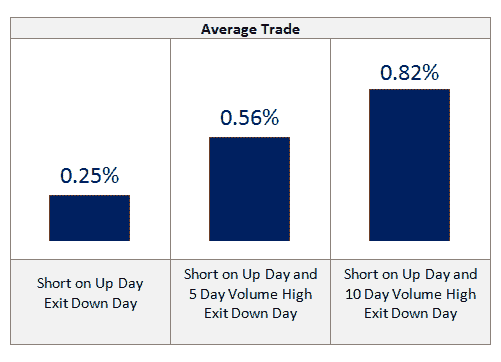
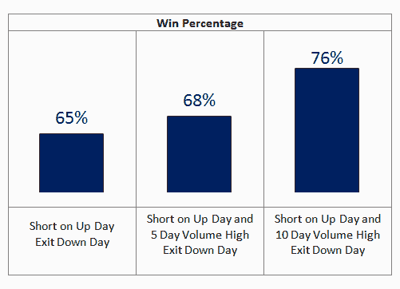
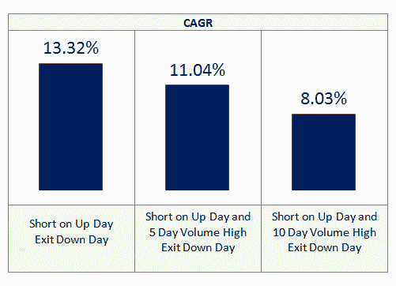
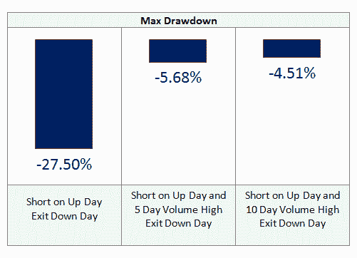

<!--yml

分类：未分类

日期：2024-05-12 18:13:15

→

# 近期成交量枯竭对短线日均值回归的重要性 | CSSA

> 来源：[`cssanalytics.wordpress.com/2011/01/27/the-recent-importance-of-volume-exhaustion-for-short-bias-daily-mean-reversion/#0001-01-01`](https://cssanalytics.wordpress.com/2011/01/27/the-recent-importance-of-volume-exhaustion-for-short-bias-daily-mean-reversion/#0001-01-01)

CSS 最近与 CSI Market Data 达成了合作伙伴关系[`csidata2.com/cgi-bin/ua_order_form.pl?referrer=CY`](https://csidata2.com/cgi-bin/ua_order_form.pl?referrer=CY)，我强烈推荐它作为高质量、准确的市场数据的来源。一些个人数据包涵盖了几乎所有可交易工具——无论是主要市场指数、股票、期货还是共同基金。更重要的是，更好的数据包包含退市数据，这对认真的交易系统开发者非常重要。由于我们有过使用 CSI 数据的经验，我们可以证明它的质量非常高，而且很容易导入数据库。对于大多数数据包提供的价格点来说，与其他选项相比，它真的提供了很强的价值——考虑到覆盖的市场范围之广。

作为一个有趣的文章，我想孤立出一个在二元日均值回归策略的短线方面需要考虑的更重要的因素。在这种情况下，过去几年在量化宽松和量化宽松期间，所有的卖空策略都遇到了困难。毫不奇怪，通过明确的政府干预向股市注入资金，使得市场在近年来出现了更多持续的上涨趋势。最值得注意的是，短期二元均值回归——特别是短线（在上涨的日子做空，在下跌的日子退出）——已经崩溃。有趣的是，其中一个似乎能显著改善进入的过滤器是成交量枯竭的概念：当成交量在过去一周或两周内达到短期高点，在短期市场强劲的情况下，很可能会接近某些峰值，因此耗尽。下面显示了自 2007 年以来，使用 SPY 成交量作为基准策略与两种不同的成交量枯竭策略进行交易的交易统计数据。正如你所看到的，使用短期成交量峰值作为过滤器显著提高了边缘（尽管最近所有策略都遇到了困难）。最重要的是，回撤显著降低——从而显著降低了进入的风险。这是未来一年到两年内需要关注的事情。

