<!--yml

分类：未分类

date: 2024-05-18 06:39:34

-->

# 快速清算市场的供需曲线形状 | 机械市场

> 来源：[`mechanicalmarkets.wordpress.com/2017/04/10/the-shape-of-supply-and-demand-curves-in-rapidly-clearing-markets/#0001-01-01`](https://mechanicalmarkets.wordpress.com/2017/04/10/the-shape-of-supply-and-demand-curves-in-rapidly-clearing-markets/#0001-01-01)

经济学中的一个中心挑战是理解价格如何影响供需量，这种关系通常被认为是近似线性的。但有些市场在这种线性的概念上，有时被称为“弹性”，可能不成立。在一篇[论文](https://arxiv.org/abs/1506.03758)中，Donier 和 Bouchaud 显示了快速清算市场的供需曲线（具有布朗运动价格过程）的平均形状在局部是二次的，没有线性项。

下面是供需总量随价格变化的经典说明：

总需求随价格单调减少——总供给随价格单调增加。曲线在处相交，这是体积最大化的市场价格。[1]在市场价格附近，供给和需求随价格的变化而线性变化。

如果我们“清算”市场，使得在处的供应与在处的需求相交易，那么曲线将看起来像：

这和第一个图表一样，只是交易量向下移动了。在附近，曲线仍然是线性的。如果我们放大，平均供需曲线将看起来像[2]：

在这个阶段，一个市场订单的价格影响平均而言会与其大小的平方根成比例。

他们的结果也引发了这样一个问题：一些市场在其生产和消费曲线是否在马鞍点运行，这可能看起来像：

其中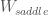是“鞍区”的粗糙宽度，该区域曲线主要是二次的。

这看起来与经典的经济学画面在本质上有所不同。它也直观地讲得通：当一个资产具有波动性时，很难确切知道供求平衡的价格点。Donier 和 Bouchaud 没有推测的大小，但至少有可能是他们的结果适用于比预期更广泛的价位范围。如果任何实际市场有一个大的，估计它们的价格弹性将变得困难或不可能。这也可能解释金融市场的冷漠——在那里，产生头条的新闻价格变动对实际世界的供求影响很小。 [4]

# 唐纳模型

唐纳和布绍（以及之前的合作者）使用反应-扩散模型得出这个结果。简而言之：

1.  新买入订单（在时间间隔）以概率创建，其中是新订单价格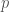与市场价格之间的差值。卖出订单以概率创建。

1.  现有订单以概率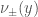被取消。

1.  市场在每个周期时间间隔内清除——当买入和卖出订单的价格交叉时匹配并从市场中移除。

1.  价格的潜在过程是布朗运动。

当较小时，他们表明，在任何合理的和下，供需曲线在局部是二次的。

当然，现实世界的市场即使在连续交易时间下也不会立即清除交叉的元订单。例如：一个交易员可能打算以每股低于 100 美元的任何价格购买 1 亿美元的股票，而另一个交易员可能打算以每股高于 90 美元的任何价格出售 1 亿美元的股票。这两个交易员可能会在几周内逐渐发出他们的订单流，而不是立即以 90 至 100 美元之间的价格相互交易。 [5]

尽管如此，可以想象有些市场表现得仿佛它们处于小极限。在比特币市场，交易者可能不像在传统市场那样倾向于隐藏他们的意图，并且可见订单簿可能代表市场价格附近的真实供需水平。作者在[图 6](https://arxiv.org/abs/1506.03758)中展示了比特币的平均展示供需，这对于在结算价格 2%内的价格（在此处累计供需通常约为 400k BTC）非常接近二次函数。所以电子市场的“马鞍区”可能与它们每日的波动范围一样宽，这并不令人惊讶；很少有石油生产商因为价格上涨 1%而增加钻探。

# 潜在流动性作为首次穿越时间

唐尼和布肖的结果似乎是布朗运动价格过程的一般特征，并且并不依赖于模型的具体细节。他们模型的精神提出了一个问题，即在给定价格的边际供应/需求，和市场穿过该价格所需的时间之间是否存在联系。也就是说，潜在流动性是否具有与首次穿越时间统计相似的性质。

二次供应/需求曲线等价于边际供应/需求随价格线性变化。根据定义，在价格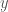远离“真实”价格时的累计供应()仅仅是截至该价格的边际供应()之和：。6 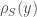也可能被称为在价格处可用的潜在卖单量。

一种达到唐尼（Donier）和布肖（Bouchaud）结果的方法是假设随时间建立，在市场价格穿过之后。为了清晰起见，以下模型与唐尼和布肖所做的工作不同，且不够复杂，但我认为这是一个很好地捕捉直觉的方法。7

作为一个示例，考虑在结算价格从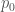瞬间跌至后，潜在订单簿会发生什么。起初，在和之间的供应提供将为零：

在此之后，新的缺口内部将开始形成潜在的卖单。假设仅作为时间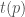的函数增长，因为价格跌破了：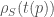。[8] 函数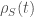的具体形式并不重要。

如果市场在初始价格下降后不再移动，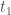时间后，潜在订单簿将被重新填充。在和之间，将提供数量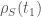：

要计算的预期值，我们需要自价格上次从当前价格通过起的时间的概率密度：![\mathbf{p}_{y}^{LPT}[t]](img/261de928980b8329c9e6a5f496391ddb.png)。对于时间可逆过程，此分布与第一通过时间![\mathbf{p}_{y}^{FPT}[t]](img/8a2e1c750a61d4c6db3d27d3c63ad6e0.png)相同。

对于连续时间的布朗运动，第一通过时间分布是众所周知的：

![\mathbf{p}_{y}^{FPT}[t] = \frac{y}{\sqrt{2\pi \sigma² t³}} e^{-y² / (2 \sigma² t)}](img/78441b86de1e4e841887c53ba305cfbb.png)

对于，这在上是线性的：

![\mathbf{p}_{y}^{FPT}[t] \approx \frac{y}{\sqrt{2\pi \sigma² t³}}](img/d4da148bc88a9447b2de89c72dd9ada8.png)

这给出了一个平均边际供应曲线，其在上是线性的：

![\mathbf{E}_{t}[\rho_{S}(t)] = \int_{0}^{T} \rho_{S}(t) \mathbf{p}_{y}^{FPT}[t] dt \propto y](img/51ce4c322c3930c2d4cd70c8023fb147.png)

其中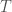是市场运行的总时间。

因此，预期的累积供应在上是二次的：![\mathbf{E}_{t}[S(y)] = \int_{0}^{y} \mathbf{E}_{t}[\rho_{S}(y')] dy' \propto y²](img/63839148f2315f51fef48c14e80ba7c5.png)。

模型在足够大的时应该失败，这时价格最后一次达到当前水平已经过去很长时间了。例如，如果油价超过了一年的最高点，达到了每桶 60 美元，那么我们预计边际供应量在 60 美元附近会反映出石油开采的真实世界经济学。因此，显然，模型在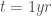的石油市场中是不起作用的。但是，如果油价只是超过了当天的最高点，那么边际供应可能只是一个与那段时长有关的机械函数。我们可以认为，当足够长，以至于企业能够对新高/低做出反应时，模型将开始失效，这应该是商业决策之间的典型时间(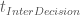).在这种情况下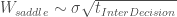，对于不流动的市场来说可能会相当大。

# 离散化过程

如果，在批量拍卖中每个期间市场清算，价格过程变得是一个离散时间随机游走。无限的应该恢复本文顶部未清的古典供需曲线。因此，随着的增加，我们预计会从布朗运动的二次供应过渡到线性 regime。

为了得到离散市场的平均供应曲线，我们需要首达时间分布。当随机游走的价格步长独立地从具有有限二阶矩的对称连续概率分布中抽取时，其首达时间概率密度函数渐进为:[10]

![\mathbf{p}_{y}^{FPT}[n] \approx  (\frac{1}{2 \sqrt{\pi n³}} + \frac{y}{\sqrt{2\pi \sigma_{step}^{2} n³}}) e^{-y² / (2 \sigma_{step}² n)}](img/6cd9b40

其中是随机游走所采取的步骤数，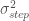是每个步骤价格变动的方差。当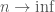并且有限时，这个近似是有效的。步数与连续时间有关，通过。如果基础过程是布朗运动，则。

当价格过程具有与市场价格距离相比很小的典型步长 () 时，第二项占主导地位，且 ![\mathbf{E}_{t}[\rho_{S}(t)]](img/485414731accd4556c0ddd7bd914c524.png) 与连续布朗运动的情况完全相同。也就是说，当 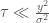 时，累积供应与价格呈二次变化。

当过程被严重离散化时， 相对于  很小且第一项占主导地位，这将在  上近似为常数。因此，边际供应将是恒定的，而累积供应将与  成线性关系。

这个结果与 Donier 和 Bouchaud 的结果相同。事实

![mathbf{E}_{n}[\rho_{S}(n)] \approx L(y + u_0 \sigma \sqrt{\tau})](img/0bc43329f433839bc0908ec5461a4292.png)

其中 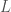 是通过积分  获得的一些常数，由 Donier 和 Bouchaud 鉴定为流动性度量。而 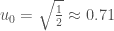 是一个与 Donier 和 Bouchaud 获得的常数不太相距的常数 (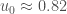)。[11][12]

因此，慢慢清晰的市场 —— 这些市场被严重离散化 —— 可能没有鞍区。[13]

# 当价格过程是 Lévy 飞行时的供需曲线

上述渐近适用于一类具有有限方差的随机游走。但是市场在短时间尺度上可能存在尾部更胖的价格波动。指数  的 Lévy 飞行具有发散方差和幂律尾部的价格增量 ()：![\mathbf{p}[x] \sim \frac{1}{|x|^{\alpha + 1}}](img/8087ff15e28058fecc89c6bbbaf539d0.png)。

Lévy 飞行的首次通过时间具有渐近概率密度函数：[14]

对于长时间 ，![\mathbf{p}_{y}^{FPT}[t] \sim \frac{y^{\alpha / 2}}{t^{3/2}} ](img/9c172ddb63af1bc0a192fb24a3ee71ba.png)。[15]

这种分布平均而言会给出一个累积供应曲线 。而一个市场订单的价格影响 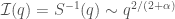。作为一个例子，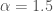 对应的市场会相当“波动”，并且有 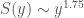 和 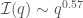。 [16]

# 子扩散价格过程的供需曲线

子扩散过程的波动性随着时间尺度的增加而增加的速度比普通布朗运动要慢。例如：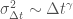。当 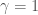 时，波动性按照布朗运动的通常方式与时间尺度线性变化。当  时，该过程是一个子扩散。子扩散市场在均值回归意义上，价格波动未来可能会被反转。因为子扩散市场具有“记忆”，所以它们被认为是“无效”的。 [17]

子扩散的第一 passage 时间分布趋向于：[18]

![\mathbf{p}_{y}^{FPT}[t] \sim \frac{y}{t^{1 + \gamma / 2}} ](img/39c7c475de6b4b72d0a0a8924be8fc64.png)

这与普通布朗运动的线性价格依赖性相同。因此，累积供应仍然是二次的，市场影响仍然是平方根。

某些类型的“效率”[会导致平方根的价格影响](https://mechanicalmarkets.wordpress.com/2016/08/15/price-impact-in-efficient-markets/)。但如果这个模型大致准确，那么像子扩散这样的“无效”市场也可能有平方根的影响。

**更新**：Benzaquen 和 Bouchaud 刚刚研究了一个[子扩散的反应-扩散模型](https://arxiv.org/abs/1704.02638)。他们表明潜在的订单簿是局部线性的（方程 10），这与这里粗略的第一 passage 分析相似。对于快速执行的元订单，他们得到 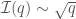。但对于在执行过程中给潜在订单更多反应时间的慢速元订单，他们得到 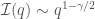。

# 扩散和子扩散中影响的数量级缩放

我觉得这个结果有趣，因为它乍一看似乎与最简单的、数量级的“推导”-平方根影响法则相矛盾。但仔细观察，我认为数量级的逻辑与子扩散和普通扩散具有类似的影响缩放是一致的。

如果一个市场是布朗式的，那么其价格变化将与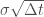成比例。价格发现的一种观点是，那些价格变化的一小部分（数量级为 1）来自交易者的影响。因此，元订单的影响将与其持续时间的平方根大致成比例：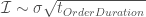。市场总体交易量随时间以恒定速率积累()，所以一个大小为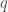的元订单将持续时间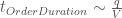。这给出了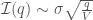。

现在，如果一个市场是亚扩散的，那么其价格变化随时间缩小的速度更慢：。如果上面论证中的其他一切保持不变，那么我们会得到。但是，没有理由期待亚扩散市场中的交易量应该以恒定的速率在时钟时间中发生。

亚扩散可以被[重新表述](https://ocw.mit.edu/courses/mathematics/18-366-random-walks-and-diffusion-fall-2006/study-materials/lec25_geraint.pdf)为具有独立增量的过程，其中步骤之间的变量时间有一个长尾。在这种表述中，步骤可能对应于交易活动——每个步骤的体积大致为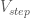。元订单将持续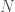个步骤，其中。这个亚扩散的步骤长度具有有限的方差，因此我们可以遵循与布朗式案例相同的论点，用步骤计数代替时间： — 这具有相同的平方根缩放。

# 结论

市场行为是群体行为，而一个群体可能比其中的个体更可预测。唐纳器和布绍 aud — 以及本文中宽松的解释 — 表明，当市场是机械的和无聊的时候，它们将具有大致上二次的平均累积供需曲线。现在，很多人认为市场并不无聊！即使许多市场确实在鞍点运行，它们可能并没有非常宽的“鞍区”。但是如果有，小的价格变动可能对生产和消费几乎没有影响，而大的价格变动可能产生巨大影响。这与标准直觉不同。

1 这个图显然是启发性的。供需曲线众所周知有很多形状，可能是[非单调的](http://www.nber.org/papers/w13243)，并且在局部可能有一个以上的价格最大化交易量。

2 在附近的供需曲线应该（可能）关于是对称的，如果我们对给定市场中的某些情景集合进行平均。

3 借鉴了他们与 Bonart，Deremble，de Lataillade，Lempérière，Kockelkoren，Mastromatteo 和 Tóth 合作早期的研究工作。（例如，[2014](https://arxiv.org/abs/1412.0141)和[2011](https://arxiv.org/abs/1105.1694))

4 即使大的价格变动几乎不影响供需，它们仍然可以发挥重要的经济作用。交易者的观点和信息被纳入价格中，当市场透明时，这些价格提供了长期商业决策的有用信号。

5 [Waelbroeck 和 Gomes](https://papers.ssrn.com/sol3/papers.cfm?abstract_id=2291720)的表 1 和图 13 表明，大多数机构股票的元订单期限少于几天。

6 需求方面也是如此。为了简化，让我们只讨论供给侧。

7 潜在流动性通常是不可观察的，因此我们无法轻易地测试这样一个假设：在给定价格下，潜在流动性随自市场达到该价格以来时间的增加而建立。但是，潜在流动性可以通过订单簿来衡量——如果一个市场高度金融化、透明，并且由不隐藏其意图的交易者主导。可以说，比特币就是（或曾经是）这样的市场。

8 我们可以在中添加一个独立的随机噪声项，这不会影响结果。假设没有显式的价格依赖性，这与 Donier 和 Bouchaud 的例子（例如，恒定的和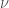）相似。这个假设显然是错误的，但如果足够接近市场价格，它可能是足够合理的。

9 企业的反应时间可能比人类的决策时间尺度长得多。特别是在所讨论的市场不透明或尚未成熟的情况下。例如，如果一个农民从种植橄榄转向种植杏仁，她的果园可能需要几年时间才能再次产生效益。因此，杏仁的价格可能需要达到多年的高点，这样她才能有信心 enough to switch crops. 但是，如果农民能够对未来产量进行套期保值，她在经济上有利时可能会迅速决定转产。或许一个发达的期货市场将这个模型的有效范围从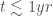减少到了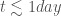。

10 见[Majumdar](https://arxiv.org/abs/0912.2586)中方程 38 的详细引用。我将方程 38 的累积分布函数(CDF)转换为概率密度函数(PDF)，并去除了一个非领先项。

11 [方程 22](https://arxiv.org/abs/1506.03758)

12 Sparre-Andersen 缩放适用于任何具有连续和对称价格变动分布的马尔可夫过程：对于很大的，首次穿越时间分布必须像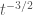那样衰减。因此，为了使对的期望值收敛，我们必须在很大的时有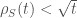（假设是单调递增的）。也就是说，在给定价格下的边际供应必须比自市场处于该价格以来的时间的平方根增长得更慢。潜在流动性与首次穿越时间之间的联系在非常长的时不会成立，但这可能提供了潜在流动性能够恢复的速度的一个宽松限制。

13 根据该模型，当价格变动足够大（因此最后一次穿越时间长）时，缓慢清除的供需曲线仍然由二次项主导。但是，当企业能够对价格变动作出反应时，模型应该在非常长的时间尺度上失败。尽管如此，如[9]所述，如果市场缓慢且不透明，模型的有效时间尺度可能会更长。

14 例如，见[Koren 等人](https://arxiv.org/abs/0706.3641)中的方程 10。

15 [图 2](https://arxiv.org/pdf/0706.3641.pdf) 显示，经过几个时间步之后，迅速收敛到这个渐进结果。

也许不应该惊讶的是，影响比布朗运动的情况更陡峭。直观地说，Lévy 尾巴使得市场更加“动量驱动”。在 Lévy 类型的市场中，一个发起价格变动的交易者可能会发现市场很快远离她。这里使用的 Lévy 过程具有独立增量，但我们可以想象在连续时间内的“中增量”中，独立性会 breakdown。即，可以想象动量交易者在时间步中间进行交易。

顺带一提，Koren 等人[17]表明，在 Lévy 飞行中，平均跃过长度是发散的。跃过长度可以被理解为止损订单在价格跳变中间执行时所获得的利润，*如果*他们能够抓住流动性并在尾事件发生时成交。这些都是很大的“如果”，但潜在的近乎无限利润可能部分解释了止损订单和短期动量策略的流行。这也可能解释为什么交易员不愿意在当前价格远离的地方提供太多流动性。

在低交易成本的亚扩散市场中，押注均值回归是一种盈利的策略。如果你知道有类似这样的电子市场，请告诉我。

即使亚扩散在电子市场中很少见，不同资产的线性组合仍然可能是亚扩散的。典型的“配对交易”涉及两种资产价格之间的均值回归差。此外，亚扩散在更广泛的场外经济中可能比我们预期的更常见。

[见 Metzler 和 Klafter 文章](http://www.agnld.uni-potsdam.de/~metz/papers/2000_MeKla_PhysA278.pdf)中第 30 式序列展开的第一个非常数项。式 30 是生存概率（即首次穿越时间累积分布函数），其概率密度是时间导数。当时这个近似是有效的。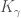是“分数扩散系数”，与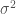（当时的标准差平方）类似。

请注意，亚扩散不是马尔可夫过程，因此 Sparre-Andersen 缩放[12]不适用。流动性必须比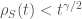更慢地补充，对于大的。

相关等待时间可能也会导致亚扩散[19]在一个具有独立增量的过程中。
