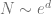

<!--yml

类别：未分类

日期：2024-05-17 23:41:25

-->

# GPU 上的 Sobol Brownian 桥生成器 - HPC-QuantLib

> 来源：[`hpcquantlib.wordpress.com/2012/09/23/the-sobol-brownian-bridge-on-a-gpu/#0001-01-01`](https://hpcquantlib.wordpress.com/2012/09/23/the-sobol-brownian-bridge-on-a-gpu/#0001-01-01)

使用准随机数最大的错误是只是像使用伪随机数一样使用它们。只有在

样本数量，其中是问题的维度。如果使用的样本数量显著较少，那么结果很可能是完全错误的。因此，在应用准 Monte-Carlo 方法时，问题维度的减少通常是第一步。

Brownian 桥是为了减少随机微分方程的 Monte-Carlo 积分的重要维度而定制的。在最近的教材[1]中，Mark Joshi 展示了如何高效地使用 Brownian 桥进行准 Monte-Carlo 定价，并且他还概述了 QuantLib 的实现。在[3]中已经表明，当从伪随机数生成器切换到 Sobol Brownian 桥生成器时，结构化股票组合的整体统计误差减少了三倍，这意味着速度提高了九倍，而 Monte Carlo 误差保持不变。

因此，一个有效的 Sobol Brownian 桥生成器是准 Monte-Carlo 期权定价的标准构建块。一个基于 nVIDIA GPU 的[CUDA 4.2](http://www.nvidia.com/object/cuda_home_new.html)实现，基于[QuantLib 1.2](http://quantlib.org)，可在此处获得[这里](http://hpc-quantlib.de/src/gpubrownianbridge.zip)。接口和使用方式与 QuantLib 的 Sobol Brownian 桥生成器非常相似。GPU 上结果的内存布局是 CURAND_ORDERING_QUASI_DEFAULT。压缩文件还包含一个验证程序，该程序检查 Sobol Brownian 桥的两个版本是否生成了相同的结果。

如图所示，GPU（GTX 560）在单精度下的平均性能比 CPU（i3@3.0GHz）高出 50 倍，在双精度下高出 12 倍。

[1] Mark Joshi, [More Mathematical Finance](http://www.markjoshi.com/more/) [2] Sebasien Gurrieri, [An Analysis of Sobol Sequence and the Brownian Bridge](http://papers.ssrn.com/sol3/papers.cfm?abstract_id=1951886)

[3] Andre Bernemann, Raplh Schreyer, Klaus Spanderen, [Accelerating Exotic Option Pricing and Model Calibration Using GPUs](http://papers.ssrn.com/sol3/papers.cfm?abstract_id=1753596)
