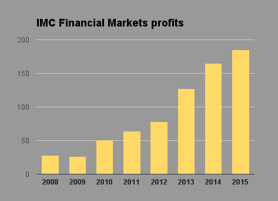
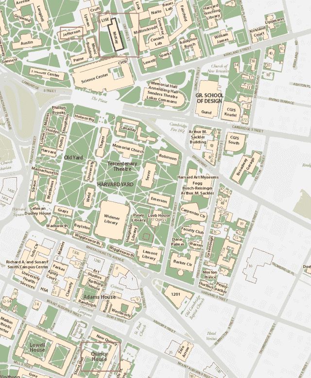

<!--yml

分类：未分类

日期：2024-05-18 14:10:29

-->

# The brothers get a taste of Gouda – Sniper In Mahwah & friends

> 来源：[`sniperinmahwah.wordpress.com/2016/09/01/the-brothers-get-a-taste-of-gouda/#0001-01-01`](https://sniperinmahwah.wordpress.com/2016/09/01/the-brothers-get-a-taste-of-gouda/#0001-01-01)

谣言已经流传了一段时间。在 14:00:00:00:000 精确时刻，这些谣言将由官方新闻稿确认： [McKay Brothers](http://www.mckay-brothers.com)，这个知名的国际低延迟提供商，服务于高频交易公司，从荷兰市场制造商国际市场制造商组合，即 IMC，获得投资。 McKay 的一个座右铭，“*不与任何交易公司或交易所关联*”，将不得不被移除。

新闻稿将说明：

> 根据协议条款，IMC 将在 McKay 中持有少数股权，为 McKay 进一步改善为延迟敏感交易社区服务的网络提供资本。协议的财务条款未公开。
> 
> 关键要素包括：
> 
> IMC 进行资本投资并收购了股权。
> 
> McKay 在联合创始人 Stéphane Tyč和 Bob Meade 的领导下保持其独立性。
> 
> McKay 承诺进一步投资，以降低其关键长途路线的延迟到物理极限。
> 
> McKay 公司继续遵循其核心业务原则，其中包括为订阅者提供一个公平的竞争环境和最低延迟的服务访问。

协议的条款未公开，也没有提供详细信息，但似乎 IMC 购买了 McKay Brothers 及其母公司 Quincy Data 不到 30%的股份。“*这对于使用我们网络的所有交易公司和整个行业来说都是好消息*”， McKay 首席执行官 Stéphane Tyč说，而 IMC 全球技术负责人 Arno de Quaasteniet 表示，“*作为一个强大的独立供应商， McKay 在确保流动性提供者获得平等和公平的市场接入中扮演着至关重要的角色。这些是 IMC 所共享的原则*”。

这是一个有趣的举措。首先，我们可以假设 IMC 一直是麦凯兄弟（McKay Brothers）的客户（现在仍然是）。据我所知，IMC 是唯一一家没有在欧洲建立专用微波网络的阿姆斯特丹交易公司，与 Optiver 和 Flow Traders 这两家其他荷兰 HFT/市场制造公司不同。其次，人们可能会问：麦凯兄弟为什么需要 HFT 公司的投资？为什么是 IMC？似乎有各种 HFT 公司提出要购买麦凯兄弟，但公司拒绝了。另一方面，我们可以假设公司需要投资来改进他们的网络（即“*将延迟减少到物理极限*”）。即使有人说麦凯拥有从芝加哥到新泽西最快的网络，但速度竞赛是一场永无止境的战争。2016 年 6 月，斯蒂芬·泰奇（Stéphane Tyč）在[芝加哥](http://www.mckay-brothers.com/exchanges-vs-networks/)解释说，路由改进对于节省几微秒至关重要，如下面的图片所示——红色路线改进花了四年时间来实现：

芝加哥（CME）与新泽西（Secaucus 和 Mahwah）之间的平均延迟

我不清楚麦凯为挽救在芝加哥和马瓦希之间节省了*17 微秒*的“路由改进”而收购的塔楼付了多少钱。这可能少于 Jump Trading 用于在[豪滕](https://sniperinmahwah.wordpress.com/2014/09/25/hft-in-my-backyard-ii/)（比利时）购买塔楼的 500 万欧元，也少于 Vigilant 和/或 New Line Networks 将在里奇堡（如果他们能建造这些[有争议](https://sniperinmahwah.wordpress.com/2016/01/26/hft-in-the-banana-land/)的非常高的塔楼）花费的金额。但是，一切都很昂贵，IMC 的现金流可能有助于麦凯/昆西（McKay/Quincy）。根据[阿姆斯特丹交易员](http://www.amsterdamtrader.com/2016/04/decent-profits-for-imc.html)的说法，IMC 在 2015 年的净利润为 1.85 亿欧元（比 2014 年多 2000 万欧元）。有了这笔钱，麦凯将有资源收购其他塔楼——如果需要的话。（如果麦凯建造了伦敦-斯德哥尔摩路线，那将是非常惊人的，可以在古老的的风车 上安装天线。）

© 阿姆斯特丹交易员

现在我敢打赌，麦凯（McKay）得告诉他们网络客户的真相：他们永远不可能给 IMC 带来速度上的优势。“*IMC 将无法获取客户信息，也没有延迟优势*”，斯蒂芬（Stéphane）说。

所以，世界上最大的市场制造商之一（在 100 多家交易所活跃并雇有 600 人）持有世界上最好的低延迟网络提供商之一的股份。看来这些天（年轻的）高频交易微波行业正在发生变化。多年来，一方面有由 proprietary firms like Vigilant/DRW、Jump 等建造的私人网络，另一方面有网络提供商（McKay、Custom Connect、Perseus 等）。2015 年，交易公司 Jump Trading 和 KCG 成立了一家名为 New Line Networks 的合资企业，以“*向行业参与者和第三方供应商出售网络带宽*”，这意味着他们现在与 McKay 和其他提供商竞争。本周早些时候，Bloomberg [报道称](http://www.bloomberg.com/news/articles/2016-08-29/traders-said-to-discuss-data-superhighway-from-chicago-to-japan)，至少有三家竞争对手交易公司（Citadel、Jump 和 Virtu）“*正在讨论共同建造从芝加哥到日本的通信链接*”，包括从芝加哥到美国西海岸的微波路线——一个被称为“Go West”的项目。在极低延迟领域，竞争不再是由 proprietary trading firms 和 networks providers 之间的战争——现在有点更复杂了。无论如何，祝这些兄弟好运。巧合的是，我明天将会去阿姆斯特丹；我会见几位参与高频交易行业的人，我想我们会谈论什么。

哈佛大学校园，McKay、Quincy 和 Jefferson 名称的来源。Jefferson Microwave LLC 是 McKay International 在 2012 年在美国建造的第一网络。
