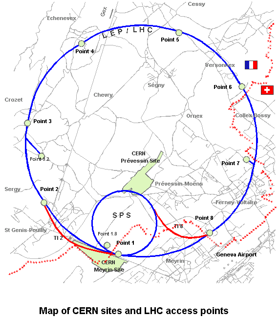
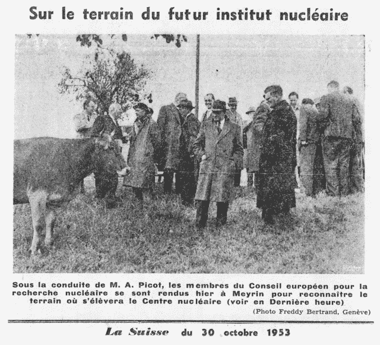
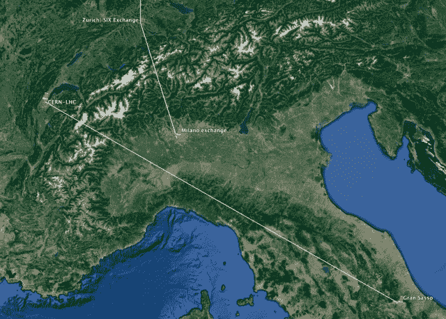

<!--yml

category: 未分类

date: 2024-05-18 14:14:03

-->

# The goddam particle – Sniper In Mahwah & friends

> 来源：[`sniperinmahwah.wordpress.com/2015/08/04/the-goddam-particule/#0001-01-01`](https://sniperinmahwah.wordpress.com/2015/08/04/the-goddam-particule/#0001-01-01)

除了研究市场微观结构，我还是一个图书出版商，我[图书公司](http://www.zones-sensibles.org)在九月份将要出版的下一本书是一项对大型强子对撞机（LHC）的人类学研究，该对撞机由欧洲核子研究组织（[CERN](http://home.web.cern.ch/)）建造，现已成为世界上最大的粒子物理实验室。1952 年由十一个欧洲国家创立，CERN 在 1957 年推出了第一个对撞机（同步回旋加速器）；第二个，质子同步加速器，由尼尔斯·玻尔本人于 1960 年落成；超级质子同步加速器在 1971 年启动；现在最长的对撞机是大型强子对撞机，在 2008 年启动，得益于来自 100 多个国家的超过 10,000 名科学家和工程师的工作——一个 27 公里的圆形，主要在法国和瑞士之间，地下 175 米。大型强子对撞机可能是人类历史上最伟大的科学成就之一。

这本书由人类学家 Sophie Houdart 撰写，她跟随知识论者 Peter Galison 的工作，解释了所有 CERN 合作者（至今仍然）必须处理许多不同的问题，其中一些相当令人惊奇——因为 LHC 在两个不同的国家之间建造，它必须处理两种不同类型的法规。书中 reproduces 了一幅旧照片，该照片于 1953 年发表在一家瑞士报纸上，当时科学家们正在乡村进行勘探任务，牛在那里和平地吃草。当时科学家们首先要做的工作之一就是安抚农民关于粒子的问题（“不，它们不会杀死你的牛”）——书中还详细介绍了 Luis Sancho 试图关闭 CERN 的事件，因为 Sancho 坚信该对撞机会创造出摧毁地球的黑洞。

今天，大型强子对撞机作为粒子加速器，在隧道中以 99,9999%的光速（比现在高频交易员用来传输数据的微波还要快）碰撞强子。LHC 的目标是证明一些物理学家关于粒子物理的理论预测；最重要的是，对撞机的设计是为了找到（而不是没有）理论上的[希格斯玻色子](https://en.wikipedia.org/wiki/Higgs_boson)。这在 2012 年实现了，2013 年彼得·希格斯获得了物理学诺贝尔奖（与弗朗索瓦·恩格勒特共享），“因为对亚原子粒子质量起源的理论发现”（顺便说一下：希格斯从未将玻色子描述为“*上帝粒子*”；他只是有一天说，玻色子是“*该死的粒子*”，因为它很难找到）。书中一个非常有趣的一点是，它展示了日内瓦附近的一个小地理区域与宇宙的最初时刻是如此“接近”，所谓的“大爆炸”。当我编辑这本书的时候，我很高兴地看到，在 LHC 工作的科学家们必须面对高频交易行业工作人员已知的问题——例如，强子旅行速度如此之快，以至于物理学家们必须非常非常小心他们的实验时间戳。

但大型强子对撞机和高频交易之间的真正联系是 neutrinos。除了在 LHC 隧道中碰撞强子外，CERN 还测试了（2006 年至 2012 年）neutrinos 穿越地球的方式。Neutrinos 是轻带电粒子，可以穿透岩石。从日内瓦站点，CERN 将 neutrinos 发送到意大利的格兰萨索国家实验室，这个项目名叫 OPERA（技术细节[在那里](http://home.web.cern.ch/about/accelerators/cern-neutrinos-gran-sasso)）：

在 2011 年 9 月某个时刻，发生了一件真正奇怪的事情：从日内瓦发送的 neutrinos 到达格兰萨索 60 纳秒 *[超过光速](http://www.nature.com/news/2011/110922/full/news.2011.554.html)*。

*到底发生了什么鬼？* 粒子是怎么超过光速的？爱因斯坦的相对论理论怎么了？当然，当实验结果公布时，高频交易界[审视](http://www.forbes.com/sites/brucedorminey/2012/04/30/neutrinos-to-give-high-frequency-traders-the-millisecond-edge/)了中微子。但是（当然）有个问题。CERN 关于中微子速度的第一个声明是在 2011 年 9 月发布的，然后在 2012 年 2 月，一个官方[更新](http://press.web.cern.ch/press-releases/2011/09/opera-experiment-reports-anomaly-flight-time-neutrinos-cern-gran-sasso)解释说这个速度被高估了：“*第一个可能的影响涉及一个用于提供 GPS 同步时间戳的振荡器。这可能导致中微子飞行时间的过高估计。第二个涉及将外部 GPS 信号引入 OPERA 主时钟的光纤连接器，这可能在测量时没有正常工作*。”总之：这是一个关于日内瓦和格兰萨索之间钟同步的问题，而这正是高频交易行业现在必须面对的：连接世界各地地理上分散的不同交易所的钟同步。

我会在关于 HFT 世界中的“时间的本质”的下一篇文章中回到这个观点（钟同步）。我真正理解为什么高频交易员对中微子表示出兴趣：用来连接不同交易所的最快技术是微波，但是微波需要地面上的塔/天线，而世界是个球体，所以你必须处理地球的曲率，由于曲率，高频交易员们正在失去时间。太糟糕了。大自然母亲并不帮忙。

—

注释：我试图设计一个封面，能够反映出大型强子对撞机中发生的事情，那里的粒子互相碰撞。那里有很多运动。我想出了这样一个光学错觉——一种隧道。如果你看向封面的中心，你应该会看到一些轻轻移动的白点。

