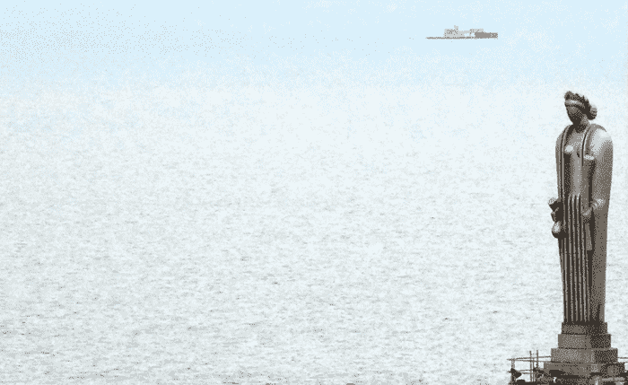
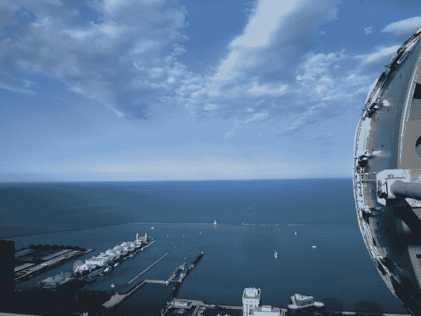

<!--yml

category: 未分类

date: 2024-05-18 14:16:31

-->

# 怪兽狮身人面像 —— 来自 Mahwah 的狙击手与朋友们

> 来源：[`sniperinmahwah.wordpress.com/2015/01/31/the-monstrous-sphinx/#0001-01-01`](https://sniperinmahwah.wordpress.com/2015/01/31/the-monstrous-sphinx/#0001-01-01)

在“我后院的高频交易”系列文章的第一部分中，我简要地提到了芝加哥商品交易所（CBOT）的第二座建筑，建于 1885 年，在大芝加哥火灾（1871 年）后摧毁了第一座建筑。1885 年的建筑位于杰克逊和拉塞尔周围，但被 1930 年建于西杰克逊大道上的现任 CME 集团大楼所取代。这座 1930 年的“塔楼”被 CBOT 董事会誉为真正的“*资本主义大教堂*”，并在大教堂顶部放置了罗马谷物女神塞勒斯的雕像 —— 很长一段时间里，这座雕像都是芝加哥天际线上最高的一点。

上面照片显示了一个背对密歇根湖的无面女神。我对微波的研究让我认为，“资本主义大教堂”上方的新的神祇可能是天线。即使 CME 集团大楼顶部没有天线（现在的楼层在奥罗拉），我觉得这张其他照片很有趣：

这是属于[麦凯兄弟](http://www.mckay-brothers.com)/昆西数据（照片来自麦凯网站）的一道菜，放在芝加哥第三高的阿恩大楼上。天线指向密歇根湖，因为信号必须穿越湖水（这是一个因为微波在水体中传播而变得漫长和复杂的链接）。新的神祇仍需要主宰芝加哥的天际线。

即使 1885 年芝加哥商品交易所（CBOT）的大楼仅是十层高，它仍是这座城市最高的建筑。更重要的是，它是第一座拥有电灯的商业建筑。在 1903 年的小说《交易场》中，弗兰克·诺里斯生动地描述了这座灯火通明的大楼：“*照亮的大楼，雨的阴霾，天空中的光芒，而董事会贸易大楼的黑色的、严肃的、单一的巨石，蹲伏在它的基础上，像一只没有眼睛的怪兽狮身人面像，沉默、严肃、静静地蹲在那里，没有声音，也没有生命的迹象，在夜晚和飘落的雨幕下*”。

现在看看这张照片：

“*上面的图片是飓风桑迪灾难中出现的更加引人注目的图片之一。由一位路透社摄影师拍摄，它展示了曼哈顿天际线因大规模电力中断而陷入黑暗，这是由热带风暴造成的。然而，在这张照片中有一座建筑仍然不屈不挠，几乎每个窗户里都闪烁着灯光。那座建筑位于西百老汇 200 号，是投资银行高盛的总部*”* [写道](http://www.inquisitr.com/381743/hurricane-sandy-rages-but-the-lights-stay-on-at-goldman-sachs/) Inquisitr。这里有一些象征意义。高盛首席执行官 Lloyd Blankfein 曾表示，该银行“*正在做上帝的工作*”。我不知道 Lloyd Blankfein 提到的那个上帝是谁（基督教的上帝？犹太人的上帝？），但这一引人注目的摄影告诉我们一些事情。很长一段时间，“*资本主义的大教堂*”是金融市场；现在，大教堂是投资银行的总部。时代已经改变。“*灯火通明的办公大楼*”是弗兰克·诺里斯谈论的新神的所在地。 Ceres 已经见过它的日子，但那座庞大的狮身人面像仍然在那里，照亮了一个陷入黑暗的城市，*在做上帝的工作*。”
