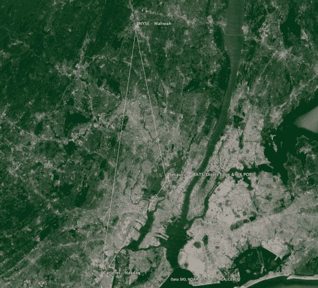
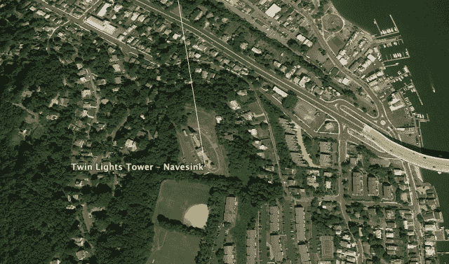
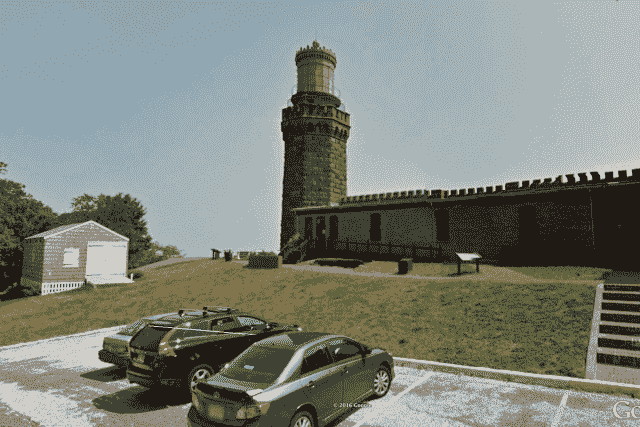
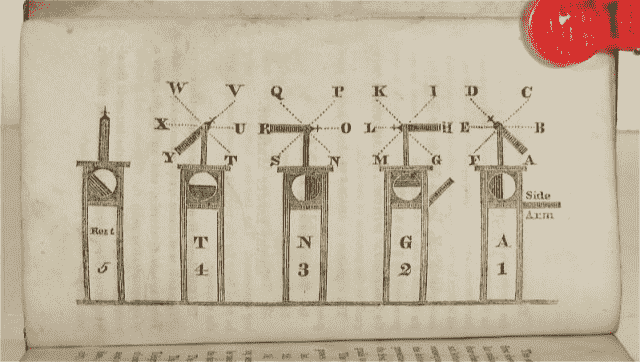
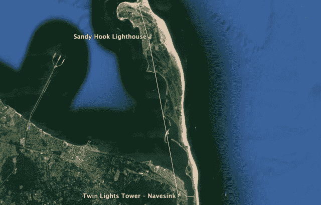
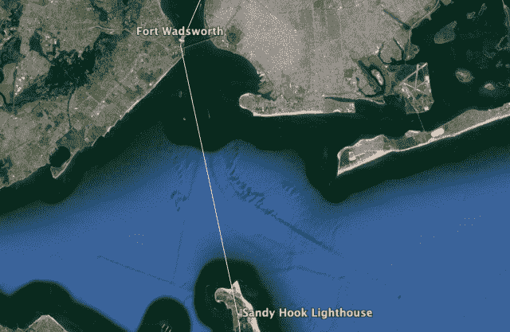
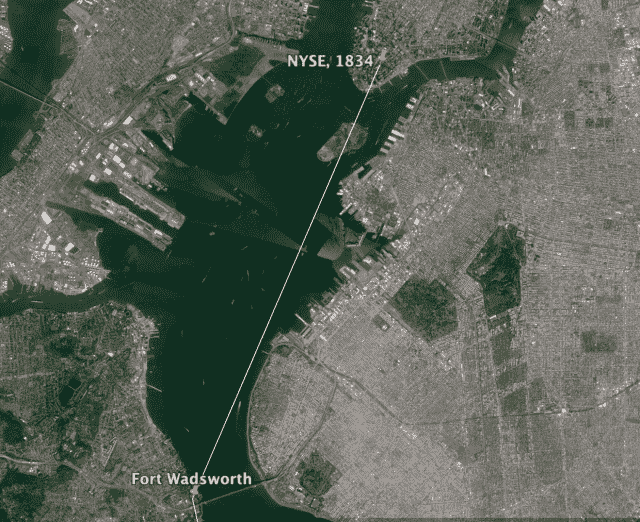
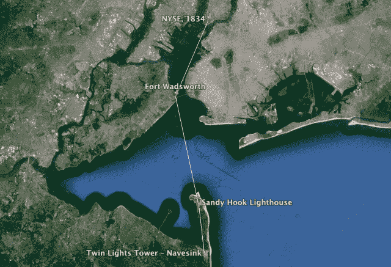
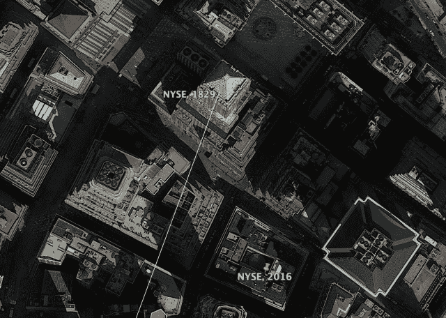

```yml

分类：未分类

日期：2024-05-18 14:11:06

-->

# 走向华尔街的未知无线网络——马哈韦狙击手与朋友们

> 来源：[`sniperinmahwah.wordpress.com/2016/06/13/the-unknown-wireless-network-going-to-wall-street/#0001-01-01`](https://sniperinmahwah.wordpress.com/2016/06/13/the-unknown-wireless-network-going-to-wall-street/#0001-01-01)

不，这不是一个独家新闻。我没有发现围绕华尔街的新无线[微波或激光或其他]网络。在 2016 年，“华尔街”指的是新泽西州，因为大多数华尔街交易所已经搬到了远离旧纽约证券交易所大楼的数据中心。纽约证券交易所的匹配引擎在马哈韦；BATS 和 Direct Edge 的匹配引擎在塞库库斯；纳斯达克的匹配引擎在卡特雷特。这个地区现在被称为“股权三角形”。这个股权三角形非常有趣；多亏了毫米波和激光网络，价格变动很快——非常非常快，我们这里谈论的是微秒。例如，从卡特雷特到塞库库斯发送数据只需*94 微秒*，考虑到在某一交易所与其他交易者位于同一位置的新闻（订单确认）只需要大约 1 微秒，每一微秒都很重要。我们处于一个非常敏感的延迟区域。对这一股权三角形的持续研究倾向于表明，由于塞库库斯位于卡特雷特和马哈韦之间，BATS/DE 的交易似乎在推动三角形的定价形成。关于这一点还有更多内容即将推出。



股权三角形，2016

围绕“速度竞赛”的争议在近年来随着新技术（微波、激光）被高频交易员用于以“光速”获取信息（市场数据）而再次引发；对一些人来说，这种“速度竞赛”被视为“社会浪费”，但其他人则认为这些新技术能更好地（且更快地）的价格差异之间进行套利（特别是在股权三角形中——例如，苹果公司的股票价格可能在 Mahwah、Secaucus 和 Carteret 之间有所不同）。英国 Richborough 最近 HFT 公司 Vigilant Global 和 New Line Networks (KCG + Jump Trading)的项目，两家公司寻求建造两个与埃菲尔铁塔一样高的微波塔，引发争议比以往任何时候都多（查看我的“[HFT 在香蕉地](https://sniperinmahwah.wordpress.com/2016/01/26/hft-in-the-banana-land/)”系列）。但无线网络比光纤更快，如果你想在大宗股票交易所之间快速交易，微波似乎是“新常态”（在欧洲，微波竞赛几乎结束，新的地平线现在在亚洲和印度）。无线网络连接交易所将会持续存在，并且它们比我们想象的要古老。巧合的是，几天前我发现了第一个向华尔街传输信息的无线网络。它不是在 2010 年左右（当时在芝加哥和新泽西之间建立了第一个微波通信系统），而是在……1827 年。大约两个世纪以前。

1827 年，纽约商人交易所公司（NYSE 在命名为 NYSE 之前）从财政部获得许可，从 Navesink 到曼哈顿部署一个[光学电报](https://books.google.be/books?id=9tnz8HPyCmMC&dq=sandy+hook+havesink+semaphore+telegraph&hl=fr&source=gbs_navlinks_s) ，使用信号旗（正如欧洲著名的克劳德·肖皮光学电报所做的那样）。该网络的起点位于 Navesink 的双光塔，在那里靠近灯塔添加了一个信号塔。



新泽西双光塔塔©谷歌



2014 年 Navesink 灯塔之一©谷歌

位于山顶的 70 英尺高的 Navesink 灯塔，特工能够使用望远镜设备监控进入下湾的船只。特工能够识别船只的名字、大小、信号旗等信息，这些信息对华尔街交易员很重要。如果一艘装载商品的船只状况不佳并丢失了一些货物，这个宝贵的信息在华尔街备受期待；信息越快到达交易所，商品价格变化越快。


1838 年左右，在新泽西的 Navesink，特工用望远镜监控船只。

来自代理人的数据被“编码”成建立在灯塔附近的信号塔上的信号旗：


纳维辛灯塔和信号塔。1856 年 9 月 20 日《弗兰克·莱斯利 Illustrated Newspaper》插图

在[这本书](http://walnutts.com/2014/02/staten-island-semaphore-station-optical-telegraph-signal-book-just-how-did-they-communicate/)中，我们可以找到关于数据编码方式的详细信息（遗憾的是，我无法找到一本副本，但看起来一个单独的数据——一个字母——是一个 10 位编码的信息，比我所写过的第一个光学网络——特洛伊-迈锡尼——多 9 位）。

[点击此处](http://walnutts.com/2014/02/staten-island-semaphore-station-optical-telegraph-signal-book-just-how-did-they-communicate/)

然后数据被发送到另一个建于桑迪胡克灯塔周围的塔楼：



从桑迪胡克，信息被发送到斯塔滕岛的福尔特·瓦德斯沃斯：



这是斯塔滕岛信号塔的旧插图：


1838 年的斯塔滕岛信号塔，“显然是美国的第一次电信插图”（出自 1965 年国际电信联盟发布的《从信号到卫星》报告。）

最后一个路径是位于曼哈顿的纽约证券交易所和斯塔滕岛的福尔特·瓦德斯沃斯之间：



从纳维辛到华尔街的全无线网络看起来像这样：



这是一个 35.9 公里（22.3 英里）的网络，大致是泽卡库斯和马瓦希之间的距离，从纳维辛到 NYSE 曼哈顿的屋顶，信息传递需要 60 秒，与高频交易延迟相比，这是一个永恒的时光（如果这个网络在 2016 年用微波天线设置，信号在纳维辛和曼哈顿之间旅行需要 120 微秒，即 0.00012 秒——但请注意，这个旧的光学网络并没有真正优化，因为它离两点之间的直线很远）。

像往常一样，一项新技术出现了，在 1853 年。那年莫尔斯电码在双灯周围到达，信号灯设备（但不是塔）被电报所取代——“新技术”意味着“更快的网络”，因为电线比史前光学网络快得多。我们将不得不等到 21 世纪才能回到无线（微波）上，讽刺的是，Guglielmo Marconi 在 1899 年美国进行的第一次证明无线电网络效率的演示，使用 Tesla 的振荡器，就是在 Navesink 山进行的：Marconi 选择了双灯的位置“*因为地势高。Navesink 这里的山有一个绝佳的无遮挡的赛马场视图，早期的无线网络就是所谓的视线无线电波。如果两端看不到对方，电子上他们就无法进行通信。所以他们需要在一个高地安装天线，这个高地与 Marconi 所在的船有直接的视觉线路*” （阅读完整故事[在这里](http://www.nytimes.com/2000/04/16/nyregion/on-the-map-a-lighthouse-that-was-a-beacon-for-wireless-communication.html)）。有趣的是看到 Marconi“发明”的技术（通过波传输信息——在 HFT 世界中是新常态）正是在六十年前用信号灯设置的第一个专门用于市场数据的无线网络进行了测试。


1899 年 Guglielmo Marconi 在 Navesink 的无线天线。

最后一个惊人的细节是：当在 1829 年在 Navesink 和华尔街之间建立第一个无线市场数据网络时，纽约证券交易所并不位于 55 号华尔街（其当前非官方地址——正式地址现在是 Mahwah 的 1700 号 MacArthur 大道），而是位于 40 号华尔街。当时纽约证券交易所的成员每月租用一个地方进行交易，只需 200 美元，但该建筑在 1835 年的纽约大火中被摧毁。



现在，猜猜 40 号华尔街有什么？一座塔。当这座塔在 1930 年建成时，它是世界上最高的建筑……一个月——通常是高频微波提供商喜欢的建筑类型。但是，由于美国交易所现在位于新泽西州（或芝加哥附近），曼哈顿不再需要高塔。位于 40 号华尔街的旧纽约证券交易所大楼，是第一个设置市场数据无线网络的地方，已经被一座商务塔所取代。那么这座建筑是谁的呢？唐纳德·特朗普。时代已经改变。


位于 40 号华尔街的特朗普大厦，是 1829 年纽约证券交易所的所在地。
