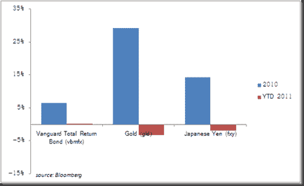

<!--yml

分类：未分类

日期：2024-05-18 15:24:52

-->

# 及时投资组合：“愚笨资金”

> 来源：[`timelyportfolio.blogspot.com/2011/01/dumb-money.html#0001-01-01`](http://timelyportfolio.blogspot.com/2011/01/dumb-money.html#0001-01-01)

在金融行业中，似乎总是有关于“愚笨资金”的讨论。通常，“愚笨资金”被用来描述零售投资者，但根据[Ned Davis Research](http://www.ndr.com)的研究，过去 50 年所有股票价格的涨幅都是在股票共同基金有流入时发生的，所以这表明“愚笨资金”可能实际上就是“聪明资金”。

另外，似乎“愚笨资金”总是别人因为你持相反观点而赚到的钱。羡慕和怨恨常常是这种“愚笨资金”分类的来源。约翰·赫斯曼（John Hussman）似乎在这篇文章[《从牙仙那里获利》](http://www.hussmanfunds.com/wmc/wmc090803.htm)中就属于这种情况，回头看明显是错误的。然而，他在同一篇文章中对“愚笨资金”的定义可能非常符合我的定义。

> 从投机性投资主题中“捕捉”那些有很大概率会崩溃的收益，（这是我添加的内容）其中风险大幅超过了潜在回报。

带着这个想法，去年什么是“愚笨资金”？我认为是美国债券、黄金和日元，但我可能只是出于怨恨或嫉妒。到 2011 年底，我们将知道真相。

（图片链接）

1 小时
