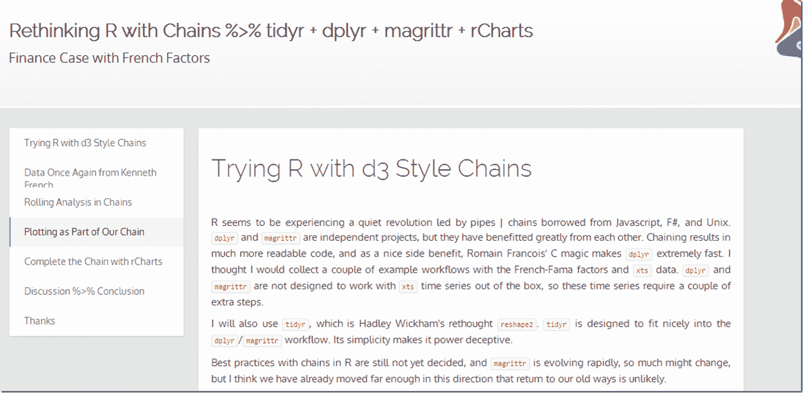

<!--yml

category: 未分类

date: 2024-05-18 14:53:10

-->

# 适时投资组合：链式和管道操作的全新 R 世界

> 来源：[`timelyportfolio.blogspot.com/2014/06/a-whole-new-r-world-with-chains-and.html#0001-01-01`](http://timelyportfolio.blogspot.com/2014/06/a-whole-new-r-world-with-chains-and.html#0001-01-01)

我认为 R 语言世界近期的转向链式和管道操作将会是永久的。即便不是这样，这种代码风格很好地转换到 JavaScript 和其他语言。我考虑通过使用 dplyr、magrittr、tidyr 和 rCharts 探索 Fama/French 因子，这将帮助我学习并思考新的工作流程。

(http://timelyportfolio.github.io/rCharts_factor_analytics/factors_with_new_R.html)
