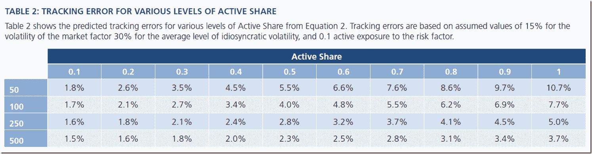

```yaml

类别：未分类

date: 2024-05-18 14:53:27

```

# Timely Portfolio: Active Share and Tracking Error | Not Mutually Exclusive Decisions

> 来源：[`timelyportfolio.blogspot.com/2014/06/active-share-and-tracking-error-not.html#0001-01-01`](http://timelyportfolio.blogspot.com/2014/06/active-share-and-tracking-error-not.html#0001-01-01)

[Antti Petajisto](http://www.petajisto.net/research.html) 他的[关于共同基金管理中的 Active Share 和 Tracking Error 的研究](http://www.cfapubs.org/doi/pdf/10.2469/faj.v69.n4.7)受到了很多关注。虽然这项研究相当有说服力，但其中缺少了对这两个指标之间潜在关系的讨论。论文似乎暗示共同基金经理可以独立且有意地追求 Active Share 和/或 Tracking Error。然而，一些[PIMCO 量化团队的研究](http://media.pimco.com/Documents/PIMCO_Quantitative_Research_Active_Share_Tracking_Error_Sapra_Hun.pdf)认为 Active Share 和 Tracking Error 是相关的，并且它们可以很容易地成为其他决策（如基准或基金暴露）的副产品。我强烈建议阅读这两组研究以全面理解这些概念。

Table 2 is simple enough, but despite its simplicity I could not visualize in my head, so I copied the data and with a couple lines of R + rCharts got all the visualization I needed.

(http://media.pimco.com/Documents/PIMCO_Quantitative_Research_Active_Share_Tracking_Error_Sapra_Hun.pdf)

复制：

源代码来自 Github(https://github.com/timelyportfolio/rCharts_pimco_activeShare/blob/gh-pages/code.R)
