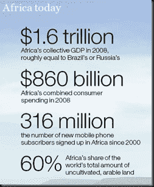

<!--yml

分类：未分类

日期：2024 年 05 月 18 日 15:22:32

-->

# 及时的投资组合：非洲

> 来源：[`timelyportfolio.blogspot.com/2011/02/africa.html#0001-01-01`](http://timelyportfolio.blogspot.com/2011/02/africa.html#0001-01-01

在过去几年里，随着中国和新兴亚洲稳定地将他们的储备转向发达世界的糟糕投资，我一直在想，他们何时会决定投资于自己和非洲会更有益。我对自从 20 世纪 60 年代殖民结束以来非洲情况的阅读让我得出结论，它最大的问题是缺乏来自稳定资本的承诺。这种稳定的资本来源很容易是亚洲国家长期关注的储备基金。如果亚洲的储备基金愿意长期追求糟糕的投资，那么他们似乎应该非常愿意追求好的投资，尽管会有短期波动。

[《Newsweek》的文章《非洲如何成为新的亚洲》](http://www.newsweek.com/2010/02/18/how-africa-is-becoming-the-new-asia.html) 在一篇精彩的文章中提供了两个非常有趣的统计数据：

> 中国和印度因其经济实力而频频登上头条，但还有一个全球增长故事很容易被忽视：非洲。2007 年和 2008 年，南部非洲、肯尼亚、坦桑尼亚和乌干达的大湖区，甚至饱受干旱之苦的非洲之角的国内生产总值增长率与亚洲的两个经济强国不相上下。去年，在全球衰退的低谷时期，非洲大陆的增长率接近 2％，大致与中东地区的增长率相当，并且超过了除印度和中国之外的其他地区。根据新修订的国际货币基金组织（IMF）估算，今年和 2011 年，非洲的增长率将达到 4.8％——这是除了亚洲之外增长率最高的地区，并且甚至高于巴西、俄罗斯、墨西哥和东欧等经常被热议的经济体。事实上，以人均计算，非洲人已经比印度人更富裕，而且有十几个非洲国家的国民总收入比中国更高。
> 
> 牛津经济学家保罗·科利尔（Paul Collier）最近对 2000 年至 2007 年间所有在非洲经营的 954 家上市公司进行了研究，发现它们的资本回报率平均比中国、印度、越南或印度尼西亚等地的类似公司高出 65％，因为亚洲的劳动成本飙升。他们的中位数利润率为 11％，也高于亚洲或南美洲。

还有一些有趣的图表来自[麦肯锡的《奔向未来的非洲》](http://www.mckinsey.com/mgi/publications/progress_and_potential_of_african_economies/index.asp)

(https://blogger.googleusercontent.com/img/b/R29vZ2xl/AVvXsEirWbKs0lpVrx6qxAD0QEoBXtVXu1EXzghZyS5gTA6wVEE0GAT3bOExXX2AeqGKBkvc3cZGWEOTRtkD1_IDSzptAWiECNxzpPwG97UcuQB7Sm30Hc5zqK4EuQQxkvW6oGVNNnWhj-diUw/s1600-h/ScreenClip6.png) ")(https://blogger.googleusercontent.com/img/b/R29vZ2xl/AVvXsEjYQujM6zSIS_2PZmGmEe8WTHnHx-XdNlCepMnM6mIiUQMGSA778X9kJwyxqFWr_2NZEyDDL9MzSJnQ7Um7XB1C7yn2JkCGEdxEOoVMj_ile-6Yyq8hWuChfk7_2vqmiMXjU4bFCyHs2w/s1600-h/ScreenClip16.png) ")(https://blogger.googleusercontent.com/img/b/R29vZ2xl/AVvXsEi_F6tyyjL-czGOm3ksJkeC5C7Es7LwRUR1bNcs3i6pEJxXq5D9stfrnTzTxzCebhPPHeiFW6K5Xcrv-_0fT5tmPU0Akp1XSQp6EMYyNUM7xXdwlXoDykLuwJC9crU9LROqRcYqFgbeKg/s1600-h/ScreenClip25.png) ")(https://blogger.googleusercontent.com/img/b/R29vZ2xl/AVvXsEhP15_owQDWFPDiONbGG2O0idWBrcAPKK2MGrZYn2_N3GgFqSNCbRshqjB8C145AW3iiIFqTxxDrgmnF4DaKi50JsVGFDApqxOpTd7jcU_Ououd4pjQjsSDJ0VC8ZSPCef2CO3sNi7g1Q/s1600-h/ScreenClip36.png)

《福布斯亚洲》杂志的这篇文章[《亚洲应该投资非洲的增长》](http://www.forbes.com/2010/08/12/asia-china-africa-trade-growth-markets-economy-investment_print.html)终于触及了我的观点——亚洲不应该购买彼此牺牲的发达国家债券，而应该在非洲寻求互惠互利的投资。

2.5 **小时**
