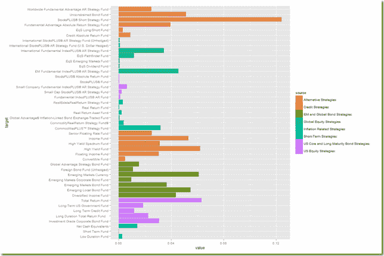

<!--yml

类别：未分类

日期：2024-05-18 14:59:00

→

# Timely Portfolio: All My Roads Lead Back to Finance–PIMCO Sankey

> 来源：[`timelyportfolio.blogspot.com/2013/07/all-my-roads-lead-back-to-financepimco.html#0001-01-01`](http://timelyportfolio.blogspot.com/2013/07/all-my-roads-lead-back-to-financepimco.html#0001-01-01)

即使路线可能曲折，我看似随机的旅程似乎都回到了金融领域。我在

[rCharts](http://rcharts.io/site)

sankey diagrams (

[Exploring Networks with Sankey](http://timelyportfolio.blogspot.com/2013/07/exploring-networks-with-sankey.html)

）使我进入了对

[PIMCO](http://www.pimco.com/Pages/default.aspx)

网络。尽管 PIMCO 以其固定收益产品最为人所知，但 PIMCO 已经将其产品范围扩展到了债券之外。这种远离债券的转变比 2009-2010 年高度公开的举措要早得多（

[Risk.net “Interview: Bill Gross, PIMCO”](http://www.risk.net/credit/interview/1590278/interview-bill-gross-pimco)

）追溯到 2002 年 PIMCO CommodityRealReturn Strategy 的启动（

[Pimco Dreams Up Funds to Overcome The Nightmare of Inflation](http://online.wsj.com/article/SB111222346650493613.html)

”）和 PIMCO All Asset Fund ( “

[PIMCO, Arnott 团队推出了一种不同寻常的 TAA 共同基金](http://connection.ebscohost.com/c/articles/7509039/pimco-arnott-team-offer-unusual-taa-mutual-fund)

”, “

[Investing Without Blinders](http://www.businessweek.com/stories/2003-09-14/investing-without-blinders)

”和“

[PIMCO All Asset Shies From Stocks](http://www.thinkadvisor.com/2003/08/19/pimco-all-asset-shies-from-stocks)

”).

PIMCO All Asset funds 是由

[Research Affiliates](http://www.researchaffiliates.com/)

Robert Arnott 和只投资其他 PIMCO 共同基金而不是个别证券，因此在许多方面基金的成败都取决于其他 PIMCO 基金的质量和范围。由于这听起来有点近亲繁殖，我以为这将是我的新工具——sankey 图和基本网络分析的好题材。

#### Excel to Edgelist with Old-school VBA

由于 PIMCO（以及事实上任何人）都没有提供 igraph 可读的边列表的持仓信息，我决定恢复一些美好的回忆并使用 VBA 将

[spreadsheet](http://investments.pimco.com/ShareholderCommunications/External%20Documents/PIMCO%20Bond%20Stats.xls)

转换为一个 3 列的边列表（源，目标，值）。尽管我对我的 VBA 代码感到尴尬，但我会在下面展示。

```
 Sub getedgelist()
    Dim clInfo As Range, clWrite As Range, tempcl As Range
    Dim offsetamt As Integer

    'this will be used throughout to indicate columns to offset for desired date
    'watch out for hidden rows
    offsetamt = 15

    'clInfo will be the cell with our reference information
    Set clInfo = ThisWorkbook.ActiveSheet.Range("a9")
    'clWrite will be the cell where we write the info that we gather
    Set clWrite = ThisWorkbook.ActiveSheet.Range("u9")

    Do Until clInfo = "Total Gross Asset Allocation"
        'looking at formatting is probably the easiest way to determine if group or fund
        'I chose indent to determine if group or fund
        'IndentLevel = 0 for groups and 1 for funds
        If clInfo.IndentLevel = 0 Then
            'if we are on a group write in clWrite the group and each fund within the group
            'with group as source and fund as target
            'we will loop until we are at the next group
            Set tempcl = clInfo
            'write mutual fund as source, group as target, and weight
            clWrite.Value = ThisWorkbook.ActiveSheet.Range("e6").Value
            clWrite.Offset(0, 1).Value = clInfo.Value
            clWrite.Offset(0, 2).Value = clInfo.Offset(0, offsetamt).Value
            Set clWrite = clWrite.Offset(1, 0)
            Do Until tempcl.Offset(1, 0).IndentLevel = 0
                'now loop through each fund in group
                'write group as source, held fund as target, and weight
                clWrite.Value = clInfo.Value
                clWrite.Offset(0, 1).Value = tempcl.Offset(1, 0).Value
                clWrite.Offset(0, 2).Value = tempcl.Offset(1, offsetamt).Value
                'next cell down
                Set tempcl = tempcl.Offset(1, 0)
                Set clWrite = clWrite.Offset(1, 0)
            Loop
            Set clInfo = clInfo.Offset(1, 0)
        Else

        End If
        'if we are on a group write in clWrite the group and each fund within the group
        'with group as source and fund as target
        Debug.Print (clInfo)
        Set clInfo = clInfo.Offset(1, 0)
    Loop
End Sub
```

现在我们已经有了在 R 中制作 sankey 图所需的一切。

```
 #sankey of PIMCO All Asset All Authority holdings
#data source http://investments.pimco.com/ShareholderCommunications/External%20Documents/PIMCO%20Bond%20Stats.xls

require(rCharts)

#originally read the data from clipboard of Excel copy
#for those interested here is how to do it
#read.delim(file = "clipboard")

holdings = read.delim("http://timelyportfolio.github.io/rCharts_d3_sankey/holdings.txt", skip = 3, header = FALSE, stringsAsFactors = FALSE)
colnames(holdings) <- c("source","target","value")

#get rid of holdings with 0 weight or since copy/paste from Excel -
holdings <- holdings[-which(holdings$value == "-"),]
holdings$value <- as.numeric(holdings$value)

#now we finally have the data in the form we need
sankeyPlot <- rCharts$new()
sankeyPlot$setLib('http://timelyportfolio.github.io/rCharts_d3_sankey')

sankeyPlot$set(
  data = holdings,
  nodeWidth = 15,
  nodePadding = 10,
  layout = 32,
  width = 750,
  height = 500,
  labelFormat = ".1%"
)

sankeyPlot
```

Blogger 使得直接将 d3 融入这篇文章变得困难，所以点击

[在此](http://rcharts.io/viewer/?6022406#.UebN9I3VCSp)

或在下方的屏幕截图上，来互动和参与 sankey。


当然，我们也可以更传统地用 ggplot2 条形图来绘制数据。

（[链接](https://blogger.googleusercontent.com/img/b/R29vZ2xl/AVvXsEiTgJunOVBCihYvbODsP36fGppWzpRpjgfQj9bWzSyJpTiaTDQJM9RbFx7cVPlhC3ywiK5W1wfB-IH8qUpHRhgYTVPnEkanpMNenq2WQtyn_NZUPtKFc2NLNiTrUgw_tbmnsuip2VTM4w/s1600-h/image%25255B10%25255D.png)

无论我们从哪个角度来看，都可以发现 PIMCO 现在拥有的远不止债券和基金，All Asset All Authority 几乎运用了所有工具。
