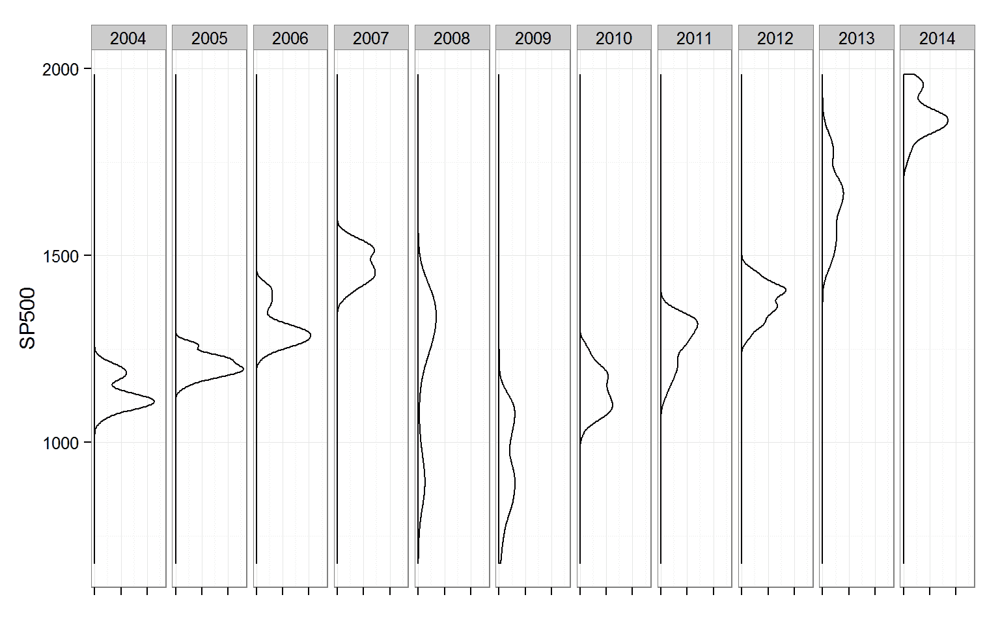
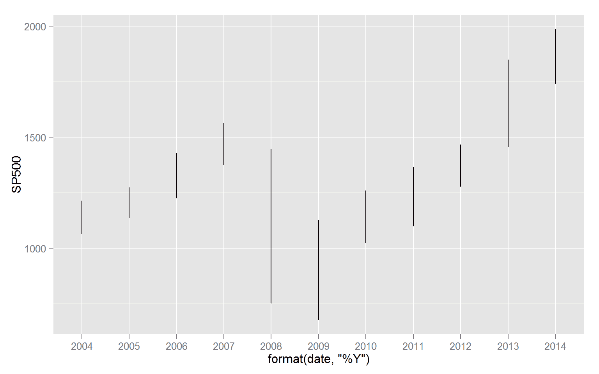
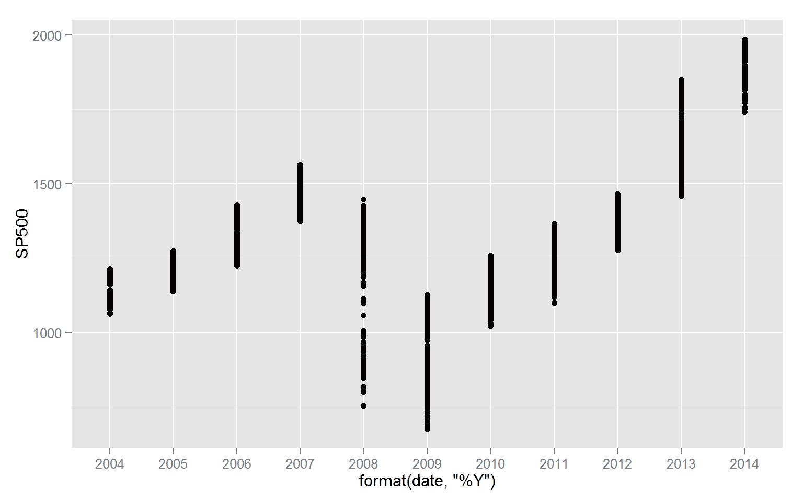
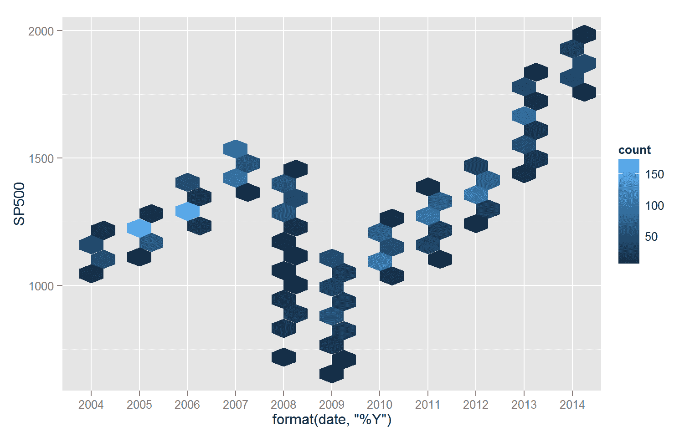
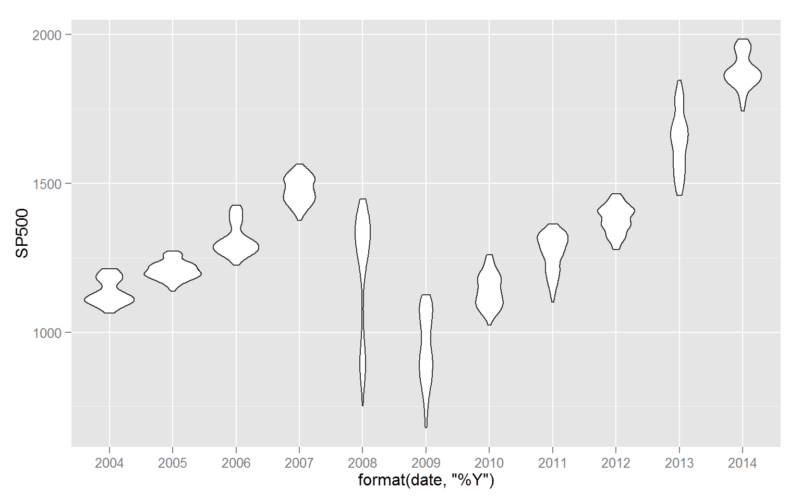

<!--yml

分类：未分类

日期：2024-05-18 14:52:36

-->

# 及时投资组合：替代价格图表 | ggplot2 + magrittr

> 来源：[`timelyportfolio.blogspot.com/2014/07/alternate-price-plots-ggplot2-magrittr.html#0001-01-01`](http://timelyportfolio.blogspot.com/2014/07/alternate-price-plots-ggplot2-magrittr.html#0001-01-01)

这里只是用 ggplot2 + magrittr 进行了几次快速实验，以不同于传统方式绘制价格。我们将从[FRED](http://research.stlouisfed.org/fred2/)获取标普 500 的日数据，使用`getSymbols`，然后通过`magrittr`管道生成各种替代图表。

对于那些可能对 magrittr 感兴趣的人，这里有两点说明。如果你想`->`或者`<-`但是不想让管道函数结束，那么你可以像这样使用`assign`。

```
mydata
  %T>% assign( x="sp_df", value = ., envir = .GlobalEnv ) %>%
```

另外，对于那些想在管道中使用特殊的`+`或者只是想让你的`+`在不同的行上以实现整洁的代码和方便注释的人，你可以这样做。

```
ggplot( ) %>%
  + geom_point()
```

如果我有误，请告知。现在如约提供一些图表。

```
require(ggplot2)
require(dplyr)
require(magrittr)
require(quantmod)

getSymbols("SP500", src="FRED", from = "1900-01-01", auto.assign=F) %>%
  na.omit %>%
  data.frame(
    date = index(.)
  ) %T>% assign( x="sp_df", value = ., envir = .GlobalEnv ) %>%
  mutate( year = format(date,"%Y") ) %>%
  ggplot(  aes( x=SP500, group = year ) ) %>%
    + geom_density() %>%
    + facet_wrap(~year,nrow=1) %>% 
    + coord_flip() %>%
    + theme_bw() %>%
    + theme(
        axis.line=element_blank()
        ,axis.text.x=element_blank()
        ,axis.title.x=element_blank()
      ) 
```



```
sp_df %>%
  ggplot( aes( x = format(date,"%Y"), y = SP500 ) ) %T>% 
  ( function(x){ print( x + geom_line() ) } ) %T>%
  ( function(x){ print( x + geom_point() ) } ) %T>%
  ( function(x){ print( x + geom_hex( bins = 20 ) ) } ) %>%
  + geom_violin()
```



如果你对查看源 Rmd 文件感兴趣，那么它就在[这里](https://github.com/timelyportfolio/magrittr_ggplot/blob/gh-pages/alternative_price_plots.Rmd)。需要说明的是，这是从 Rstudio 编织的 Rmd 文件复制粘贴过来的，仅做了少许修改。
