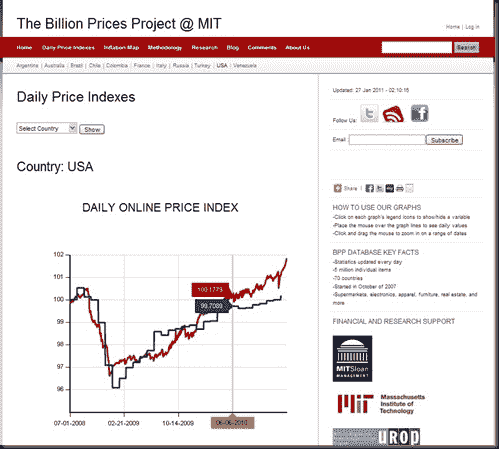

<!--yml

分类：未分类

日期：2024-05-18 15:23:36

-->

# 及时投资组合：MIT 的亿万价格项目——小心债券和消费者价格指数！！！

> 来源：[`timelyportfolio.blogspot.com/2011/01/billion-prices-project-mit-watch-out.html#0001-01-01`](http://timelyportfolio.blogspot.com/2011/01/billion-prices-project-mit-watch-out.html#0001-01-01)

这是一组极其有价值的信息，尤其是当它显示市场中尚未定价的内容时，尤其是债券。我一直每周/每月检查，等待价格的飙升，现在它来了。小心债券和 CPI！

(http://bpp.mit.edu/daily-price-indexes/?country=USA)

请大家去网站上亲自玩玩这些数字。也请和任何关心这些问题的人分享这个链接。

**20 分钟**
