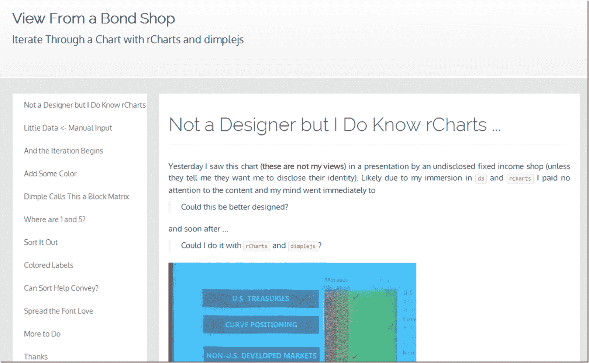

```

分类：未分类

日期：2024-05-18 14:55:08

```

# Timely Portfolio: Bond Shop Views with dimplejs and rCharts

> 来源：[`timelyportfolio.blogspot.com/2014/03/bond-shop-views-with-dimplejs-and.html#0001-01-01`](http://timelyportfolio.blogspot.com/2014/03/bond-shop-views-with-dimplejs-and.html#0001-01-01)

我在一个报告中看到了这个图表，并认为我可以使其变得更好和更具互动性。以下是迭代过程的简短文章。点击下面的截图或[此处](http://timelyportfolio.github.io/rCharts_dimple/viewFromBondShop.html)查看完整的帖子。

注意：这些内容不是我的观点，也不构成财务建议。我没有标明图表的原始来源。如果您是原始来源，并且恰巧看到这个，请告知我是否需要标明您的名字。

](http://timelyportfolio.github.io/rCharts_dimple/viewFromBondShop.html)
