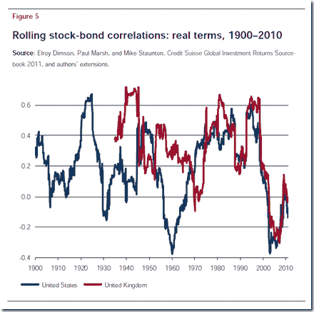
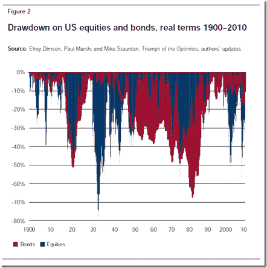

<!--yml

分类：未分类

date: 2024-05-18 15:03:54

-->

# Timely Portfolio：债券的夏普比率远超巴菲特

> 来源：[`timelyportfolio.blogspot.com/2012/08/bonds-much-sharpe-r-than-buffett.html#0001-01-01`](http://timelyportfolio.blogspot.com/2012/08/bonds-much-sharpe-r-than-buffett.html#0001-01-01)

Mebane Faber 的帖子[Buffett 的阿尔法](http://www.mebanefaber.com/2012/08/21/buffetts-alpha/)指出，沃伦·巴菲特的 0.76 夏普比率在标题相似的论文[Buffet 的阿尔法](http://www.econ.yale.edu/~af227/pdf/Buffett's%20Alpha%20-%20Frazzini,%20Kabiller%20and%20Pedersen.pdf "Buffet 的阿尔法")中讨论。我当然立刻想到了世界第八大奇迹——美国债券市场，其夏普比率在过去 30 年中远超巴菲特。更好的是，所有那些战术系统都在它们的回测中使用美国债券，并且不对未来显著不同的回报进行调整。对于那些不知道的人来说，债券

**如果有人能向我展示如何在接下来的 30 年内获得 8%的年化回报，最大回撤不超过 5%，请告诉我，我会用杠杆购买并享受生活。我将很乐意与拥有答案的人分享我的收益。**

除了令人难以置信的夏普比率外，在股票熊市期间，债券还表现出与股票低/负相关的特性，这在历史上也是非常不寻常的。

我只是因为喜欢[地平线图](http://timelyportfolio.blogspot.com/search/label/horizonplot)。

从更长远的角度来看，这里是从 1900 年开始的 CSFB 2011 年鉴滚动相关性图表。

（[图片链接](https://blogger.googleusercontent.com/img/b/R29vZ2xl/AVvXsEiIzYpsuoVO_uG_ONu1A6bEg3Sdvzxw78NfRTk6GNZMSO_X8HAf89YQOzA7czlk1txjLpJGbN3ndVtAOpFZ_SQ31gC1xlX4TSIkfArq8kHX44lGD0OVLdIkaLMNrqxk0okc3igsv9xpSw/s1600-h/image%25255B7%25255D.png)

因此，这次经历可能会与我们近年来幸运地经历的大相径庭。

（[图片链接](https://blogger.googleusercontent.com/img/b/R29vZ2xl/AVvXsEgmuUCPJ2SMmb9Yr70w2PfB-u41nhGFtlseUwjSfqPGi2e3zgaPYOb9BNs2FbfGz7cd179ch5_-TnL71WZ-J2mKcLUnp0Jo46KFYxQfufVnGn0Gj250sKhvevv9p-SqoJw-3WG5HDCPwg/s1600-h/image%25255B11%25255D.png)

[R 代码来自 GIST（安装 xtsExtra）](https://gist.github.com/3440838)
