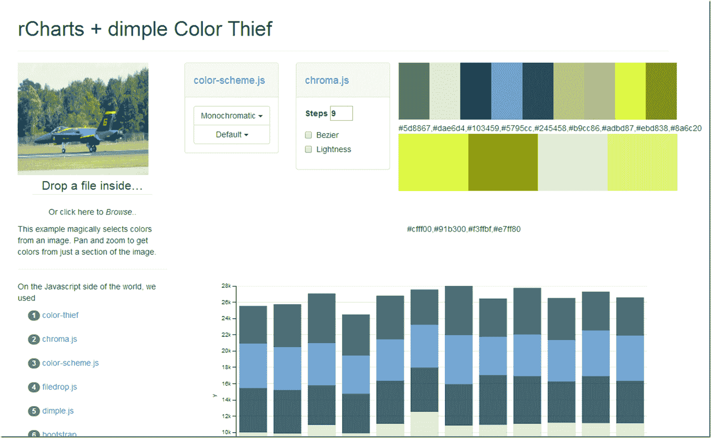

<!--yml

category: 未分类

date: 2024-05-18 14:52:31

-->

# Timely Portfolio: R 生成的图表 + Javascript 生成的色彩

> 来源：[`timelyportfolio.blogspot.com/2014/07/chart-from-r-color-from-javascript.html#0001-01-01`](http://timelyportfolio.blogspot.com/2014/07/chart-from-r-color-from-javascript.html#0001-01-01)

另一个结合了 R 和 Javascript 色彩实验。我真希望我能像[rPlotter](http://github.com/woobe/rPlotter)那样在 Javascript 中实现均等进化距离。我喜爱使用[d3.js](http://d3js.org)的缩放行为在画布上进行平移和缩放图像。另外，[filedrop.js](http://filedropjs.org)让拖放图像变得简单。这段代码里有很多小教程，适合那些想要研究[代码](http://github.com/timelyportfolio/rCharts_color_thief)的人。

你也许还会注意到我上篇文章提到的参考色彩[一个用 R 和 Shiny 标签构建的颜色选择网站 %$%](http://timelyportfolio.blogspot.com/2014/07/pick-color-site-built-in-r-with-shiny.html "http://timelyportfolio.blogspot.com/2014/07/pick-color-site-built-in-r-with-shiny.html")。

(http://timelyportfolio.github.io/rCharts_color_thief/#)
