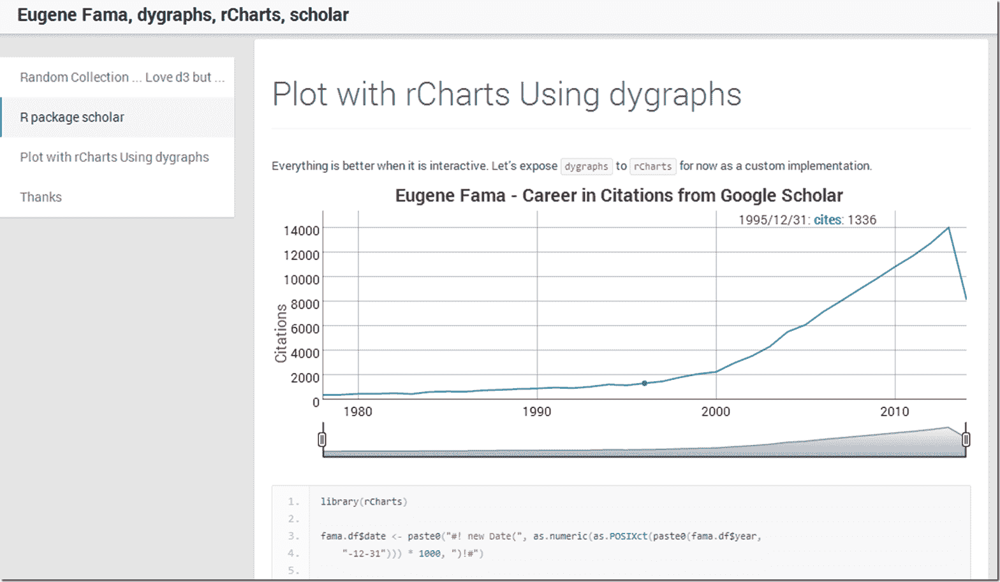

<!--yml

类别：未分类

日期：2024-05-18 14:56:20

-->

# 及时投资组合：结合埃尤根·法玛、rCharts、dygraphs 和学者

> 来源：[`timelyportfolio.blogspot.com/2013/10/combining-eugene-fama-rcharts-dygraphs.html#0001-01-01`](http://timelyportfolio.blogspot.com/2013/10/combining-eugene-fama-rcharts-dygraphs.html#0001-01-01)

有什么比在周末结束时将许多随机主题投入到一些实验中更好的方式呢？以下是[发生的事情](http://timelyportfolio.github.io/research_scholar/)。

](http://timelyportfolio.github.io/research_scholar/)
