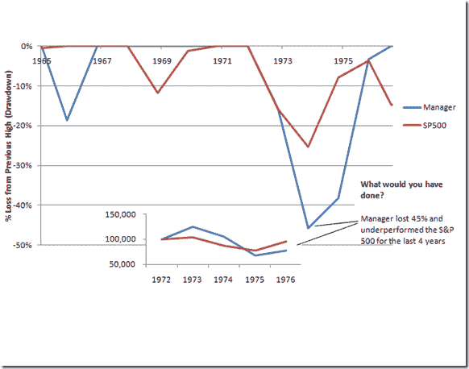

<!--yml

类别：未分类

date: 2024-05-18 15:13:57

-->

# 及时投资组合：信心、结束时的股本，以及作为资金管理者我能做的事

> 来源：[`timelyportfolio.blogspot.com/2011/06/confidence-ending-equity-and-what-i-can.html#0001-01-01`](http://timelyportfolio.blogspot.com/2011/06/confidence-ending-equity-and-what-i-can.html#0001-01-01)

我本打算将此作为我的季度评论，但我认为它更适合作为一篇一般性的讨论文章。比起任何其他文章，我更渴望得到反馈，无论是好是坏。

**信心、资金管理以及您的财富**

如果这是您的资金管理者（稍后揭晓）在 1974 年的情况，您会怎么做？会增加或减少资金吗？虽然我不知道您的答案，我可能会有所减少或完全关闭账户。

](https://blogger.googleusercontent.com/img/b/R29vZ2xl/AVvXsEi7MIF7ILf79teu_k7LXrXyifXWRBCRvOXYvDegvCpPqmOS2QD7u8wf0ofIlxV3susDhMOpBIKWLHkTXrJvqBXfJj50LRYQp2zxK7kMj2c5KL00AKxvgr_-VwGeyRUehyphenhyphenRadsiUoBZQUA/s1600-h/image%25255B7%25255D.png)

*数据由 Statman, Meir 和 Scheid, Jonathan 提供，Buffett in Foresight and Hindsight（2001 年 9 月）。Santa Clara 大学工作论文编号 00/01-37。可在 SSRN 上找到：* [`ssrn.com/abstract=277161`](http://ssrn.com/abstract=277161 "http://ssrn.com/abstract=277161")

您的最终财富在很大程度上取决于您何时以及添加或减少多少钱，而不是我表现得多好。虽然作为您的资金管理者，我可以管理风险和回报，但我遗憾的是不能控制决定您最终财富的这个最重要的因素。没有信心，资金管理就会失败，所以我为了建立和维持您的信心所做的努力，可能比我的几何收益关联更能构建您的财富。我建立和维持您的信心以及最终财富的方法需要两个要素：开放的诚实沟通和回撤最小化。

1) 开放的诚实沟通需要您的帮助，因为对话需要双向进行。我将继续发送季度更新和业绩报告，但我也需要了解您的感受、担忧、建议、问题、生活变化，或任何其他事情，这样我才能帮助您实现财务目标。我可通过电话、电子邮件、邮件、面对面、短信、Twitter、Skype 和即时消息联系到您。

2) 在上面的图表中，我猜您的决策更多地基于损失的钱而不是表现不佳。恐惧摧毁信心，如果我能将回撤控制在 10-15%以内，那么您的恐惧的持续时间和强度都将大大减轻。

如果你在 1976 年抛掉了伯克希尔哈撒韦和沃伦·巴菲特，你会作何感想？上表中的经理人是沃伦·巴菲特，如果你一直持有巴菲特/伯克希尔直到 2010 年，那么你最初的 10 万美元投资将比持有标普 500 指数多赚 1.61 亿美元。我绝不是声称自己有能力复制沃伦·巴菲特的业绩或管理风格，但我认为这很好地说明了一个世界级的最佳基金经理是如何可能失去客户的信任，并可能影响他们最终的净资产的。

在 1998 年 10 月 29 日的《福布斯》杂志中，伯克希尔帮派一文中，巴菲特说：“第一批投资者只是相信我。那些有信心的人留了下来；如果你用撬棍撬，我的阿姨凯蒂也不会卖掉。但是后来因为认为股票便宜并被我的记录吸引而进来的人并不总是留下来。这是一个自然选择的过程。”

如我所说，我很想听听您的看法。我把这篇文章限制在一页之内，但另一篇非常相关的好文章可以在

> 耐心投资者的机会，杰森· zwieg 和塞斯·克拉曼
> 
> [金融分析师杂志，2010 年 9/10 月，第 66 卷，第 5 期：18-28 页。](http://www.cfapubs.org/loi/faj)

我在 Excel 中做了这个图表，但我还是决定也包含[巴菲特的数据显示（点击文件）](https://spreadsheets.google.com/spreadsheet/ccc?key=0Amqp2r96khJPdHJXZ1hwbVQ0UTAtMW4yNE9FMFMyamc&hl=en_US)在 R 中。以下是它的样子。

[R 代码（点击下载）：](https://docs.google.com/leaf?id=0B2qp2r96khJPMjYzYzBlNDYtOTNmYy00ZjRjLTg1YjAtZTkxNjVmNWZiMzA3&hl=en_US)

```
require(quantmod)
require(PerformanceAnalytics)
require(ggplot2)   berkshire_sp500 <- read.csv("berkshire_and_sp500.csv",stringsAsFactors=FALSE)
berkshire_sp500 <- as.xts(berkshire_sp500[,2:3],order.by=as.Date(berkshire_sp500[,1]))   #annual data unfortunately does not work with PerformanceAnalytics
#so these won't look as good as I would like   #calculate growth of $1
#first step is getting returns
cumPerf <- ROC(berkshire_sp500,n=1,type="discrete")
#remove na from start of series
cumPerf[1,] <- 0
#second step is calculating the cumulative product of returns
#or geometrically link the periodic returns
cumPerf[,1] <- cumprod(1+cumPerf[,1])
cumPerf[,2] <- cumprod(1+(cumPerf[,2]))   #get df from the xts
df <- data.frame(cbind(index(cumPerf),data.matrix(coredata(cumPerf[,1:2]))))
#name columns
colnames(df) <- c("Date",colnames(df)[2:3])
#use melt to get in format that ggplot likes best
df <- melt(df,id=1)
colnames(df) <- c("Date","Investment","GrowthOfDollar")
#jpeg(filename="GrowthOfDollar.jpg",quality=100,width=6.25, height = 5, 
# units="in",res=96)
ggplot(df,aes(x=Date,y=GrowthOfDollar,colour=Investment)) +
geom_line() + scale_x_date(major="5 years",format="%Y") +
scale_y_log10() + opts(title = "Berkshire and S&P 500 Growth of $1 
1965-2010")
#dev.off()
```

[由 Pretty R 在 inside-R.org 创建](http://www.inside-r.org/pretty-r "由 Pretty R 在 inside-R.org 创建")
