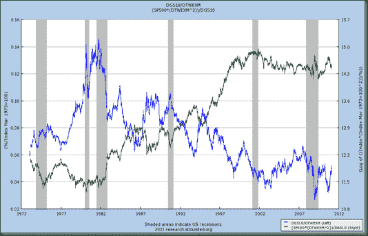

<!--yml

category: 未分类

date: 2024-05-18 15:20:12

-->

# 及时投资组合：死亡螺旋警告图

> 来源：[`timelyportfolio.blogspot.com/2011/03/death-spiral-warning-graph.html#0001-01-01`](http://timelyportfolio.blogspot.com/2011/03/death-spiral-warning-graph.html#0001-01-01)

在死亡螺旋场景中，利率上升而货币贬值。以下是观察的方法。我不是说美元和利率的死亡螺旋会发生，但如果没有采取重要措施恢复对财政和货币政策的信心，几乎是肯定的。幸运的是，自由市场和民主可能会及早制止螺旋，但似乎需要一个小危机来迫使采取行动。

&id=p76537466593)

来自 [StockCharts.com](http://stockcharts.com/h-sc/ui?s=%24tnx:%24usd&p=m&st=1990-01-01&en=(today)&id=p76537466593)

当我们将其作为 S&P 500 的分母或定价机制添加时（转换需要先删除自然美元定价），图表看起来像这样。自 2008 年以来由于积极的货币行动而引起的股价短暂的假象性改善更加清晰。绿线上的任何数值超过 14.3 都表明这个螺旋的第一阶段。

并且为了增加一些 R，让我们看一下 SP500 与 10 年期美元/美元比率的滚动相关性。在 1998 年夏天，由于长期资本管理公司和俄罗斯违约，相关性神奇地增加，而美联储的支持也变得牢固。

R 代码：

require(quantmod)

require(PerformanceAnalytics)

#从美联储美元其他数据系列获取货币汇率和股票数据

getSymbols("DGS10",src="FRED") #加载美联储 10 年期利率

getSymbols("DTWEXM",src="FRED") #加载美联储美元

getSymbols("DTWEXO",src="FRED") #加载美联储美元其他

getSymbols("SP500",src="FRED") #加载美联储 SP500

returns<-merge(monthlyReturn(to.monthly(DGS10/DTWEXM)),monthlyReturn(to.monthly(SP500)))

corSP10USD<-runCor(returns["1973::2011-02",1],returns["1973::2011-02",2],n=6)

chartSeries(corSP10USD,theme='white',name="S&P 500 Rolling 1y Correlation with US$ and US10y Rates")
