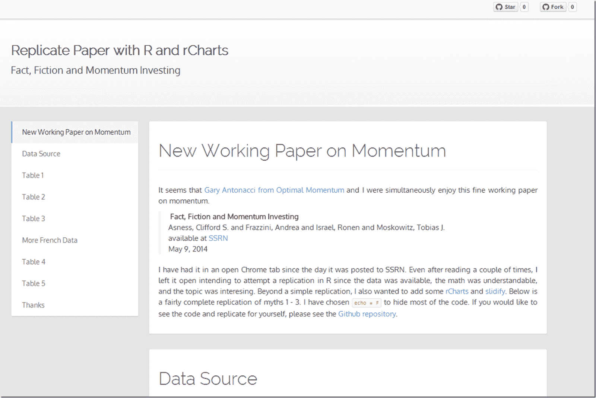

<!--yml

类别：未分类

日期：2024-05-18 14:53:19

-->

# [及时投资组合：消除动量投资的十大误区](http://timelyportfolio.github.io/rCharts_factor_analytics/aqr_fact_fiction_momentum.html) - AQR 研究工厂

> 来源：[`timelyportfolio.blogspot.com/2014/06/dispelling-myths-of-momentum-aqr.html#0001-01-01`](http://timelyportfolio.blogspot.com/2014/06/dispelling-myths-of-momentum-aqr.html#0001-01-01)

在 AQR（[AQR](http://www.aqr.com/)）研究工厂最近的一篇[工作论文](http://papers.ssrn.com/sol3/papers.cfm?abstract_id=2435323)中，作者试图消除关于动量投资的十个常见误区。他们利用了 Kenneth French 公开提供的精细数据，并使用相对简单的指标，对这十大误区及动量因子进行了有说服力的论证。我用 R 语言复现了大部分计算，并通过复现、总结和流程讨论的方式，利用[rCharts](http://rcharts.io)、[Gmisc](http://gforge.se/gmisc/)和[slidify](http://slidify.io)创建了下面的[报告](http://timelyportfolio.github.io/rCharts_factor_analytics/aqr_fact_fiction_momentum.html)。我希望其他人觉得这有用，它的作用远不止是简单的复现。

对于这篇论文的另一个非常详细的总结，请参阅[Gary Antonacci 的 Optimal Momentum 博文](http://optimalmomentum.blogspot.com/2014/06/fact-fiction-and-momentum-investing.html)。

为了确保那些可能不读论文的人也能看到，我将下面的致谢部分复制粘贴下来。

### 特别感谢：
