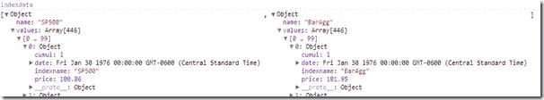

<!--yml

category: 未分类

date: 2024-05-18 15:01:09

-->

# Timely Portfolio: 使用 d3 艰难地做事

> 来源：[`timelyportfolio.blogspot.com/2013/03/doing-things-hard-way-with-d3.html#0001-01-01`](http://timelyportfolio.blogspot.com/2013/03/doing-things-hard-way-with-d3.html#0001-01-01)

虽然有些尴尬，但我认为这可能对那些学习[d3.js](http://d3js.org)的人有所帮助。我在[d3.js](http://d3js.org)上的大部分挣扎都集中在数据的正确格式上。我认为这主要是心态问题。d3.js 提供了一系列完整的辅助函数来轻松完成这个任务，但似乎我的大脑已经被训练成了一种不同的思考方式。在某种程度上，我把它比作我最初对[R 语言](http://r-project.org)的 apply 函数系列的困难。经过大量的练习，我认为一旦你掌握了，就会一劳永逸。

以最近的一项实验为例，实验中使用了[zui53 和 d3 处理索引数据](http://bl.ocks.org/timelyportfolio/5149102)。我花了超过一个小时才创造出这个混乱场面：

```
 ```

var indexkeys = d3.keys(d3.nest().key(function (d) { return d.indexname; }).map(data))

```

var indexdata = indexkeys
     .map(function (name) {
           return {
           name: name,
           values: data.filter(function (d) { return d.indexname == name; })
       };
 });
```

```
The original data is a csv in long format
```

```
date,indexname,price
1976-01-30,SP500,100.86
1976-02-27,SP500,99.71
...
2013-01-31,BarAgg,1831.49
2013-02-28,BarAgg,1840.67
```

```
which I would like to look like.
```

```

```

```
Although my ugly mess works, after a couple days away from the code, I had a thought after reading D3 Nest Tutorial and examples for a fifth time.  I could have just simply done this.
```

```
indexdata = d3.nest().key(function(d) {return d.indexname;}).entries(data)
```

我在[`groups.google.com/forum/?fromgroups=#!topic/d3-js/biALMQnYUgo`](https://groups.google.com/forum/?fromgroups=#!topic/d3-js/biALMQnYUgo)之后自以为已经完全掌握了方法，但正如你所见，我差得远呢。
