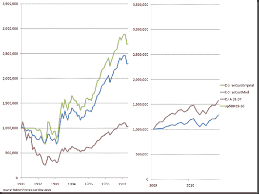

<!--yml

分类：未分类

日期：2024-05-18 15:24:27

-->

# 及时投资组合：糟糕市场中的美元成本平均投资版本 2

> 来源：[`timelyportfolio.blogspot.com/2011/01/dollar-cost-average-in-ugly-markets.html#0001-01-01`](http://timelyportfolio.blogspot.com/2011/01/dollar-cost-average-in-ugly-markets.html#0001-01-01)

作为今天早些时候发布的[《在糟糕市场中进行美元成本平均投资》](http://timelyportfolio.blogspot.com/2011/01/dollar-cost-averaging-in-ugly-markets.html)博文的更新，我对系统进行了轻微的修改。在这个版本中，在经历 55%的回撤后，每个月购买比上个月高出 10%的股票。下面展示了道琼斯工业平均指数 1931-1937 年以及标普 500 指数 2009-2010 年的结果。

当然，还有许多更好的系统和方法，我不建议你以此作为入门方法，但在恐慌之中保持简单有时是一件令人愉快和安慰的事情。

当然，这都假设投资者在 55%的回撤之前某个时刻退出了。

**1 小时**
