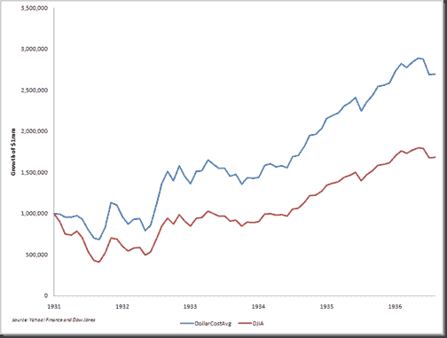

<!--yml

类别：未分类

日期：2024-05-18 15:24:35

-->

# Timely Portfolio: Dollar Cost Averaging in Ugly Markets

> 来源：[`timelyportfolio.blogspot.com/2011/01/dollar-cost-averaging-in-ugly-markets.html#0001-01-01`](http://timelyportfolio.blogspot.com/2011/01/dollar-cost-averaging-in-ugly-markets.html#0001-01-01)

[Pragmatic Capital 的总结](http://pragcap.com/deep-thoughts-by-jeff-saut)的[Jeff Saut 的周评](http://www.raymondjames.com/inv_strat.htm)让我想起了我在（我不是开玩笑）2009 年 3 月 9 日的电子邮件中的美元成本平均观念：

> “我还有一个想法：
> 
> 如果你在 1931 年 9 月达到 60%的回撤水平后，用道琼斯指数进行 10%/月的投资，为期 10 个月，直到 100%的股权分配，你会追求这种策略的回报。这是你的回报，假设这是绝对最坏的情况（想不出比大萧条 89%的最终回撤更糟糕的了） 。我喜欢我的机会。”

在那个时刻的想法是如何克服 2008 年可怕市场的恐慌/绝望/消沉，并采取明确的行动将丑陋转化为机会。所以， knowing in 2008，底线是不可知的，我认为我可以测试在 US 历史上最糟糕的市场中进行美元成本平均值，看看它可能如何工作。我在没有优化的基础上选择了 60%作为回撤水平，以启动 10 个月（使数学更简单）的 10%/月的分配给道琼斯（1929-1931）和标普 500（2007-2008）。在月平均基础上，60%的回撤水平在 1931 年 9 月触及，所以我们来看看那时它是如何工作的。仅仅知道最坏的情况可以帮助克服使人瘫痪的恐惧。稍微调整可以显著提高性能，但我想要保持智力上的诚实，并不优化。

](https://blogger.googleusercontent.com/img/b/R29vZ2xl/AVvXsEilQqjfTb0uc7V9CI5iAX8JX_pkjtifMHWXDOI-YCxj8o5_WI_5u2hmS5bEggXHdFW1AAMpYqHk6TVH0o801O5ycpcZ0UczuCpu9OF9Q53CjKFcVKOQ1MTuWt-VIzBGaYHD8TlRLFM0AQ/s1600-h/image%5B27%5D.png)

不幸的是，对于系统，但幸运的是对于剩余的股票投资者，标普 500 在 2008 年危机中没有达到 60%的回撤。纯粹为了好玩，让我们将这篇文章和系统概念与我在[“底部挖掘的危险”文章](http://timelyportfolio.blogspot.com/2011/01/perils-of-bottom-picking.html)中的警告联系起来，通过将回撤修正为 55%，并且只在指数在明天篇文章中每月上升时投资（还没做，所以会让我也感到惊讶）…

75 分钟
