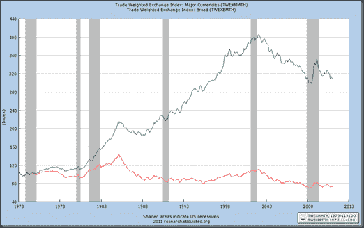

<!--yml

分类：未分类

日期：2024-05-18 15:20:52

-->

# Timely Portfolio: Dollar Not Even Started Against Non-reserve Currencies

> 来源：[`timelyportfolio.blogspot.com/2011/02/dollar-not-even-started-against-non.html#0001-01-01`](http://timelyportfolio.blogspot.com/2011/02/dollar-not-even-started-against-non.html#0001-01-01)

伯南克在美元出现显著额外贬值之前，还没有完成他的贬值工作。由于利率低且美元持续稳定，我能理解他如何证明可以追求由新兴市场货币低估和美元储备所启发的糟糕的货币政策。

(http://research.stlouisfed.org/fred2/graph/fredgraph.png?&chart_type=line&graph_id=&category_id=&recession_bars=On&width=1000&height=600&bgcolor=%23B3CDE7&graph_bgcolor=%23FFFFFF&txtcolor=%23000000&ts=8&preserve_ratio=true&fo=ve&id=TWEXMMTH,TWEXBMTH&transformation=nbd,nbd&scale=Left,Left&range=Custom,Max&cosd=1973-01-01,1973-01-01&coed=2011-01-01,2011-01-01&line_color=%23FF0000,%23006600&link_values=,&mark_type=NONE,NONE&mw=4,4&line_style=Solid,Solid&lw=1,1&vintage_date=2011-02-25,2011-02-25&revision_date=2011-02-25,2011-02-25&mma=0,0&nd=1973-11-01,1973-11-01&ost=,&oet=,&fml=a,a&fq=Monthly,Monthly&fam=avg,avg&fgst=lin,lin)

当我正在收集国内股市下跌、债券利率上升和>50%的货币贬值的国家死亡螺旋数据时，我想知道美元如何在针对自己或任何其他货币的攻击中幸存，因为另一种货币攻击的第一个反应将是出售美元以进行防御。
