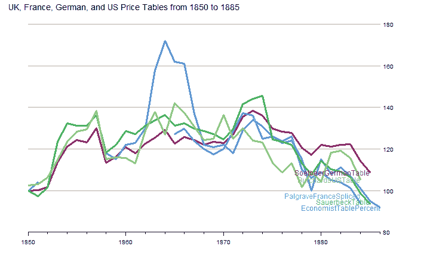
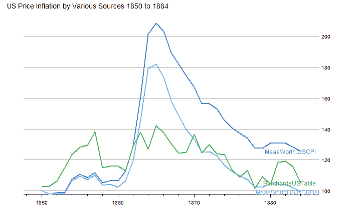

<!--yml

分类：未分类

日期：2024-05-18 15:00:48

-->

# Timely Portfolio：在谷歌书架上翻阅 130 年的黄金书籍

> 来源：[`timelyportfolio.blogspot.com/2013/03/dust-off-130-year-old-gold-books-on.html#0001-01-01`](http://timelyportfolio.blogspot.com/2013/03/dust-off-130-year-old-gold-books-on.html#0001-01-01)

非常出色的论文

> **黄金困境**（2013 年 1 月 8 日）
> 
> 作者：Erb, Claude B. 和 Harvey, Campbell R.
> 
> 可在 SSRN 上找到：[`ssrn.com/abstract=2078535`](http://ssrn.com/abstract=2078535)

本文中讨论的[《我是如何错过“黄金困境”的》](http://timelyportfolio.blogspot.com/2013/03/how-did-i-miss-golden-dilemma.html)激发了我重新翻阅一些关于黄金的非常旧的书籍，这些书我已经添加到了我的谷歌书架上。我总是惊讶于几个世纪的金融和经济学对话仍然听起来如此相关。更令人感兴趣的是，许多问题仍然没有答案。关于黄金和通货紧缩的新讨论出现在[《1873 年以来的黄金与价格》](http://books.google.com/books?id=UFMuAAAAYAAJ&printsec=frontcover#v=thumbnail&q&f=false)一书中，由詹姆斯·劳伦斯·洛弗尔撰写，以这样的方式开始（强调和链接由我添加）：

> § I. 关于最近价格运动的意义的许多不同意见，是由于黄金的价值是一个随其任一术语变化而变化的比率。无论是商品相对于黄金下跌还是黄金相对于商品上涨，在这两种情况下，黄金的价值都上升了。因此，同样的现象可能由根本不同的原因引起。因此，虽然承认价格下跌，但可以说，一方面，黄金价值的上升是由于影响黄金本身的某些原因，如稀缺；另一方面，有人认为，价格的下跌是由于与商品有关的原因，而不是与黄金有关的原因。
> 
> **黄金稀缺价值的信仰者**通过引用黄金年产量下降、1873 年以来德国、意大利和美国对黄金的异常需求、货币市场的紧张、黄金在艺术中的增加使用、物价普遍下跌、1873 年以来贸易衰退的异常特征、普遍存在的低工资、利润和租金，以及 1873 年以来黄金和银的节约手段没有任何进步来支持他们的立场。这些观点与[罗伯特·吉芬先生，英国贸易委员会统计学家](http://books.google.com/books?id=tgzxAAAAMAAJ&printsec=frontcover&dq=editions:Zo11ySnomUYC&hl=en&sa=X&ei=PBJLUaaLLsHc0QGCl4CYCA&ved=0CEQQ6AEwAw#v=twopage&q&f=false)和[戈森先生，现任 Chancellor of the Exchequer](http://books.google.com/books?id=0iU5AAAAMAAJ&printsec=frontcover&dq=editions:vBmzMXPNwLYC&hl=en&sa=X&ei=6RJLUefZLe-70QGm6oDwDg&ved=0CDEQ6AEwAA#v=twopage&q&f=false)紧密相关；而主要命题与双金属主义明显的联系给它带来了半政治性质，并在欧洲和美洲获得了许多支持者。
> 
> 第二章。由于自 1873 年以来黄金价值的上升与物价的下跌成比例，因此批判性地看待与物价有关的事实是很重要的。为了达到这个目的，自 1850 年以来更重要的物价表已在附录中收集，并解释了计算方法、来源和可靠性。希望对这些表格的不同方法和结果进行比较能起到有益的作用。
> 
> 迄今为止，伦敦《经济学人》杂志的 22 篇文章中的数据几乎被普遍用作物价运动的证据；**但这种对这一偶像的崇拜该停止了。**近来，**更加可靠的数据表已经发布。**

我非常喜欢作者的方法，即考虑价格分数的分子和分母，并尽可能收集数据，而不是依赖一个可能存在缺陷的数据集。到第 3 页，我们已经看到了这幅关于英国、法国、德国和美国物价/通货膨胀的精彩图表。这些额外的物价数据使我们能够更加客观地讨论。

在作者方法的精神下，我想在 R 中重现上面的图表，并比较美国布尔哈德的表格与[MeasuringWorth](http://measuringworth.com)的 CPI 和 GDP 平减指数数据。我试图用 OCR 走捷径，但最终还是手动输入了附录中的价格表。



这幅图做得很好，实际上无法再改进，除了颜色和标签。

如我之前提到的，[MeasuringWorth](http://measuringworth.com) 是长期经济和金融数据的绝佳来源。我想比较 Burchard 的美国价格表和 MeasuringWorth 的美国 GDP 平减指数和 CPI。内战显著地破坏了物价稳定。这种影响在 MeasuringWorth 的数据中表现得更为明显。



作者在[附录表 M](http://books.google.com/books?id=UFMuAAAAYAAJ&pg=PR14#v=onepage&q&f=false)中讨论了 Burchard 价格的不足之处。

> 对财政报告表的检查表明，它们并没有被精心编制。一种商品的价格会从一个月到下一个月没有变化；然后，突然之间，它会上升或急剧下降。通常会一起波动的商品（如猪和生铁、黄油和奶酪）的价格显示出非常松散的相关性。此外，同样的商品年复一年地出现。一种商品会被引用多年，然后消失，后来，也许会再次出现…尽管存在这些严重的缺陷，我们还是重新印刷了 Burchard 先生 1850-84 年的数字，因为它们是美国平均价格的唯一连续数字。

作者将他剩余的论点组织成了 8 个额外的部分，我已经给它们加上了标题。此外，我会从每个部分中给出我最喜欢的段落。有趣的是，其中许多论点可以直接应用于今天的 MMT 世界，唯一的例外就是没有金本位制。

#### 第三部分：货币和信贷的供应必须被考虑

> 实际上，在今天的社会中，物价的一般水平（足够长的时间，以使社区的商业习惯或现有黄金库存的变化产生影响）必须取决于货币数量与信贷各种形式的结合。这两者是不可分割地联系在一起。因此，因此，物价水平（就购买力的提供而言）取决于两个因素，货币量和信贷的扩张或收缩，这两个因素中的每一个都可能在不依赖另一个的情况下发生相当大的变化。两者可以同时增加或减少，或者一个的增长可能抵消另一个的损失。

#### 第四部分：影响价格的其他事件

> 在战争时期，商品的需求异常旺盛，正是在财富巨大毁灭的时期，这种情况产生了一种不健康的局面；但表面上一切似乎都很公平，人们开始相信价格注定会一直上涨。1873 年对金属的投机（见图 II）是前所未有的...到处都是不健康和异常状况的迹象。但当实际购买力大幅受损时，这种不受控制的需求是无法永远持续的。一旦发现人们创造了超出他们支付能力的负债，末日就到了。1873 年的危机是在近二十年的投机狂热之后，人们痛苦地意识到实际情况的回归。由于疾病已经取得了巨大的进展，因此影响更为严重。

#### 第五节：工业流程的改进与商品的新供应

> 在一次巨大的金融动荡之后，自然会出现许多改进生产过程和降低生产成本的方法。需求成为发明之母。自 1873 年以来，生产者为了在激烈的竞争中降低生产成本而所做的努力，导致了这样一个问题：价格的下跌是否可以仅仅归因于与商品有关的因素，而不是黄金。如果这些影响已经广泛传播，那么这将是有力证据，证明黄金稀缺的影响并不像一些人认为的那样大。

#### 第六节：按商品类型分析价格

> 从四十九篇文章中推断黄金稀缺，或者根据五十一篇文章的价格推断黄金充足，对于那些认为价格能直接证明货币数量的人来说，这是一个尴尬的困境。正如 Forsell 所指出的，黄金稀缺的理论与许多商品价格上涨的事实是不兼容的。

#### 第七节：黄金供应

> 从这些数据中，我们可以看到，文明世界的银行储备显示出黄金增长非常显著。尽管总的纸币流通增加了 29%，但黄金储备增加了 75%，银也增加了 25%。在 1870-74 年间，黄金储备占到总纸币流通的 28%，构成所有货币储备的 64%。到了 1885 年，黄金相对于更多的纸币发行占有更大的比例，即总纸币流通的 41%；尽管白银积累异常（例如在法国银行），黄金仍占货币储备的 71%。这是非常显著的。它意味着，毫无疑问，黄金供应如此充裕，以至于纸币流通的性质和安全得到了显著改善。在 1871-74 年间，每 3.60 美元的纸币流通中就有 1 美元的黄金.* 在 1885 年，每 2.40 美元的纸币流通中有 11 美元的黄金。

#### 第八节：信贷供应

> 1.8 亿盎司的黄金以纸币形式流通，代表等量的黄金；但是，黄金并没有因为纸币的流通而节约。在这些国家，流通总额增加了 35%，而纸币得到了更好的保护……除了俄罗斯，每个国家的纸币货币都得到了加强，许多国家的增加幅度很大。黄金储备不仅允许扩大纸币流通，而且为增加的发行提供了更好的保护。

#### 第九节：土地劳动价格

> 立刻会回忆起，关于租金，自 1873 年以来，一个显著的特征是新的肥沃土地的开发，其产品以大幅降低的成本运输。但这也正是为什么在较老的国家土地应该被抛荒，租金应该降低的原因。因此，这一现象可以用黄金稀缺以外的其他原因来解释……工资上涨倾向于证实人们的信念，物价下跌主要是由于改进技术的引入。

#### 第十节：结论

> 假设因为物价下跌与白银货币化同时发生，所以这是由于黄金升值所致，而没有考虑到是否这些同时发生的现象可以追溯到完全不同的原因，这就是陷入了“先后即因果”的谬误。然而，固定任何时间价格水平的因素太过复杂，不能推断出因为物价严重下跌，黄金就变得稀缺了。

[自 1873 年以来黄金与价格的关系](http://books.google.com/books?id=UFMuAAAAYAAJ&printsec=frontcover#v=thumbnail&q&f=false)提醒我们，当前的经济是如何与过去紧密相连的。我经常觉得，世界各国中央银行前所未有的行动已经打破了与几个世纪金融历史的联系。相反，看起来他们只是暂时暂停了人类与金钱不可改变的法则，也许“因为疾病已经取得了巨大的进展，所以影响更为严重”的阴影会困扰我们。

我时间不够了，无法在 d3 中完成可视化。任何有动力的人，这里有一个获取 JSON 的方法：

```
# for the ambitious and more motivated than me, here is how to easily get
# the JSON to translate the graph to an interactive http://d3js.org
require(rjson)
toJSON(list(Date = format(index(priceTables), "%Y-%m-%d"), as.list(priceTables))) 
```

（留白）

[完全由 R markdown 生成的帖子，以便复制：](https://gist.github.com/timelyportfolio/5214773)
