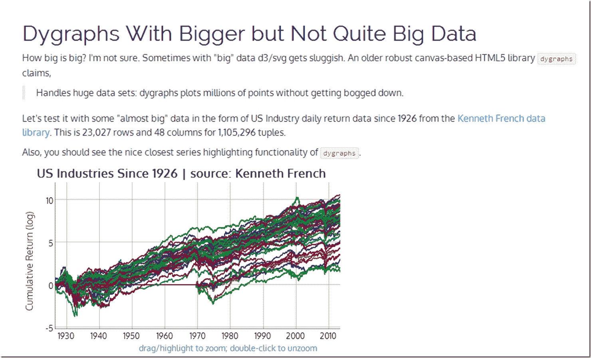

<!--yml

分类：未分类

日期：2024-05-18 14:56:03

-->

# Timely Portfolio: Dygraphs with Bigger Data | US Industries from Kenneth French

> 来源：[`timelyportfolio.blogspot.com/2013/11/dygraphs-with-bigger-data-us-industries.html#0001-01-01`](http://timelyportfolio.blogspot.com/2013/11/dygraphs-with-bigger-data-us-industries.html#0001-01-01)

在看到[@lauraegerdal](https://twitter.com/lauraegerdal)宣布美国证券交易委员会（SEC）使用[dygraphs](http://dygraphs.com)来可视化[市场结构](http://www.sec.gov/marketstructure/datavis.html#.UoZe-hqsiM5)后，我受到了启发，想更多地尝试结合 dygraphs 和 rCharts。我真的很想看看 dygraphs 在处理相对较大的数据集时的响应性。一些[Kenneth French](http://mba.tuck.dartmouth.edu/pages/faculty/ken.french/data_library.html)的美国行业数据似乎足够大，可以很好地了解 dygraph 的消化能力。您可以在[这里](http://timelyportfolio.github.io/rCharts_dygraphs_posts/biggerdata.html)看到它的实际应用，或者点击下面的屏幕截图。

](http://timelyportfolio.github.io/rCharts_dygraphs_posts/biggerdata.html)
