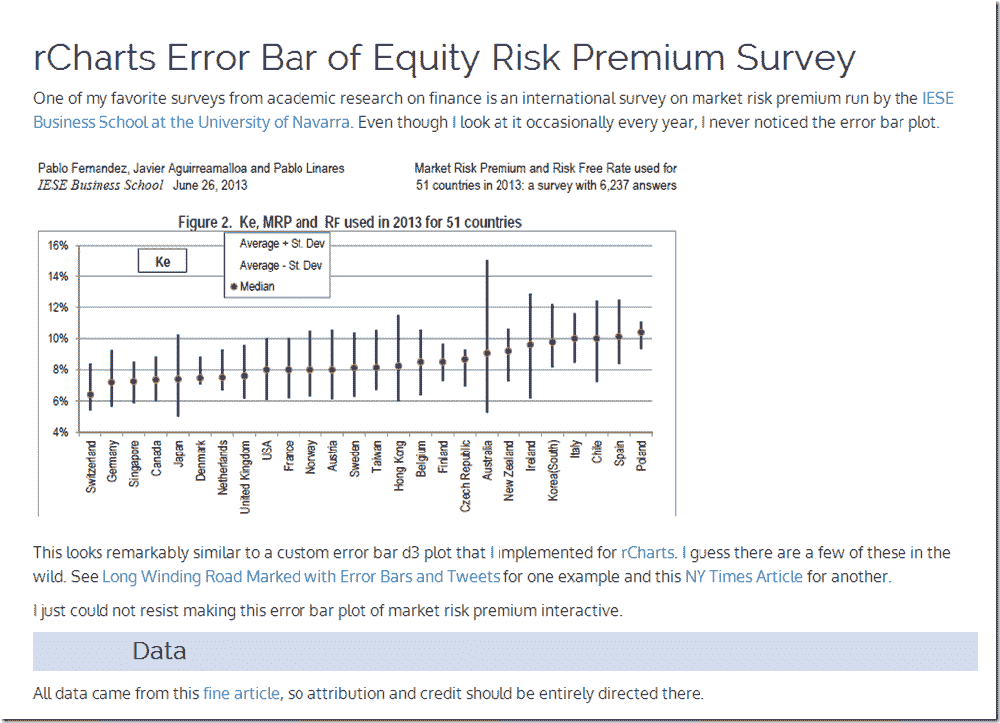

<!--yml

类别：未分类

日期：2024-05-18 14:56:29

-->

# 及时投资组合：全球股票市场风险溢价

> 来源：[`timelyportfolio.blogspot.com/2013/10/equity-market-risk-premium-around-world.html#0001-01-01`](http://timelyportfolio.blogspot.com/2013/10/equity-market-risk-premium-around-world.html#0001-01-01)

多年来，我真的很喜欢这份由[IESE 商学院](http://www.iese.edu/)进行的全球市场风险溢价调查，它非常全面。

> **2013 年用于 51 个国家的市场风险溢价和无风险利率**
> 
> 一份包含 6,237 个回答的调查
> 
> 费尔南德斯，巴勃罗和阿吉拉尔马略阿，哈维尔和林 ares，巴勃罗
> 
> 2013 年 6 月 26 日
> 
> 可在 SSRN 上找到：[`ssrn.com/abstract=91416`](http://ssrn.com/abstract=91416)

我想，加入一点 d3/rCharts 的交互性可能会真正让误差线图活跃起来。这远非完美，但我喜欢它的发展方向。点击[这里](http://timelyportfolio.github.io/rCharts_errorbar/marketriskpremium/mktRiskPremium.html)或下面的截图查看它的实际效果。

(http://timelyportfolio.github.io/rCharts_errorbar/marketriskpremium/mktRiskPremium.html)
