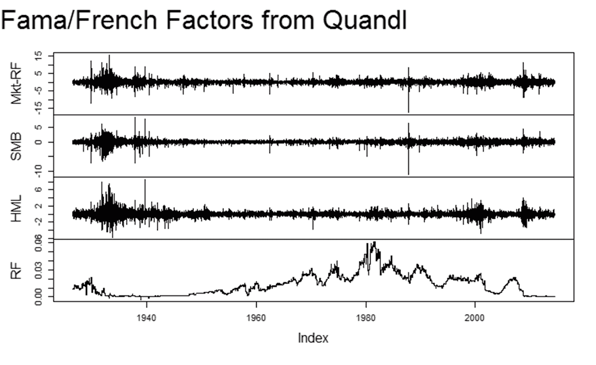

<!--yml

category: 未分类

date: 2024-05-18 14:52:12

-->

# Timely Portfolio: 一行代码获取 Fama/French 因子

> 来源：[`timelyportfolio.blogspot.com/2014/08/famafrench-factors-in-1-line-of-code.html#0001-01-01`](http://timelyportfolio.blogspot.com/2014/08/famafrench-factors-in-1-line-of-code.html#0001-01-01)

在过去，从 Kenneth French 数据集获取 Fama/French 因子需要一个复杂的下载过程，包括下载 zip 文件、解压文件、清洗数据和转换为 xts。现在，借助[Quandl](http://www.quandl.com/KFRENCH/FACTORS_D)，我们只需一行代码即可完成。**注意：此数据可通过 API 以多种格式（JSON、CSV、XML）提供，并支持[多种编程语言](http://www.quandl.com/help/libraries)。**

```
# use Quandl Kenneth French Fama/French factors
# http://www.quandl.com/KFRENCH/FACTORS_D

library(Quandl)
library(quantmod)

f <- Quandl(
  "KFRENCH/FACTORS_D"
)

f <- as.xts(f[,-1],order.by=f[,1])

plot.zoo( f, main = NA )
mtext(
  text = "Fama/French Factors from Quandl"
  , adj = 0
  , outer = T
  , line = -2
  , cex = 2
)

```

(https://blogger.googleusercontent.com/img/b/R29vZ2xl/AVvXsEjxS1j5Jn3q3F0V6t0QIMSoh-6DGAUhqv_rtBmJufKPev6b4OnKCuRDuTdJxDXtA3WXQzQN-5JSqkSjtxhEmu4pNOpefjhhrvpPB235GuFhLzMyugImvESj7e-Rds5W88_46fbnJKUwDg/s1600-h/image%25255B4%25255D.png)
