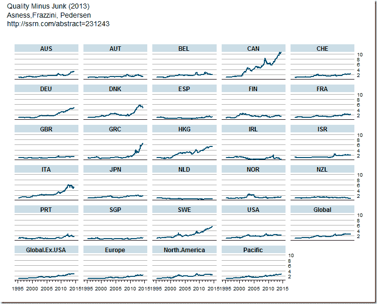

<!--yml

分类：未分类

日期：2024-05-18 14:52:04

-->

# Timely Portfolio: Frazzini goes French

> 来源：[`timelyportfolio.blogspot.com/2014/09/frazzini-oes-french.html#0001-01-01`](http://timelyportfolio.blogspot.com/2014/09/frazzini-oes-french.html#0001-01-01)

一位好心的读者评论说：“不知道你是否看到了，但弗拉齐尼现在也开始使用法语了”。我曾在[`timelyportfolio.blogspot.com/search/label/french`](http://timelyportfolio.blogspot.com/search/label/french)上[大量感谢和赞扬](http://timelyportfolio.blogspot.com/search/label/french)过凯瑟琳·弗 rench 提供的令人难以置信[数据图书馆](http://mba.tuck.dartmouth.edu/pages/faculty/ken.french/data_library.html)。现在，看起来我不得不反复做同样的事情来[感谢安德烈·弗拉齐尼](http://www.econ.yale.edu/~af227/data_library.htm)了。

下面是一个关于全球[质量减去垃圾(QMJ)](http://ssrn.com/abstract=231243)的快速图表。图表下面的代码片段。



```
#ssrn citation to the paper
#Asness, Clifford S. and Frazzini, Andrea and Pedersen, Lasse Heje
#Quality Minus Junk (October 9, 2013)
#Available at SSRN: http://ssrn.com/abstract=231243

require(gdata)
require(quantmod)
require(latticeExtra)

#read spreadsheet
qmjFactors <- read.xls(
  "http://www.econ.yale.edu/~af227/data/QMJ%20-%20Factors%20-%20monthly.xlsx"
  ,pattern = "DATE"
  ,blank.lines.skip = T
  ,stringsAsFactors = F
)
#convert spreadsheet data to R xts
#remove % with gsub, make numeric, and divide by 100
qmjFactors.xts <- as.xts(
  do.call(cbind,
          lapply(
            qmjFactors[,-1]
            ,function(x){
              df<-data.frame(as.numeric(
                gsub(
                  x=x
                  ,pattern="%"
                  ,replacement=""
                )
              )/100)
              colnames(df) <- colnames(x)
              return(df)
            }
          )
  )  #date is first column; will use in order.by
  ,order.by = as.Date(qmjFactors[,1]) #as.Date(paste0(qmjFactors[,1],"-01"),format="%Y%m%d")
)

#xyplot(qmjFactors.xts)

asTheEconomist(
  xyplot(
    cumprod(1+na.omit(qmjFactors.xts))
    , scales = list( y = list( relation = "same" ) )
    , main = "Quality Minus Junk (2013)\nAsness,Frazzini, Pedersen\nhttp://ssrn.com/abstract=231243"
  )
)
```
