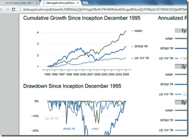

<!--yml

分类：未分类

date: 2024-05-18 15:02:16

-->

# Timely Portfolio: 从 d3 到 pdf（希望是 knitr）的使用 R Shiny 编写的代码

> 来源：[`timelyportfolio.blogspot.com/2012/12/from-d3-to-pdf-hopefully-knitr-with-r.html#0001-01-01`](http://timelyportfolio.blogspot.com/2012/12/from-d3-to-pdf-hopefully-knitr-with-r.html#0001-01-01)

虽然我认为我更喜欢[d3](http://d3js.org/)，R 和[Shiny](http://rstudio.com/shiny)团队，但我确实可以预见到使用 R，[knitr](http://yihui.name/knitr/)和 latex 编写的多页 pdf 报告的巨大需求，通过[Shiny](http://rstudio.com/shiny)发送到浏览器。Shiny 提供了预先构建的功能，以发送由 R 创建的.png 图表和图形。这尤其有效，因为大多数浏览器都为图形提供容器，可以动态更改。

在这个快速的实验中，我使用 R 的 pdf()设备函数而不是期望的 knit2pdf，以查看是否可以发送二进制 pdf 数据。~它看起来 Shiny 的 downloadHandler 函数目前只处理文本。~ Shiny 的 downloadHandler 函数也提供下载服务很好。我还包含了使这种行为工作的代码，如果你更喜欢这种行为的话。

在[`glimmer.rstudio.com/timelyportfolio/shiny-d3-pdf`](http://glimmer.rstudio.com/timelyportfolio/shiny-d3-pdf)尝试一下。它似乎与最新的 Chrome 和 IE 一起工作。

](http://glimmer.rstudio.com/timelyportfolio/shiny-d3-pdf)

代码托管在[Github](http://github.com/timelyportfolio/shiny-d3-pdf)。
