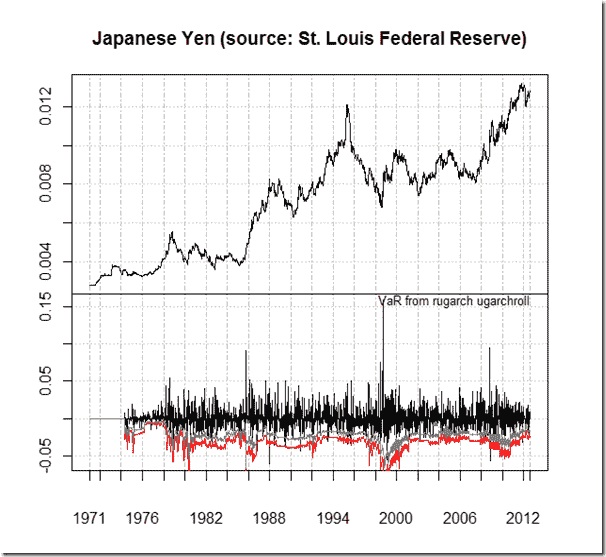

<!--yml

分类：未分类

日期：2024-05-18 15:04:07

-->

# 及时投资组合：plot.xts 中的 GARCH 面板

> 来源：[`timelyportfolio.blogspot.com/2012/08/garch-panel-in-plotxts.html#0001-01-01`](http://timelyportfolio.blogspot.com/2012/08/garch-panel-in-plotxts.html#0001-01-01)

我对大多数 rugarch 函数都超出了我的能力范围，但我认为提供一个结合 plot.xts 和 uGARCHroll 的例子可能会很好。

(https://blogger.googleusercontent.com/img/b/R29vZ2xl/AVvXsEjsOAHk9LE8yMjEsTaO5ogcDIlHTF2q0pujQgPaMGCwpopabJ-APAioQY73Mp30coR5ulzFfKtfryABJZuDfxlFIfbHt-KOGD-YaDKCDexxY9tFAa1C0xOoD9vM1A2Z23oBy7J3if8d1g/s1600-h/image%25255B4%25255D.png)

[GIST 中的 R 代码：](https://gist.github.com/3382974)
